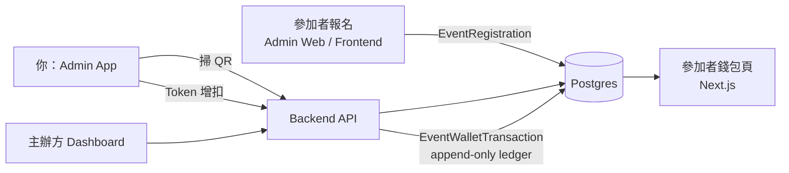
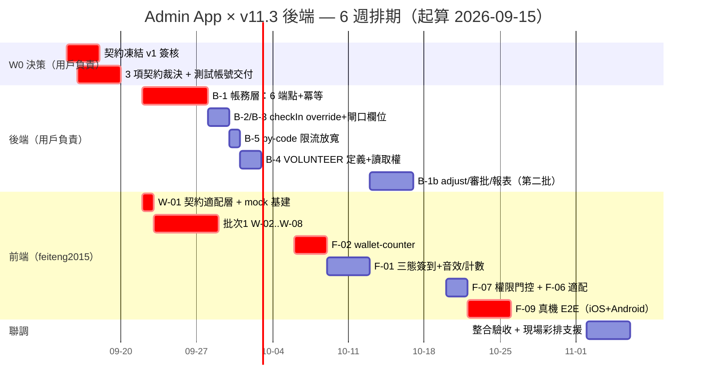
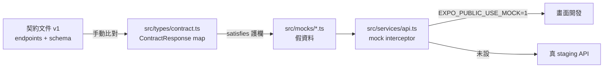
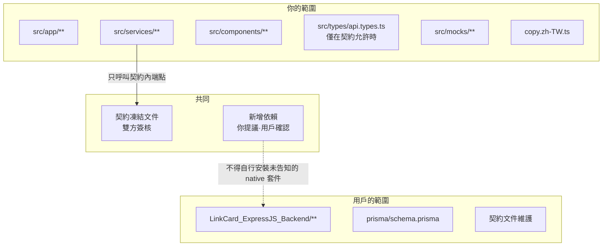

# LinkCard Event Admin App — 前端施工計畫（for feiteng2015）

> **版本**：v1.0 ｜ **建立日期**：2026-09-15 ｜ **狀態**：📋 待用戶簽核契約後開工
> **產出**：Neo Loop Engine（JARVIS Agent Network）/ Edison 規劃部（architect）
> **品質合約**：strict（Pass 93）/ L3 Deep Dive
> **硬期限**：2026-11 中旬 Macau Startup Festival（可用工程時間約 6 週）
> **分工**：**前端畫面 = feiteng2015 ｜ 後端 API = 用戶本人**
>
> **本文是執行指令，不是建議。** 每個 W-ID 都可直接開工。遇到與本文不符的實作，以本文為準並回報。

---

## 1. TL;DR（≤ 15 行）

1. **你不會被後端卡住。** 批次 1 的 **7.0 人日完全不需要等後端**，第 1 天就能開工。
2. **契約已凍結**（見 `20260915_AdminApp_API_Contract_Freeze_v1.md`）。你按契約寫，就不會重工。
3. **唯一先決條件**：用戶必須在開工前交付 **3 個契約裁決**（§4.4）＋ staging 測試帳號。這 3 項沒交，W-01 做不了。
4. 你的 10 個 P0 功能已拆成 **17 個 W-ID**，總量 **15.0 人日**（含 P1 buffer 共 20.5 人日）。
5. **三批施工**：批次 1 = 無依賴（7.0 日）／批次 2 = 等後端帳務層（5.0 日）／批次 3 = 權限與收尾（3.0 日）。
6. 🔴 **最大地雷**：`GET /registrations` 目前**擋掉 OPERATOR**（`EventService.ts:375` 只放 SA/CO）。你若照現在的服務層寫名單頁，閘口 staff 會看到按鈕但按下去 403。已在契約文件列為 🟡 必修正。
7. 🔴 **第二大地雷**：`by-code` 限流是 **20 次/5 分鐘/IP**（`registrations.routes.ts:15-33`）。展館 WiFi NAT 共用出口 IP → 開場尖峰必爆。這是**後端必修**（B-5），不是你能解的。
8. 🔴 **第三個**：簽到要「震動＋音效＋大字綠畫面」，但 `package.json` **沒有任何音效套件**（`expo-av`/`expo-audio` 皆無）。震動可用 RN 內建 `Vibration`；音效需你決定套件並告知。
9. **Mock 不要手寫**。本 repo 已有 3 處欄位名漂移（§5.1），手寫 mock 就是第 4 處。
10. **不要存取不屬於你的層**：§7 有職責邊界表，越界會被退回。
11. 你**不需要**碰 Prisma / migration / 後端 service。
12. 你**需要**碰：`src/app/`、`src/services/`、`src/types/`、`src/components/`、`src/constants/copy.zh-TW.ts`、`src/mocks/`（新）。
13. 每完成一個 W-ID 請 commit 一次，訊息格式：`feat(admin-app): W-XX <名稱>`。
14. **不確定就停下來問**，不要自行發明契約。自創欄位名 = 整合期重工。
15. 本文所有 file:line 皆為 **2026-09-15 實測**，行號會隨開發變動，**以函式名為準**。

---

## 2. 專案定位與資料流

### 2.1 一句話定位

Admin App 是**現場作戰終端**（掃碼簽到、NFC 發卡、Token 增扣、即時查詢），**不是配置中心**。配置（活動建立、報名欄位、Token 規則、權限分派）在 **Admin Web**（Next.js）上做。

依據：`docs/LinkCard Event related/20260914_LinkCard_Event_Admin_App_Meeting_1.md` §一。

### 2.2 資料流（誰產生、誰消費）

### 2.3 四個 repo 的關係

| Repo | 誰的 | 你的關係 |
|---|---|---|
| `LinkCard_ExpressJS_Backend` | 用戶本人 | **你的 API 來源**（契約在此） |
| `LinkCard_Event_Admin_App_Expo` | **你（feiteng2015）** | 你的工作範圍 |
| `LinkCard_Frontend` | 用戶 | 參加者錢包頁（你不碰，但 Token 餘額變動會反映在這） |
| `LinkCard_Promoter_App_Expo` | 另一工程師 | 可參考的姊妹 App（同一個 `theme.ts`、同一套 service 風格） |

### 2.4 你的職責邊界（不要越界）

| 你可以改 | 你不可改 |
|---|---|
| `src/app/**`（畫面 / 路由） | `LinkCard_ExpressJS_Backend/**`（任何檔案） |
| `src/services/**`（API 呼叫） | `prisma/schema.prisma` |
| `src/types/api.types.ts`（**僅在契約文件允許時**） | `src/constants/theme.ts`（100% 對齊 Promoter，不得私改 token） |
| `src/components/**`（新增/擴充 UI 元件） | Promoter App 任何檔案 |
| `src/constants/copy.zh-TW.ts`（文案） | 後端契約欄位名（除非契約文件標 🟡 待修正） |
| `src/mocks/**`（新增，標 GENERATED） | |

---

## 3. 施工順序總覽（三批）

| 批次 | 時程 | 內容 | 前置條件 | 人日 |
|---|---|---|---|:---:|
| **批次 1** | W1–W2（9/22–10/05） | F-04 / F-03a / F-05 / F-08 / F-10 / Settings | 契約 v1 簽核＋3 項裁決＋測試帳號 | 7.0 |
| **批次 2** | W3–W4（10/06–10/19） | F-02（wallet-counter）→ F-01（三態簽到） | 後端 B-1、B-2、B-3、B-5 完成 | 5.0 |
| **批次 3** | W5（10/20–10/26） | F-07 / F-06 適配 / F-09 真機 E2E | 後端 B-4 完成＋D12 裁決 | 3.0 |
| — | W6（10/27–11/02） | 整合驗收＋現場彩排支援（非你的交付，但需你在場） | — | 0.5 |

### 3.1 6 週排期（Mermaid Gantt）

> ⚠️ **Gantt 讀法**：前端的 `F-02` 條從 10/06 開始，是因為它**必須等 B-1**。若 B-1 延後，F-02 整條平移——這是本專案唯一的 critical path 風險。緩解見 §4.3。

---

## 4. 工作分解（W-ID）

### 4.1 批次 1 — 無後端依賴，可立即開工

#### W-01 ｜契約適配層 + Mock 基建

| 項 | 內容 |
|---|---|
| **檔案** | `src/types/api.types.ts`（改）、`src/types/contract.ts`（新）、`src/mocks/`（新目錄）、`src/services/api.ts`（改，加 mock interceptor） |
| **依賴** | 契約文件 v1 已簽核 |
| **估時** | 1.0 人日 |
| **驗收標準** | ① 修正 3 處已知漂移（見 §5.1）；② `pagination` 型別在 repo 內**只有一份定義**；③ mock 檔案以契約型別 `satisfies` 標註，契約變更時 `tsc` 必須報錯；④ `EXPO_PUBLIC_USE_MOCK=1` 可切換全部 API 為 mock |
| **阻斷標記** | 🚫 **需用戶交付 3 項契約裁決**（§4.4） |

---

#### W-02 ｜四大功能卡首頁（F-04）

| 項 | 內容 |
|---|---|
| **檔案** | `src/app/(auth)/[eventId]/overview.tsx`（改編）、`src/app/(auth)/[eventId]/_layout.tsx`（加路由）、`src/constants/copy.zh-TW.ts` |
| **依賴** | 無 API 依賴（純編排既有路由） |
| **估時** | 1.0 人日 |
| **驗收標準** | ① 四張卡：掃碼簽到 / Token / 名單 / 我的；② 首頁到任一核心操作 **≤ 2 次點擊**（會議 §四）；③ 按鈕 ≥ 48dp、深色高對比；④ 既有統計卡不退化（現有 registrations / checkedIn / exhibitors 三個數字保留）；⑤ 未實作的卡（Token）顯示可用，點入進 placeholder 而非崩潰 |
| **阻斷標記** | ✅ 無 |

**現況事實**：`overview.tsx:33-37` 目前 `QUICK_ACTIONS` 只有 3 項（check-in / nfc-bind / badges），需改為四大卡並補 wallet 入口。

---

#### W-03 ｜名單列表頁（F-03a）

| 項 | 內容 |
|---|---|
| **檔案** | `src/app/(auth)/[eventId]/registrations.tsx`（新）、`src/services/event.service.ts`（改）、`src/app/(auth)/[eventId]/_layout.tsx` |
| **依賴** | `GET /api/v1/events/:eventId/registrations`（🟢 已存在） |
| **估時** | 1.5 人日 |
| **驗收標準** | ① 分頁（後端回 `totalPages`，見 §5.1）；② 狀態篩選（`status` query）；③ 票種篩選（`ticketTypeId`）；④ 可見性篩選（`visibility`: all/active/hidden/archived）；⑤ 下拉刷新 + 無限滾動；⑥ 空狀態／錯誤狀態／載入骨架 |
| **阻斷標記** | ⚠️ **部分阻斷**：`search` / `sortBy` 參數後端**尚未實作**（`EventRegistrationService.ts:1213-1222` 只有 page/limit/status/ticketTypeId/visibility/depositRefunded）→ 搜尋與排序拆到 W-04。另：**OPERATOR 角色目前會被 403**（B-4 修正）。 |

---

#### W-04 ｜名單搜尋與排序整合（F-03b）

| 項 | 內容 |
|---|---|
| **檔案** | `src/app/(auth)/[eventId]/registrations.tsx`（改） |
| **依賴** | 🔴 後端新增 `search` + `sortBy` + `sortOrder` query（契約 🔴 REG-02） |
| **估時** | 0.5 人日 |
| **驗收標準** | ① 支援姓名 / Email / 手機 / 報名編號搜尋；② 排序（createdAt / 姓名 / Token 餘額）；③ debounce ≥ 300ms；④ 搜尋中不清空舊結果（避免閃爍） |
| **阻斷標記** | 🚫 **阻斷**：需後端先交付 `search` / `sortBy` 參數。若後端延遲，先上 W-03（僅分頁+篩選）作為可交付版本。 |

---

#### W-05 ｜用戶詳情頁（F-05）

| 項 | 內容 |
|---|---|
| **檔案** | `src/app/(auth)/[eventId]/registrant/[registrationId].tsx`（新）、`src/services/wallet.service.ts`（新，僅 balance/transactions）、`src/services/registration.service.ts`（改）、`_layout.tsx` |
| **依賴** | 🟢 4 個既有端點即可拼出 80%：`by-code`（或 list 取單筆）＋ `wallet/balance`＋`wallet/transactions`＋`nfc/lookup` |
| **估時** | 2.0 人日 |
| **驗收標準** | ① 區塊：基本資料 / 報名紀錄 / 簽到紀錄 / Token 流水 / 綁定 NFC / 所屬社團協會；② Token 流水區塊在 `transactions` 上線後補 `reasonCode`/`approvedBy`（v11.3 P0-05，additive 不破壞）；③ 敏感個資遮罩（Email/手機部分遮蔽，會議 §五）；④ 從名單列表與掃碼結果頁皆可進入 |
| **阻斷標記** | ⚠️ **部分阻斷**：「所屬社團/協會」目前**無對應端點**（未驗證，需用戶確認是否有 association 查詢 API）→ 先預留區塊顯示「—」並標 TODO。 |

---

#### W-06 ｜EAS 初始化（F-08）

| 項 | 內容 |
|---|---|
| **檔案** | `app.json`（加 `extra.eas.projectId`）、`eas.json`（確認） |
| **依賴** | 🚫 **需 Expo 帳號**（用戶提供） |
| **估時** | 0.5 人日 |
| **驗收標準** | ① `extra.eas.projectId` 存在；② `npx eas build --profile preview --platform android` 可提交（不需等 build 完成）；③ `.easignore` 或 `.gitignore` 不誤含 `dist/` |
| **阻斷標記** | 🚫 **阻斷**：需用戶提供 Expo 組織帳號權限。**實證**：`app.json` 無 `extra.eas.projectId`。 |

**現況事實**：`package.json` 已有 `eas-cli ^22.0.0` devDependency，`eas.json` 三個 profile 已配置（development / preview / production），唯獨缺 `projectId`。

---

#### W-07 ｜Badge 批次資料建置（F-10）

| 項 | 內容 |
|---|---|
| **檔案** | 無程式碼變更（純 staging 資料操作 + 驗證） |
| **依賴** | 🟢 5 個端點全在：`GET /nfc/badges`、`GET /nfc/badges/export`、`POST /nfc/batch`、`POST /nfc/batch/:batchId/complete`、`POST /nfc/batch/claim`（`event-ops.routes.ts:60-65`） |
| **估時** | 0.5 人日 |
| **驗收標準** | ① staging 建 10–20 張 badge；② App `badges.tsx` 列表可顯示、可分頁；③ 至少 1 張完成 bind ↔ registration；④ 用 `GET /nfc/badges/export` 驗證 CSV 可下載 |
| **阻斷標記** | ⚠️ 需 **COORDINATOR 以上**權限（`EventNfcBatchController.ts:83` 用 `checkAccess(...,'write')`＝owner/SA/CO）。**OPERATOR 不能建批次**。 |

> 📌 **注意**：這 5 個端點在 `docs/api/**` 內**零文件覆蓋**（實測 grep 0 命中）。它們的行為以 `EventNfcBatchController.ts` 與 `EventNfcBatchService.ts` 為準，契約文件已補錄。

---

#### W-08 ｜Settings 頁補完（P-06，buffer）

| 項 | 內容 |
|---|---|
| **檔案** | `src/app/(auth)/settings.tsx` |
| **依賴** | 無 |
| **估時** | 0.5 人日 |
| **驗收標準** | ① 登出；② Event 切換；③ 版本號；④ NFC 可用性檢查（`NfcManager.isSupported()`）；⑤ **不顯示** 未實作設定（避免假功能） |
| **阻斷標記** | ✅ 無 |

**批次 1 小計 = 7.0 人日**

---

### 4.2 批次 2 — 等後端 B-1 / B-2 / B-3 / B-5

#### W-20 ｜wallet.service.ts + 契約型別

| 項 | 內容 |
|---|---|
| **檔案** | `src/services/wallet.service.ts`（新）、`src/types/api.types.ts` |
| **依賴** | 🔴 後端 B-1 完成 |
| **估時** | 0.5 人日 |
| **驗收標準** | ① 方法：`getBalance` / `getTransactions` / `topUp` / `redeem` / `adjust`；② 全部帶 `eventId`；③ `topUp`/`redeem`/`adjust` 支援注入 `Idempotency-Key` header；④ 回傳 `ApiResponse<T>` envelope（與既有 service 風格一致） |
| **阻斷標記** | 🚫 阻斷（B-1） |

---

#### W-21 ｜wallet-counter 步驟 1：找帳戶

| 項 | 內容 |
|---|---|
| **檔案** | `src/app/(auth)/[eventId]/wallet-counter.tsx`（新）、`src/services/registration.service.ts`（沿用 `getByCode`） |
| **依賴** | 🟢 `GET /registrations/by-code/:code`（已存在）＋🔴 `wallet/balance` |
| **估時** | 0.5 人日 |
| **驗收標準** | ① 掃 QR 或手動輸入 registrationCode；② 顯示姓名 + 票種 + 當前餘額；③ 若 `frozen: true` 顯示凍結 banner 且 disable 消費類 tab |
| **阻斷標記** | 🚫 阻斷（B-1） |

依據：v11.3 §5.2 步驟 1。

---

#### W-22 ｜wallet-counter 步驟 2：三 tab

| 項 | 內容 |
|---|---|
| **檔案** | `wallet-counter.tsx` |
| **依賴** | 🔴 `top-up` / `redeem` / `adjust` |
| **估時** | 1.0 人日 |
| **驗收標準** | ① **增值** tab：金額 + 收款方式（CASH/BANK_TRANSFER）+ 參考號 + 備註；② **核銷** tab：來源選單（`coffee_pass` / `xoxo_machine` / `workshop`）+ 數量（預設 1）；③ **調整** tab：方向（CREDIT/DEBIT）+ 金額 + 理由碼 + 備註；④ 扣減前顯示「餘額 → 扣後餘額」預覽，餘額不足時按鈕置灰並提示差額（會議 §B 防呆）；⑤ 大額增值/任何扣減需二次確認 |
| **阻斷標記** | 🚫 阻斷（B-1）。**注意**：`adjust` 後端可能回 **202 PENDING**（待審批）——你的 UI 必須處理「已送出待覆核」狀態，**不能當成失敗**。 |

依據：v11.3 §5.2 步驟 2、§4.3 範例。

---

#### W-23 ｜wallet-counter 步驟 3：結果 + 錯誤碼文案

| 項 | 內容 |
|---|---|
| **檔案** | `wallet-counter.tsx`、`src/utils/api-error.ts`（改） |
| **依賴** | 🔴 錯誤碼表（契約文件 §4） |
| **估時** | 0.5 人日 |
| **驗收標準** | ① 成功顯示新餘額 + `transactionId`；② 每個錯誤碼有對應中文文案（**不得**顯示原始 code）；③ `409 EVENT_TOKEN_FROZEN` / `400 INSUFFICIENT_TOKEN_BALANCE` / `409 IDEMPOTENCY_CONFLICT` / `409 ADJUSTMENT_ALREADY_REVIEWED` 四個為必測 |
| **阻斷標記** | 🚫 阻斷（B-1） |

---

#### W-24 ｜wallet 審計流水區

| 項 | 內容 |
|---|---|
| **檔案** | `wallet-counter.tsx`、`src/components/ui/WalletTransactionRow.tsx`（新，可選） |
| **依賴** | 🔴 `wallet/transactions` 加 `reasonCode` / `approvedBy` / `sourceId` |
| **估時** | 0.5 人日 |
| **驗收標準** | ① 畫面下半部顯示最近 10 筆（時間 / 類型 / 增減 / 操作者 / 理由碼）；② 依 type 上色（INITIAL_ALLOCATION 綠 / TOP_UP 藍 / DEDUCTION 橙 / EXPIRY 灰 / REVERSAL 紫 / ADMIN_ADJUSTMENT 紫藍）；③ 符號契約：**DEDUCTION 顯示為負、REVERSAL 顯示為正**（v11.3 §4.4 唯一記法；不得自行反轉）。管理員可展開看 `approvedBy` |
| **阻斷標記** | 🚫 阻斷（B-1） |

> ⚠️ **絕對不要**在 UI 層對 REVERSAL 做「反向」邏輯。後端契約是 REVERSAL 恆正、方向由 `type`+`reversalOfId` 表達（v11.3 §4.4）。前端二次反轉 = 帳務顯示錯。

---

#### W-25 ｜冪等鍵 + 雙擊防護

| 項 | 內容 |
|---|---|
| **檔案** | `src/utils/idempotency.ts`（新）、`wallet-counter.tsx` |
| **依賴** | 🔴 後端 B-1（`idempotencyKey` 欄位 + `P2002` 處理） |
| **估時** | 0.25 人日 |
| **驗收標準** | ① 每次送出前生成 ULID 作 `Idempotency-Key`；② 送出即 disable 按鈕；③ 網路重試**沿用同一 key**（不是重新生成）；④ 成功後才清 key |
| **阻斷標記** | 🚫 阻斷（B-1） |

---

#### W-26 ｜簽到三態 UI 重構（F-01a）

| 項 | 內容 |
|---|---|
| **檔案** | `src/app/(auth)/[eventId]/check-in.tsx`（重大改編）、`src/components/CheckInResultSheet.tsx`（新） |
| **依賴** | 🟢 `POST /registrations/checkin`（已存在） |
| **估時** | 0.75 人日 |
| **驗收標準** | ① 三態清楚分離：**有效**（綠）/ **重複簽到**（黃）/ **無效未報名**（紅）；② 全螢幕相機 + 底部固定結果卡（不跳頁）；③ 手電筒 + 手動輸入碼保留（現有功能不得退化）；④ 3s auto-reset 保留 |
| **阻斷標記** | ✅ **不阻斷**（現有 checkin 端點可用，僅需前端重構）。這項可**提前到批次 1** 若你有空檔。 |

**現況事實**：`check-in.tsx` 已有 QR 掃描 + 手動輸入 + 3s auto-reset + 錯誤映射（`ERROR_MESSAGES` map）。

---

#### W-27 ｜重複簽到覆核流程（F-01b）

| 項 | 內容 |
|---|---|
| **檔案** | `CheckInResultSheet.tsx`、`src/services/registration.service.ts`（改） |
| **依賴** | 🚫 **後端 B-2**：`checkIn` 需加 override（現況 `EventRegistrationService.ts:1042-1044` 無條件拋 `ALREADY_CHECKED_IN`） |
| **估時** | 0.5 人日 |
| **驗收標準** | ① 顯示首次簽到時間（＋地點，若 B-3 到位）；② 需主管動作才能二次放行（主管 = COORDINATOR+）；③ 覆核動作寫入 `checkedInBy` 且**不覆蓋**原始 `checkedInAt`；④ override 被拒（403）時有明確文案 |
| **阻斷標記** | 🚫 **阻斷 B-2**（＋B-3 若需顯示地點） |

---

#### W-28 ｜音效 + 震動 + 大字狀態（F-01c）

| 項 | 內容 |
|---|---|
| **檔案** | `check-in.tsx`、`CheckInResultSheet.tsx`、`package.json`（**新增依賴**） |
| **依賴** | 無 API 依賴 |
| **估時** | 0.5 人日 |
| **驗收標準** | ① 簽到成功：震動（RN 內建 `Vibration.vibrate()`，無需新依賴）+ 音效 + 大字綠畫面；② 失敗：不同音效 + 紅畫面；③ 音效可關閉（Settings）；④ 靜音模式下仍要**震動**（展館嘈雜，視覺+觸覺是主通道） |
| **阻斷標記** | ⚠️ **需你決定音效套件並告知用戶**。實證：`package.json` 無 `expo-av` / `expo-audio` / `expo-haptics`。候選：`expo-audio`（SDK 57 推薦）、`expo-av`（舊但穩定）。 |

---

#### W-29 ｜單日/單場簽到計數器（F-01d）

| 項 | 內容 |
|---|---|
| **檔案** | `check-in.tsx`（頂部）、`src/services/event.service.ts`（改） |
| **依賴** | 🔴 **新增端點**（契約 🔴 CHK-04）：需要「今日 / 本場次」簽到計數。現有 `GET /registrations?status=CHECKED_IN` 只給總數（`overview.tsx:60-67` 已用此法），**無法區分單日/單場** |
| **估時** | 0.5 人日 |
| **驗收標準** | ① 頂部即時顯示今日/本場次簽到數；② 簽到成功後即時 +1（樂觀更新）；③ 每 60s 背景刷新一次 |
| **阻斷標記** | 🚫 **阻斷（新端點）**。**替代方案**：以現有 `status=CHECKED_IN&limit=1` 拿總數，標記為「總簽到」而非「今日簽到」——**語意降級但現場仍可用**。已寫入契約文件供用戶選擇。 |

**批次 2 小計 = 5.0 人日**（F-02 = 2.25、F-01 = 2.75）

---

### 4.3 批次 3 — 等後端 B-4 + 決策

#### W-30 ｜權限矩陣門控（F-07）

| 項 | 內容 |
|---|---|
| **檔案** | `src/hooks/usePermission.ts`（新）、四大功能卡與各頁 |
| **依賴** | 🚫 **後端 B-4**（VOLUNTEER 定義）＋ **D12 裁決**（OPERATOR 讀取權） |
| **估時** | 0.5 人日 |
| **驗收標準** | ① 依契約文件「權限矩陣」表隱藏無權操作（不是按下去才 403）；② `useEventStore` 已存 `userRole`（來自 `/my-managed` 的 `_meta.userRole`）——直接複用，不新增查詢；③ 未知角色一律視為最小權限（fail-closed） |
| **阻斷標記** | 🚫 阻斷（B-4 + D12） |

> 📌 **實證**：`/my-managed` 已回 `_meta.userRole`（`EventService.ts:543-548` 型別為 `SUPER_ADMIN | COORDINATOR | OPERATOR | VOLUNTEER | MEDIA`），且 Admin App 已在 `event.service.ts:29-34` unwrap 成 `userRole`。所以你**不需要**新端點拿角色。

---

#### W-31 ｜Credential 展示適配（F-06 前端側）

| 項 | 內容 |
|---|---|
| **檔案** | `src/app/(auth)/[eventId]/registrant/[registrationId].tsx`（改） |
| **依賴** | 🚫 **後端 F-06（純後端，用戶做）** |
| **估時** | 0.5 人日 |
| **驗收標準** | ① Credential 列表在用戶詳情頁顯示（type + 狀態 + QR 縮圖）；② QR 渲染複用 `react-native-qrcode-svg`（已在依賴內）；③ 純展示，**不新增編輯功能**（會議 §E 是 Admin 視角） |
| **阻斷標記** | 🚫 阻斷（後端 Credential 模型未建；實證 `schema.prisma` 無 `EventCredential`） |

---

#### W-32 ｜真機 E2E（F-09）

| 項 | 內容 |
|---|---|
| **檔案** | `docs/20260915_AdminApp_Device_E2E_Checklist.md`（新） |
| **依賴** | 批次 1+2 全綠 |
| **估時** | 1.5 人日 |
| **驗收標準** | ① Android 實機：登入 → 選活動 → 掃碼簽到（三態）→ 發卡 → Token 增值 → 核銷 → 名單查詢 → 詳情頁；② iOS 實機：至少驗簽到 + Token + NFC（iOS NFC 限制多）；③ 每步截圖存證；④ 異常劇本：重複簽到 / 無效碼 / 餘額不足 / 活動凍結 / 斷網 |
| **阻斷標記** | ⚠️ 需 Android + iOS 實機 + 測試 badge 資料（W-07） |

> 📌 **現況**：真機驗證 = 0（`PROGRESS.md`）。Android 優先——NFC 寫卡在 iOS 受限。

---

#### W-33 ｜整合驗收 + 現場彩排支援

| 項 | 內容 |
|---|---|
| **估時** | 0.5 人日 |
| **驗收標準** | ① 與用戶共同跑一次完整鏈路（報名 → 簽到 → 發卡 → 增值 → 核銷 → 報表）；② 併發壓測配合（5 分鐘 500 人，會議 §五）；③ 參與 W6 實地彩排（異常劇本演練） |
| **阻斷標記** | ⚠️ 需用戶排時間 |

**批次 3 小計 = 3.0 人日**

---

### 4.4 每批的開工前置條件（用戶必須先交付）

#### 批次 1 前置（**W0 內必須完成，否則 W-01 阻塞**）

| # | 交付物 | 為什麼必須 | 狀態 |
|---|---|---|---|
| P1-1 | **API 契約文件 v1 簽核** | 沒有凍結契約，W-01 無法修正型別 | ⬜ 待交 |
| P1-2 | **裁決 C-1：pagination 寫法** | repo 內有 **5 種 live 形狀**，不統一則每個 service 都要各自猜 | ⬜ 待裁決 |
| P1-3 | **裁決 C-2：`Registration` 型別** | 決定 `Registration` 要不要改；影響 W-03/W-05 | ⬜ 待裁決 |
| P1-4 | **裁決 C-3：`by-code` 限流策略** | 決定前端是否需要做本地快取/退避；影響 W-21/W-26 | ⬜ 待裁決 |
| P1-5 | **staging 環境 + 測試帳號**（COORDINATOR 以上 1 個 + OPERATOR 1 個） | 沒有帳號無法驗任何東西 | ⬜ 待交 |
| P1-6 | **Expo 帳號權限**（W-06 用） | EAS init 需要 | ⬜ 待交 |
| P1-7 | **確認「所屬社團/協會」是否有查詢 API**（W-05 用） | 目前未驗證 | ⬜ 待確認 |

#### 批次 2 前置

| # | 交付物 | 狀態 |
|---|---|---|
| P2-1 | B-1 完成：6 條新端點 + `idempotencyKey` + `REVERSAL`（**至少** `redeem` + 強化 `top-up` + idempotency 三項） | ⬜ |
| P2-2 | B-2 完成：`checkIn` override | ⬜ |
| P2-3 | B-3 完成：閘口/地點欄位（若 W-27 要顯示地點） | ⬜ |
| P2-4 | B-5 完成：`by-code` 限流放寬 | ⬜ |
| P2-5 | 錯誤碼總表上線（含 v11.3 新增碼） | ⬜ |

#### 批次 3 前置

| # | 交付物 | 狀態 |
|---|---|---|
| P3-1 | B-4 完成 + D12 裁決 | ⬜ |
| P3-2 | F-06 Credential 後端模型完成 | ⬜ |
| P3-3 | Android + iOS 實機 + 測試 badge | ⬜ |

---

## 5. Mock 策略（核心：不要製造第 4 份契約）

### 5.1 先看現存的 3 處漂移（這是為什麼不能手寫 mock）

| # | 項目 | 文件寫的 | 後端實作 | Admin App 型別 | 已驗證 |
|:---:|---|---|---|---|:---:|
| **D-1** | registrations pagination | `{ total, page, limit, pages }` `03-registration-payment-api.md:140` | `{ total, page, limit, totalPages }` `EventRegistrationService.ts:1333` | `{ total, page, pageSize, pages? }` `event.service.ts:6-11` | ✅ |
| **D-2** | `Registration` 姓名 | （未寫） | flat `firstName`/`lastName` `EventRegistrationService.ts:1088-1098` | `profile.fullName` `api.types.ts:70-78` | ✅ |
| **D-3** | NFC badges pagination | （**零文件**） | `{ total, page, pageSize }`（query 參數亦為 `pageSize`） `EventNfcBatchService.ts:130,146` | `{ total, page, pageSize, pages? }` `nfc.service.ts:8` | ✅ |

> 🔴 **實測補充**：pagination 在**同一個後端**內就有 **3 種 live 形狀**：
> - `GET /registrations` → `{total, page, limit, totalPages}`（`EventRegistrationService.ts:1333`）
> - `GET /my-managed` → `{page, limit, total, totalPages}`（`EventService.ts:560`）
> - `GET /nfc/badges` → `{total, page, pageSize}`（`EventNfcBatchService.ts:146`，**query 參數也叫 `pageSize`**）
>
> 這比「3 種寫法」更嚴重：**是 3 種 live + 1 種文件 + 1 種 App 型別 = 5 種**。裁決 C-1 必須先拍板。

### 5.2 Mock 三原則

| 原則 | 做法 | 為什麼 |
|---|---|---|
| **① 契約是唯一輸入** | mock 檔只能從契約文件的 response schema 產生，**不得手寫欄位名** | D-1/D-2/D-3 的成因就是「手寫第二份契約」 |
| **② 型別護欄（最低成本，必做）** | `const balanceMock = {...} satisfies ContractResponse<'GET /wallet/:id/balance'>` | 契約一改，`tsc --noEmit` 立刻報錯。成本 ≈ 0，效果等於 codegen 的 80% |
| **③ 產生器（可選，有時間再做）** | `scripts/gen-mock-from-openapi.ts` 讀契約 JSON → 輸出 `src/mocks/__generated__/*.ts`，檔頭標 `// GENERATED — DO NOT EDIT` | 省手寫時間，但 W0 只有 1 人日，優先做原型② |

**明確不採用**：MSW（Mock Service Worker）。理由：① 本 repo 無測試框架，引入 MSW 的收益只在測試；② RN + MSW 需額外 native 配置；③ 訊號不足（目前需求只是「開發期假資料」）。
→ **當前需求複雜度不需要額外設計模式**（v11.3 §4.8 同立場）。

### 5.3 實作方式（建議做法）

| 步驟 | 內容 |
|---|---|
| 1 | `src/types/contract.ts` 定義端點 → response 型別映射（可用 string literal key） |
| 2 | `src/mocks/registrations.mock.ts` 等，每個 export 都 `satisfies` 對應契約型別 |
| 3 | `src/services/api.ts` 加 **請求** interceptor：若 `EXPO_PUBLIC_USE_MOCK=1` 且命中 mock 表 → 直接 resolve，不發網路請求 |
| 4 | 提供 `.env.local.example` 說明如何切換 |
| 5 | mock 需覆蓋**錯誤情境**（至少：409 FROZEN、400 INSUFFICIENT、409 IDEMPOTENCY_CONFLICT），否則 W-23 的錯誤文案做不了 |

> ⚠️ **不要用 `page.route()` 類攔截**：本機實測 `page.route()` 對 axios XHR 不可靠。用**請求 interceptor** 在 axios 層攔截，比在網路層攔截穩定。

---

## 6. 非功能需求（現場會炸的那幾條）

| 類別 | 要求 | 你怎麼做 | 來源 |
|---|---|---|---|
| 效能 | 掃碼 → 結果 ≤ 1.5s | 樂觀 UI + 掃碼即顯示「查詢中」骨架，不等 API 才反饋 | 會議 §五 |
| 效能 | 開場尖峰 5 分鐘 500 人 | 前端無法解（後端限流 B-5）→ 你做「429 退避 + 友善提示」 | 會議 §五 |
| 可用性 | 弱網自動重試 | 冪等鍵 + 指數退避（**重試沿用同 key**） | 會議 §五 |
| 可用性 | 操作可撤銷 Undo 5s | ⚠️ **v11.3 不做 undo**（無此端點）；改用「二次確認 + 反向 adjust」 | 會議 §五 vs v11.3 §5.4 |
| 安全 | 強制登入逾時 | 既有 `api.ts` interceptor 已處理 401 | — |
| 安全 | 敏感個資遮罩 | W-05 詳情頁實作 | 會議 §五 |
| 稽核 | 全操作日誌 | 後端 ledger 負責（`approvedBy`）；你只需確保 UI 顯示 | 會議 §五 |
| 多語言 | 繁 / 簡 / 英 / **葡** | P1（P-08）。批次 1–3 先全繁中，文案集中 `copy.zh-TW.ts` 以便日後抽 i18n | 會議 §五 |
| 設備 | 中低階 Android 相容 | 避免重動畫；Camera 用 `expo-camera` 既有配置 | 會議 §五 |
| 設備 | 按鈕 ≥ 48dp、戴手套可操作 | `theme.ts` 既有 `spacing` / `components` token 已足夠，**不得自創尺寸** | 會議 §四 |

> 🔴 **明確的期望落差**：會議要求「操作可撤銷（Undo 5 秒）」，但 v11.3 明確**不做 undo**，改以 `ADMIN_ADJUSTMENT` 沖銷。
> 你**不要**在 UI 層假裝有 undo（先刪本地再打 API 會造成帳實不符）。已在契約文件的「已知落差」區列出。

---

## 7. 職責邊界（越界會被退回）

| 情境 | 正確做法 |
|---|---|
| 你發現契約有錯／不夠用 | **停下**，寫在 `docs/` 的 issue 清單，請用戶裁決。**不要**自行改 `api.types.ts` 迎合後端 |
| 你需要新端點 | 提出 request（method/path/request/response 草案），由用戶決定做不做 |
| 你需要新 native 套件（如音效） | 在 PR 說明＋告知用戶，避免 build 配置衝突 |
| 你發現後端有 bug | 開 issue，附重現步驟 + `curl`。**不要**改後端 |
| 後端回傳與契約不符 | 以契約為準開 bug；若契約本身錯 → 走裁決流程 |

---

## 8. 測試與驗證指南

### 8.1 現況（實證）

| 項 | 現況 |
|---|---|
| Test framework | **無**（`.project-context.md`「Testing: 無 test framework」） |
| Type check | `npm run typecheck`（`tsc --noEmit`）✅ 有 |
| Lint | `npm run lint`（eslint 9）✅ 有 |
| 真機驗證 | **0**（`PROGRESS.md`） |
| Deploy | **0**（EAS 未初始化） |

### 8.2 每個 W-ID 的最低驗證門檻

| 門檻 | 指令 / 動作 | 必過 |
|---|---|---|
| T1 型別 | `npm run typecheck` | ✅ 每個 W-ID |
| T2 Lint | `npm run lint` | ✅ 每個 W-ID |
| T3 Web 冒煙 | `npm run web` → 手動走該頁流程 | ✅ 批次 1 各項 |
| T4 Mock 情境 | `EXPO_PUBLIC_USE_MOCK=1` → 錯誤碼路徑 | ✅ W-23 |
| T5 真機 | Android（+iOS）實機走鏈路 | ✅ W-32 |

### 8.3 建議現在就加（低成本高回報）

前端目前零測試。**不要**在此時引入完整測試框架（超範圍）。建議只做兩件事：

1. **契約護欄編譯測試**：`npm run typecheck` 即是契約測試（mock 用 `satisfies` 時）。這已足夠。
2. **一支 smoke script**（可選）：`scripts/smoke.ts` 打 staging 的 4 個關鍵端點，回報 200/非 200。用途：整合期快速確認後端狀態，不用開 App。

---

## 9. 常見啟動失敗排查

| 症狀 | 原因 | 解法 |
|---|---|---|
| App 起來但所有 API 404 | 少了 `/api` prefix（歷史 bug，commit 11 修過） | 檢查 `constants/config.ts` 的 `API_BASE_URL` 是否含正確 base |
| 登入成功但選活動頁空白 | `/my-managed` 回 `_meta.userRole` 沒被 unwrap | `event.service.ts:29-34` 已有 unwrap 邏輯，確認沒被改回 |
| `check-in` 一直回「此報名尚未確認」 | 錯誤碼讀取用錯欄位（commit 12 修過） | 用 `getApiErrorCode`（`utils/api-error.ts`），不要直接讀 `error.message` |
| NFC 在 web 上沒反應 | web 不支援 NFC（預期） | 用 Android 真機 |
| `eas build` 失敗 | `app.json` 無 `extra.eas.projectId` | 等 W-06 完成（需 Expo 帳號） |
| `.env.local` 改了沒生效 | Expo 的 `EXPO_PUBLIC_*` 在命令列指定**不會**覆蓋 `.env.local` | 直接改 `.env.local` 後重啟 |
| 掃碼簽到 429 | `by-code` 限流 20 次/5 分鐘/IP | **這是後端 B-5，不是你修**。先加友善提示，並回報用戶 |
| 名單頁 403 | `GET /registrations` 擋 OPERATOR（`EventService.ts:375`） | 用 COORDINATOR 帳號驗；此為 B-4 待修 |

---

## 10. 附錄：與 P1 / P2 的關係

| 分類 | 項目 | 何時 |
|---|---|---|
| **Buffer 工作**（批次 1 若提早完成） | P-01 NFC 補發/換卡/退卡（1.5 日）、P-05 角色門控小項（0.25 日）、P-06 settings 補頁（0.5 日） | 批次 1 空檔 |
| **P1（11 月最好有）** | P-02 現場補報名、P-03 工作人員管理 UI、P-04 儀表板、P-08 多語言（含葡文） | W5–W6 或活動後 |
| **P2（明確不做）** | 支付串接 MPay、Booth Mode、離線模式、推播、名片交換、多租戶 | v11.3 §5.4 / 會議 §P2 |
| **明確不做（後端 OOS，你也不要做 UI）** | 線上購買 Token、Token 折抵報名費、跨活動轉移、NFC tap-to-deduct、操作 Undo | v11.3 §3.4 / §5.4 |

---

## 11. 文件關係

| 文件 | 用途 |
|---|---|
| **本文** | 你的施工計畫（W-ID、批次、前置條件、mock 策略） |
| `20260915_AdminApp_API_Contract_Freeze_v1.md` | **你與用戶的共同真相**。所有端點、欄位、錯誤碼、權限 |
| `docs/research/09-feasibility-review.md` | 可行性複審（5 阻斷項 + 契約漂移 + 決策清單） |
| `../../LinkCard_ExpressJS_Backend/docs/20260915_AdminApp_Backend_TODOs.md` | 用戶的施工清單（你可讀，了解進度） |
| `docs/research/06-feature-list.md` | F-01..F-10 / P-01..P-09 完整清單（歷史來源） |
| `docs/research/07-mvp-schedule.md` | 6 週排期與風險（歷史來源） |
| `LinkCard_ExpressJS_Backend/docs/development-cycles/v11.3-event-token-system/04-design-plan.md` | **wallet-counter 規格書**（§5.2 是施工圖、§4.3 是 API、§4.4 是冪等） |

---

## 12. 變更記錄

| 版本 | 日期 | 變更 | 原因 |
|---|---|---|---|
| v1.0 | 2026-09-15 | 初版（三批 × 17 W-ID + mock 策略 + 前置條件） | Neo Loop（admin-app-handoff）PLAN stage 交付 |

---

**END OF FILE**
