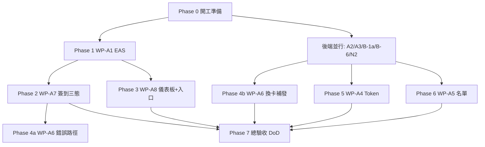

# LinkCard Admin APP — 詳細實施計畫（已審核）

> **文件類型**：執行級實施計畫  
> **建立日期**：2026-09-18 ｜ **審核更新日期**：2026-09-18  
> **對應任務卡**：`docs/notion/20260918_Event_Admin_App_Assign_Notion_Card.md`  
> **規格來源**：`docs/research/16-feiteng2015-work-packages.md`、`docs/20260915_AdminApp_API_Contract_Freeze_v1.md`、`docs/20260915_AdminApp_Handoff_for_feiteng2015.md`  
> **產品名**：LinkCard Admin APP（現場作戰終端）  
> **硬期限**：2026-11 Macau Startup Festival  
> **狀態**：✅ **已審核通過（v0.6）** — Phase 0 完成；Phase 1 工程完成（真機截圖待補）

---

## 0. 文件目的

把 Notion 任務卡的 6 個 WP（A1 / A7 / A8 / A6 / A4 / A5）拆成**可獨立施工、可獨立驗收**的步驟，使最終能勾選任務卡 DoD（111–119 行）。

本計畫只覆蓋 **Phase A（11 月必須）**；WP-B1..B4、WP-N1 桌面 CLI 不在本輪交付範圍，僅作為依賴/風險標註。

---

## 1. 目標與 DoD 對照

| DoD 項（任務卡） | 對應 Phase / 步驟 | 最終提交物 |
| --- | --- | --- |
| WP-A1 EAS APK + 真機登入 | Phase 1 | EAS build URL + 安裝登入截圖 |
| WP-A7 三態 + 震動/大字/音效 + 覆核 | Phase 2 | 三態截圖 + 覆核錄影 |
| WP-A8 降級儀表板 + Admin App check-in 可達 | Phase 3 | 儀表板截圖 + App 導覽實測（Web 遷移後補） |
| WP-A6 NFC 綁定/換卡/補發 | Phase 4 | 真機綁定/換卡錄影 |
| WP-A4 Token 增值/扣減/流水/確認 + 同步 | Phase 5 | Web 錄影 + 流水截圖 + 用戶端同步截圖 |
| WP-A5 搜尋/篩選/排序/詳情/補報名 | Phase 6 | 三種搜尋 + 詳情截圖 |
| 每 WP：`tsc` 0 + `lint` 0 | 每步驟 Exit Gate | CI 本地指令輸出 |
| 每 WP：真機/瀏覽器證據 | 每步驟 Exit Gate | `docs/evidence/<WP>/` |
| commit：小步 + WP 編號 | 全程 | git log 可追溯 |

> ⚠️ **條件化 DoD**（與任務卡一致）：WP-A4 / A5 / A6 的功能驗收依賴後端前置（B-1a / B-6+T-1 / WP-N2）。前置未解鎖時，允許交付「錯誤路徑 + UI 骨架」，並在本計畫勾選狀態寫 **BLOCKED→骨架完成**，功能驗收延後。

---

## 2. 範圍邊界

### 2.1 本輪要做（Admin App / 關聯前端）

| WP | 主要 repo | 說明 |
| --- | --- | --- |
| **WP-A1** | `NFC_LinkCard_Event_Admin_App_Expo` | EAS development/preview Android APK |
| **WP-A7** | Admin App | 簽到三態、感官回饋、計數、覆核 UI |
| **WP-A8** | **Admin App（本輪）**；`LinkCard_Frontend` **延後遷移** | App 降級儀表板 + **本輪僅在 Admin App 做 check-in 入口**；Web manage 導覽後續再遷到 `LinkCard_Frontend`（已裁決 v0.4） |
| **WP-A6** | Admin App | NFC 錯誤路徑；換卡/補發/退卡（待 WP-N2） |
| **WP-A4** | **`LinkCard_Frontend`（主交付，已裁決）** + Admin App 入口 | Token 櫃台以 Web 為主；Admin App 僅保留入口/深鏈或 placeholder，不做完整 Token 櫃台 |
| **WP-A5** | Admin App | 名單 / 搜尋 / 詳情 / 現場補報名 |

### 2.2 本輪不做（標註依賴方）

| 項 | 負責人 | 影響 |
| --- | --- | --- |
| WP-A2 T-1（OPERATOR 讀名單） | 用戶本人（Backend） | 不解鎖 → WP-A5 無法用 OPERATOR 驗收 |
| WP-A3 B-5（by-code 限流） | 用戶本人（Backend） | 不解鎖 → 開場尖峰 429，A7 現場不可用 |
| B-1a / B-1b（wallet 冪等 + adjust） | 用戶本人（Backend） | 不解鎖 → WP-A4 只能做 UI 骨架 |
| B-6（search/sortBy） | 用戶本人（Backend） | 不解鎖 → WP-A5 搜尋/排序降級 |
| WP-N2（換卡端點） | 阿聰 + 用戶本人 | 不解鎖 → WP-A6 換卡/補發/退卡延後 |
| WP-N1 / Phase B | 用戶本人 / 後續 | 不納入本輪 DoD |

### 2.3 職責紅線（不可越界）

- ❌ 不改 Backend Prisma / migration / service 實作  
- ❌ 不私改 `src/constants/theme.ts` token（對齊 Promoter）  
- ❌ 不自創 API 欄位名；契約未凍結處先停下來問  
- ❌ Token 扣減動詞一律用 **`deduct`**（禁用 `redeem`）  
- ❌ 登入必須走 **promoter 端點**（單軌 JWT）；誤用 plain `/api/auth/login` 會導致後續 401  

---

## 3. 施工總覽（建議順序）

| Phase | 內容 | 估時 | 可開工條件 |
| --- | --- | --- | --- |
| 0 | 環境 / 帳號 / 證據目錄 / 提交約定 | 0.25 d | 立即 |
| 1 | WP-A1 EAS | 0.5 d | Expo 帳號 + staging URL |
| 2 | WP-A7 簽到三態 | 2.25 d | 大部分可立即；覆核需 B-2 |
| 3 | WP-A8 儀表板 + **Admin App** check-in 入口 | 1.0 d | 立即（Web 遷移不在本輪） |
| 4 | WP-A6 NFC | 2.0 d | 錯誤路徑立即；換卡待 WP-N2 |
| 5 | WP-A4 Token | 7.5 d（含 BE 2.0） | 待 B-1a |
| 6 | WP-A5 名單 | 4.0 d | 待 B-6 + T-1 |
| 7 | 總驗收 / DoD 勾選 | 0.5 d | 上述完成或條件化完成 |

**建議並行**：Phase 1 完成後，Phase 2 與 Phase 3 可並行；Phase 4a 可與 2/3 並行。

---

## 4. 通用 Exit Gate（每個步驟結束必須過）

每個步驟勾選完成前，必須同時滿足：

1. **代碼**：符合契約 / 任務卡 AC  
2. **品質**：`npx tsc --noEmit` → 0 error；`npm run lint` → 0 error  
3. **證據**：真機或瀏覽器截圖/錄影放入 `docs/evidence/<WP-ID>/`（目錄可新建）  
4. **Commit**：小步提交，message 含 WP 編號，例如：  
   `feat(admin-app): WP-A7 add success vibration and green fullscreen`  
5. **不發明契約**：未知欄位先開 issue / 問用戶，不擅自加欄位  

---

## 5. Phase 0 — 開工準備

> **狀態（2026-09-18）**：✅ **基本完成**（staging 測試帳登入驗證待補）  
> 證據：`docs/evidence/PHASE-0/README.md`

### Step 0.1 — 環境與帳號確認

| 項 | 內容 |
| --- | --- |
| **動作** | ① Node/npm 可用；② `npm ci`；③ 複製 `.env.example` → `.env.local`；④ 填入 staging：`EXPO_PUBLIC_API_URL=https://staging-api.link-card.xyz`、`EXPO_PUBLIC_WEB_URL=https://staging.link-card.xyz`；⑤ 確認 Expo 帳號可登入；⑥ 確認 staging 測試帳號（promoter/OPERATOR）已交付 |
| **產出** | 可 `npm run typecheck`；環境變數就緒 |
| **驗收標準** | ① `.env.local` 存在且 **不含** `/api` 後綴；② `npx eas whoami` 成功；③ 用 staging 帳號 curl 或 Web 登入成功至少一次 |
| **結果** | ① ✅ ② ✅（`feiteng` / `linkcard`）③ ⏳ staging API 302 可達；**帳密登入待用戶交付帳號**；另修復 `copy.zh-TW.ts` 截斷使 `tsc`/`lint` 全綠 |

### Step 0.2 — 提交與證據約定（已裁決：可直推 main）

| 項 | 內容 |
| --- | --- |
| **動作** | **不開獨立 branch / PR**；在 `main`（或當前預設開發分支）上小步 commit 並可直推。建立 `docs/evidence/` 目錄結構 |
| **驗收標準** | ① commit message 含 WP 編號；② 每子功能一 commit；③ 證據目錄路徑寫入本計畫對應步驟；④ **允許直推 main**（用戶 2026-09-18 裁決） |
| **結果** | ✅ `docs/evidence/{PHASE-0,WP-A1..A8}/` 已建立 |

### Step 0.3 — 後端前置追蹤板（非本 repo 施工，但必須盯）

| 前置 ID | 內容 | 解鎖 WP | 狀態（2026-09-18 開工） |
| --- | --- | --- | --- |
| T-1 / WP-A2 | OPERATOR 讀 `GET /registrations` → 200 | A5 | ☐ 未確認 |
| B-5 / WP-A3 | by-code 限流改 key / 放寬 | A7 現場可用 | ☐ 未確認 |
| B-2 | `checkin/override` | A7 覆核 | ☐ 未確認 |
| B-3 | `gateId` | A7 稽核欄位 | ☐ 未確認 |
| B-1a | wallet 冪等 + `initiatedBy` | A4 | ☐ 未確認 |
| B-6 | `search`/`sortBy`/`sortOrder` | A5 | ☐ 未確認 |
| WP-N2 | 換卡/補發/退卡端點 | A6 完整 | ☐ 未確認 |

### Phase 0 Exit Gate

- [x] `.env.local` + Expo 帳號 + typecheck/lint 綠  
- [x] `docs/evidence/` 結構就緒  
- [x] 後端前置追蹤板已記入  
- [ ] staging 測試帳登入截圖（帳號已交付：`505810824@qq.com`；截圖併入 WP-A1）  

## 6. Phase 1 — WP-A1 EAS Build 驗證（0.5 人日）

> 對應 DoD：EAS build 成功產出可安裝 APK + 真機登入成功  
> **狀態（2026-09-18）**：🟡 工程項完成；真機登入截圖待測帳密碼本地驗證後補  
> 證據：`docs/evidence/WP-A1/README.md`

### Step 1.1 — 確認 EAS profile 與環境變數注入

| 項 | 內容 |
| --- | --- |
| **檔案** | `eas.json`、`app.json`、EAS Secrets / 構建 env |
| **動作** | 確認 `development` profile（`developmentClient: true`）；為 preview/production 注入 `EXPO_PUBLIC_API_URL` / `EXPO_PUBLIC_WEB_URL`（非 `__DEV__` 缺值會 throw 白屏） |
| **建議 commit** | `chore(admin-app): WP-A1 ensure eas env for staging` |
| **驗收標準** | ① `eas.json` 三檔齊全；② staging origin **無** `/api`；③ projectId 已寫入 `app.json` |
| **結果** | ✅ development/preview → staging；production → linkcard.xyz；projectId 已有 |

### Step 1.2 — 產出 Android APK / Dev Client

| 項 | 內容 |
| --- | --- |
| **動作** | `npx eas-cli build --profile development --platform android`（或 preview 產出可安裝 APK）；記錄 EAS build URL |
| **驗收標準** | ① Build status = finished；② 可下載 APK 或安裝連結；③ 構建日誌無致命錯誤 |
| **結果** | ✅ FINISHED；APK：見 `docs/evidence/WP-A1/README.md` |

### Step 1.3 — 真機安裝與 staging 登入

| 項 | 內容 |
| --- | --- |
| **動作** | 真機安裝 → 用測試帳登入 → 進入「我的活動」列表；**登入暫用** `POST /api/auth/login`（promoter claim 路徑後續再切） |
| **證據** | `docs/evidence/WP-A1/login-success.png` + build URL 寫入同目錄 `README.md` |
| **驗收標準** | ① 登入成功；② 能看到至少一個 managed event；③ 截圖含 staging 行為證據（非本地 mock） |
| **結果** | ✅ 代碼維持 `/api/auth/login`；測試帳 `505810824@qq.com`；⏳ 截圖待本地真機補 |

### Phase 1 Exit Gate

- [x] EAS build URL + APK 可下載  
- [x] `eas.json` staging/prod env 注入  
- [x] 登入維持 `/api/auth/login` + `tsc`/`lint` 綠（promoter 路徑延後）  
- [ ] 真機登入截圖（`505810824@qq.com` → 我的活動）  

---

## 7. Phase 2 — WP-A7 簽到三態強化（2.25 人日）

> 對應 DoD：簽到三態齊備 + 震動/大字/音效 + 重複覆核  
> **狀態（2026-09-18）**：🟡 工程完成；真機截圖待補  
> 證據：`docs/evidence/WP-A7/README.md`  
> 主要檔案：`src/app/(auth)/[eventId]/check-in.tsx`、`walk-in.tsx`、`src/utils/check-in-feedback.ts`  
> 音效套件：**`expo-audio`**（契約 C-10）

### Step 2.1 — 簽到流程改為「先查後簽」三態資料模型

| 項 | 內容 |
| --- | --- |
| **結果** | ✅ `CheckInUiState` + by-code → VALID/DUPLICATE/INVALID；無效不呼叫 checkin |

### Step 2.2 — ✅ 有效態結果卡（大字綠畫面）

| 項 | 內容 |
| --- | --- |
| **結果** | ✅ 大字標題 + 姓名/公司/票種/Email/報名時間/Token/簽到時間 |

### Step 2.3 — 震動 + 音效

| 項 | 內容 |
| --- | --- |
| **結果** | ✅ `playCheckInFeedback`；Web 無震動、音效失敗靜默降級 |

### Step 2.4 — ⚠️ 重複簽到 + 主管覆核 UI

| 項 | 內容 |
| --- | --- |
| **結果** | ✅ 覆核按鈕 + BLOCKED Banner（階段完成裁決）；嘗試 `checkin/override`，失敗維持骨架 |

### Step 2.5 — ❌ 無效態 + 補報名入口

| 項 | 內容 |
| --- | --- |
| **結果** | ✅ 導向 `walk-in` placeholder（WP-A5 前不白屏） |

### Step 2.6 — 頂部簽到計數

| 項 | 內容 |
| --- | --- |
| **結果** | ✅ 「總簽到（累計，非今日）」+ `status=CHECKED_IN` pagination.total |

### Phase 2 Exit Gate

- [x] 三態 UI 齊備（工程）  
- [x] 震動/音效接入（工程；真機證據待補）  
- [x] 覆核 UI 骨架 + BLOCKED（已裁決算階段完成）  
- [x] `tsc` / `lint` 綠  
- [ ] 真機/瀏覽器三態截圖（請補入 `docs/evidence/WP-A7/`）  
- [ ] DoD WP-A7 正式勾選（截圖齊備後）  

---

## 8. Phase 3 — WP-A8 降級儀表板 + Admin App check-in 入口（1.0 人日）

> 對應 DoD：降級儀表板數據正確 + check-in 可達  
> **已裁決（v0.4）**：**本輪僅在 Admin App 實施** check-in 入口與儀表板；**暫不在 `LinkCard_Frontend` 開工**。Web manage 導覽留待後續遷移（見 Step 3.3 延後項）。

### Step 3.1 — Admin App：check-in 入口 + 四大功能卡 / 概覽補強

| 項 | 內容 |
| --- | --- |
| **Repo** | `NFC_LinkCard_Event_Admin_App_Expo`（**本輪唯一施工面**） |
| **檔案** | `src/app/(auth)/[eventId]/overview.tsx`、`_layout.tsx`、`copy.zh-TW.ts`；既有 `check-in.tsx` 路由 |
| **動作** | ① **保證「掃碼簽到」為一級入口**：從活動概覽 ≤ 2 次點擊到達 `/(auth)/[eventId]/check-in`；② 快速操作含簽到（會議四大卡方向：掃碼簽到 / Token / 名單 / …，保留 NFC 或併入）；③ 未實作頁進 **placeholder** 不崩潰；④ 保留既有三統計卡 |
| **Commit** | `feat(admin-app): WP-A8 ensure check-in entry and four quick actions` |
| **驗收標準** | ① **Admin App**：home → 活動 → 點「掃碼簽到」→ check-in 頁可達（截圖/錄影）；② 首頁到簽到 ≤ 2 次點擊；③ 點未完成模組不 crash；④ 既有 registrations/checkedIn/exhibitors 不退化 |

### Step 3.2 — 降級儀表板數據

| 項 | 內容 |
| --- | --- |
| **Repo** | Admin App |
| **動作** | 顯示：報名數、已簽到、到場率（checkedIn/total）；Token 總發放/消耗——有 aggregate 端點則接，無則顯示「—」或隱藏並標降級；禁止假數據 |
| **Commit** | `feat(admin-app): WP-A8 degraded dashboard metrics` |
| **驗收標準** | ① 數字與 staging API 一致（抽樣核對）；② 無端點時不顯示錯數；③ 截圖存證 |

### Step 3.3 — Web check-in 導覽（延後遷移，本輪不做）

| 項 | 內容 |
| --- | --- |
| **Repo** | `LinkCard_Frontend` |
| **本輪狀態** | ⏸️ **SKIP / 延後** — 不在本輪實施 |
| **後續動作** | 遷移時修復 `app/check-in/[eventId]`（或同等路徑）從 manage 活動頁不可達問題：側邊欄/按鈕加入口 |
| **後續驗收** | ① 從 manage ≤ 2 次點擊到達 check-in；② 深鏈刷新不 404 |
| **Commit（遷移時）** | `fix(web): WP-A8 migrate manage navigation to check-in` |

> 📌 **本輪 DoD**：僅要求 **Admin App** check-in 可達 + 降級儀表板。Web 側標記為 **DEFERRED**，不阻擋 Phase 3 勾選。

### Phase 3 Exit Gate

- [ ] 儀表板截圖（Admin App）  
- [ ] **Admin App** check-in 導覽實測證據  
- [ ] ~~Web check-in 導覽~~ → **本輪 DEFERRED**（遷移後補證據）  
- [ ] `tsc` / `lint`（Admin App）  
- [ ] DoD WP-A8 可勾選（Web 項標延後）  

---

## 9. Phase 4 — WP-A6 NFC 綁定強化（2.0 人日）

> 對應 DoD：NFC 綁定/換卡/補發流程跑通（待 WP-N2）  
> 主要檔案：`nfc-bind.tsx`、`nfc.service.ts`、`nfc-utils.ts`  
> **必須用 Dev Build / 真機 Android**（Expo Go 不可靠）

### Step 4.1 — 錯誤路徑三態（可立即開工）

| 項 | 內容 |
| --- | --- |
| **動作** | 覆蓋：無效 tagUid、重複綁定、已綁其他 registration、寫卡失敗、後端 bind 失敗；每種有明確文案 + 可重試 |
| **Commit** | `feat(admin-app): WP-A6 nfc bind error-path states` |
| **驗收標準** | ① 至少 3 種錯誤可在真機或模擬後端重現；② 成功/失敗不混淆；③ Web 仍顯示「不支援 NFC」 |

### Step 4.2 — 綁定成功路徑穩定性

| 項 | 內容 |
| --- | --- |
| **動作** | 查 by-code → 選 badge → 寫 NDEF URI（`WEB_BASE_URL/u/:registrationId`）→ `POST /nfc/bind`；寫卡與 bind 失敗可回滾提示（勿靜默成功） |
| **Commit** | `fix(admin-app): WP-A6 harden nfc write-then-bind flow` |
| **驗收標準** | ① Android 真機綁定成功錄影；② 讀回 URI 正確指向 staging Web（非誤寫 prod）；③ 後端可查到綁定 |

### Step 4.3 — 換卡 / 補發 / 退卡（待 WP-N2）

| 項 | 內容 |
| --- | --- |
| **動作** | 依 WP-N2 契約接 void 舊卡 → bind 新卡；補發、退卡入口與確認 dialog |
| **前置未到** | 先做 UI 骨架 + disabled + Banner「等待後端 WP-N2」 |
| **Commit** | `feat(admin-app): WP-A6 replace/reissue/return card flows` |
| **驗收標準** | ① WP-N2 就緒後：換卡錄影完整；② 舊卡 lookup 顯示作廢；③ 新卡可入場 |

### Phase 4 Exit Gate

- [ ] 綁定成功錄影  
- [ ] 錯誤路徑截圖  
- [ ] 換卡錄影 **或** BLOCKED+骨架證據  
- [ ] `tsc` / `lint` 綠  
- [ ] DoD WP-A6 可勾選（條件化則註明）  

---

## 10. Phase 5 — WP-A4 Token 櫃台（7.5 人日，待 B-1a）

> 對應 DoD：Token 增值/扣減/流水/二次確認 + 用戶端同步  
> **已裁決：主交付在 `LinkCard_Frontend`**（`manage/[eventId]/wallet`）；Admin App **只做入口/深鏈或 placeholder，不做完整 Token 櫃台**  
> 契約：WAL-01..04（既有）+ B-1a 強化；動詞 **`deduct`**

### Step 5.1 — 前置核對（B-1a Gate）

| 項 | 內容 |
| --- | --- |
| **動作** | 確認 staging：`idempotencyKey`、`initiatedBy`（或等價操作員欄位）已上；用 curl 驗證 top-up / deduct / transactions |
| **驗收標準** | ① B-1a checklist 全綠才開始功能開發；② 未綠則只做 Step 5.2 骨架 |

### Step 5.2 — UI 骨架（可先行）

| 項 | 內容 |
| --- | --- |
| **動作** | Web wallet 頁骨架：搜人/掃碼入口、餘額區、Top-up 區、Deduct 區、流水表、確認 Modal；App overview Token 卡進 placeholder 或 Web 深鏈 |
| **Commit** | `feat(web): WP-A4 wallet counter UI skeleton` |
| **驗收標準** | ① 無後端時不崩潰；② 二次確認 Modal 可打開關閉 |

### Step 5.3 — 增值（top-up）

| 項 | 內容 |
| --- | --- |
| **動作** | 快捷 +10/+50/+100（後端可配置則讀配置，否則常數）、自訂金額、來源標記、`idempotencyKey`、操作員欄位 |
| **Commit** | `feat(web): WP-A4 top-up with quick amounts` |
| **驗收標準** | ① 增值後餘額正確；② 重複提交不雙記（冪等）；③ 流水可見 |

### Step 5.4 — 扣減（deduct）+ 餘額不足

| 項 | 內容 |
| --- | --- |
| **動作** | 兌換品項清單點擊扣減；餘額不足置灰 + 差額提示；**禁止**呼叫 `redeem` |
| **Commit** | `feat(web): WP-A4 deduct catalog with insufficient guard` |
| **驗收標準** | ① 不足時無法提交；② 成功後餘額與流水正確 |

### Step 5.5 — 流水表 + 二次確認 + 用戶端同步

| 項 | 內容 |
| --- | --- |
| **動作** | 流水：時間/操作員/金額/類型/備註；大額/扣減二次確認；操作後 3 秒內用戶端 App/Web 餘額同步（UAT-2） |
| **Commit** | `feat(web): WP-A4 transactions list and confirm modal` |
| **驗收標準** | ① 錄影：增值→流水→用戶端餘額；② 扣減同理；③ 無操作員欄空值（B-1a 後） |

### Phase 5 Exit Gate

- [ ] Web 操作錄影  
- [ ] 流水表截圖  
- [ ] 用戶端同步截圖  
- [ ] `tsc` / `lint`（Web + App 若有改）  
- [ ] DoD WP-A4 可勾選（或 BLOCKED+骨架）  

---

## 11. Phase 6 — WP-A5 名單 / 搜尋 / 詳情 / 補報名（4.0 人日，待 B-6 + T-1）

> 對應 DoD：搜尋/篩選/排序/詳情/補報名  
> 新檔建議：`registrations.tsx`、`registrant/[registrationId].tsx`；服務層擴充 `event.service` / `registration.service`

### Step 6.1 — 名單列表（分頁 + 篩選，可部分先行）

| 項 | 內容 |
| --- | --- |
| **動作** | `GET /registrations`：分頁、status、ticketTypeId、visibility；下拉刷新、無限滾動、骨架/空/錯態 |
| **前置** | T-1 未修時 OPERATOR 會 403 → 用 owner/CO 帳驗收並標風險 |
| **Commit** | `feat(admin-app): WP-A5 registrations list page` |
| **驗收標準** | ① 列表可滾動分頁；② 篩選生效；③ 從 overview「名單」可進入 |

### Step 6.2 — 搜尋與排序（待 B-6）

| 項 | 內容 |
| --- | --- |
| **動作** | `search`（姓名/手機/Email/編號）、`sortBy`/`sortOrder`；debounce ≥ 300ms；搜尋中保留舊結果防閃爍 |
| **Commit** | `feat(admin-app): WP-A5 registrations search and sort` |
| **驗收標準** | ① 至少 3 種搜尋條件截圖；② B-6 未到則前端降級方案需書面註明且不假裝已後端搜尋 |

### Step 6.3 — 用戶詳情頁

| 項 | 內容 |
| --- | --- |
| **動作** | 區塊：基本資料 / 報名 / 簽到 / Token 流水 / 綁定 NFC / 社團（無 API 顯示 —）；個資遮罩（Email/手機） |
| **Commit** | `feat(admin-app): WP-A5 registrant detail page` |
| **驗收標準** | ① 從名單與簽到結果可進入；② 無資料區塊 EmptyState；③ 截圖存證 |

### Step 6.4 — 現場補報名

| 項 | 內容 |
| --- | --- |
| **動作** | 精簡表單 → 觸發與線上一致的建帳/Email（依契約既有或新增端點）；成功後可接簽到/發卡 |
| **Commit** | `feat(admin-app): WP-A5 onsite walk-in registration` |
| **驗收標準** | ① 提交成功有回饋；② Email 觸發可在 staging 驗證；③ 與簽到無效態入口打通 |

### Phase 6 Exit Gate

- [ ] 三種搜尋條件截圖  
- [ ] 詳情頁截圖  
- [ ] 補報名證據（或 BLOCKED）  
- [ ] `tsc` / `lint` 綠  
- [ ] DoD WP-A5 可勾選（條件化則註明）  

---

## 12. Phase 7 — 總驗收與 DoD 勾選

### Step 7.1 — 品質全綠複掃

| 項 | 內容 |
| --- | --- |
| **動作** | 在 Admin App root：`npm run typecheck && npm run lint`；Web 側同等檢查 |
| **驗收標準** | 兩邊 0 error |

### Step 7.2 — 證據包彙總

| 項 | 內容 |
| --- | --- |
| **動作** | 整理 `docs/evidence/WP-A*/`；每個 WP 一份 `README.md`（build URL / 帳號角色 / 步驟 / 已知限制） |
| **驗收標準** | 任務卡 DoD 每一條都能指向具體檔案或連結 |

### Step 7.3 — 條件化項結案聲明

| 項 | 內容 |
| --- | --- |
| **動作** | 對仍 BLOCKED 的 A4/A5/A6：寫明缺失前置 ID、已交付骨架範圍、預計解鎖後的補驗收 checklist |
| **驗收標準** | 審核者可一眼區分「已上線可用」vs「骨架待接」 |

### Step 7.4 — 任務卡 DoD 最終勾選表

複製自 Notion 卡，驗收時勾選：

- [ ] **WP-A1** EAS build 成功產出可安裝 APK + 真機登入成功  
- [ ] **WP-A7** 簽到三態齊備 + 震動/大字/音效 + 重複覆核  
- [ ] **WP-A8** 降級儀表板數據正確 + **Admin App** check-in 可達（Web/`LinkCard_Frontend` 遷移 **DEFERRED**）  
- [ ] **WP-A6** NFC 綁定/換卡/補發流程跑通（待 WP-N2）  
- [ ] **WP-A4** Token 增值/扣減/流水/二次確認 + 用戶端同步（待 B-1a）  
- [ ] **WP-A5** 搜尋/篩選/排序/詳情/補報名（待 B-6 + T-1）  
- [ ] 每個 WP：`tsc --noEmit` 0 error + `lint` 0 error  
- [ ] 每個 WP：真機/瀏覽器截圖或錄影（**tsc 過 ≠ 可用**）  
- [ ] commit：hackathon 式小步（每子功能一 commit，含 WP 編號）  

---

## 13. 建議日曆（可依產能調整）

| 週次 | 日期（示意） | 焦點 |
| --- | --- | --- |
| W0 | 09-18 ~ 09-21 | Phase 0 + **WP-A1** + 催後端 A2/A3 |
| W1 | 09-22 ~ 09-28 | **WP-A7** + **WP-A8**；NFC Gate 1；催 WP-N2 |
| W2 | 09-29 ~ 10-05 | **WP-A6** 錯誤路徑 + 綁定穩定性 |
| W3–W4 | 10-06 ~ 10-19 | **WP-A4**（B-1a 後）、**WP-A5**（B-6+T-1 後） |
| W5 | 10-20 ~ 10-26 | 換卡補發（N2 後）、整合修 bug |
| W6 | 10-27 ~ 11-12 | 總驗收、現場彩排；11-15 活動日 |

時間錨點（任務卡）：

| 日期 | 事件 | 行動 |
| --- | --- | --- |
| 09-22 | NFC 硬體最後下單日 | 確認 PM 已下單 |
| 09-28 | NFC Gate 1 spike | 與用戶驗證讀寫 |
| 10-13 | 工具 Alpha | 若做 NFC CLI（非本輪主責） |
| 11-12 | 現場演練 | 提前 3 天彩排 |
| **11-15** | **Macau Startup Festival** | 活動日 |

---

## 14. 風險與降級策略

| 風險 | 影響 | 降級 |
| --- | --- | --- |
| B-5 未修 | 開場 429 | 分散出口 IP / 暫緩壓測；現場少用 by-code |
| B-2 未交 | 無法覆核二次入場 | 重複簽到僅顯示警示，人工放行記紙本 |
| B-1a 延遲 | Token 無法上線 | 僅記帳紙本 / Web 骨架；支付不進 App |
| B-6 延遲 | 無法全域搜尋 | 僅分頁+篩選；搜尋標「本頁過濾」 |
| WP-N2 延遲 | 無換卡 | 11 月僅「首次綁定」；換卡走後台人工 |
| NFC 硬體延誤 | 無實體卡 | 降級印刷 QR 手帶（會議 MVP 底線） |
| Expo/Apple 帳號 | 無 iOS | Android-only 上線 |

---

## 15. 已裁決事項（2026-09-18）

| # | 議題 | 裁決 |
| :-: | --- | --- |
| 1 | WP-A4 交付面 | ✅ 以 **`LinkCard_Frontend`（Web）為主**；Admin App 僅入口/深鏈或 placeholder |
| 2 | WP-A7 覆核（B-2 未就緒） | ✅ **「覆核 UI 骨架 + BLOCKED」算階段完成**；B-2 後補功能驗收 |
| 3 | WP-A8 check-in 入口 | ✅ **本輪僅 Admin App**；**暫不在 `LinkCard_Frontend` 實施**，後續再遷移 Web manage 導覽 |
| 5 | 分支策略 | ✅ **不開獨立 branch + PR**；允許 **直推 main**（仍要求小步 commit + WP 編號） |

### 仍待確認（不阻開工）

| # | 議題 | 預設 |
| :-: | --- | --- |
| 4 | 證據目錄 | 暫用 `docs/evidence/WP-A*/`（未反對則照此執行） |
| 6 | staging 測試帳號交付時間 | 開工前向用戶索取 OPERATOR / COORDINATOR |

---

## 16. 參考索引

| 文件 | 用途 |
| --- | --- |
| `docs/notion/20260918_Event_Admin_App_Assign_Notion_Card.md` | 任務卡與 DoD |
| `docs/research/16-feiteng2015-work-packages.md` | WP 規格與 AC |
| `docs/handoff/05-WORK-PACKAGES-QUICK-REF.md` | 施工順序速查 |
| `docs/20260915_AdminApp_API_Contract_Freeze_v1.md` | API 契約權威 |
| `docs/20260915_AdminApp_Handoff_for_feiteng2015.md` | W-ID 細部施工 |
| `docs/20260914_AdminApp_Meeting_Requirements.md` | 產品定位與模組 A–G |
| `docs/handoff/04-KNOWN-PITFALLS.md` | 踩雷地圖 |

---

## 變更記錄

| 版本 | 日期 | 說明 |
| --- | --- | --- |
| v0.1 | 2026-09-18 | 初版：依 Notion DoD 拆 Phase 0–7，每步含驗收標準，待用戶審核 |
| v0.2 | 2026-09-18 | 納入用戶裁決：A4=Web 主交付；A7 覆核骨架+BLOCKED 算階段完成；A8 在 LinkCard_Frontend；允許直推 main |
| v0.3 | 2026-09-18 | WP-A8 澄清：Web + Admin App 雙端都要有 check-in 入口 |
| v0.4 | 2026-09-18 | WP-A8：**本輪僅 Admin App 實施**；`LinkCard_Frontend` 暫不開工，後續再遷移 |
| v0.5 | 2026-09-18 | Phase 0 執行：修復 `copy.zh-TW.ts`；建立 `docs/evidence/`；環境驗收記入 |
| v0.6 | 2026-09-18 | Phase 1：eas env 注入；promoter 登入修正；EAS APK FINISHED 記入證據 |

---

**END OF FILE — Phase 1 工程完成（真機截圖待補）**
