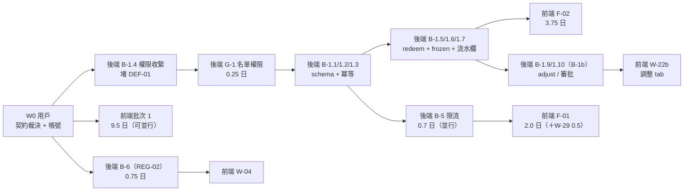

# Admin App 交接前可行性複審（前端外派 × 後端自做）

> **產出**：Neo Loop Engine（JARVIS Agent Network）｜**日期**：2026-09-15
> **品質合約**：strict（Pass Threshold 93）/ L3 Deep Dive
> **研究方法**：DISCOVER 階段獨立研究（morpheus）+ PLAN 階段證據核對（architect，發現 3 個 DISCOVER 未列問題）
> **Repo 基準**：`LinkCard_Event_Admin_App_Expo` @ `e33ca67`（main，working tree clean）
> **新增前提**：⚠️ **前端畫面交由工程師 `feiteng2015` 開發；後端 API 由用戶本人開發**
> **證據基準**：2026-09-15 實測。行號會隨開發變動，**以函式名為準**。

---

## 0. 一句話結論

> **功能清單設計得出來、技術上做得到；但「現在交出去」會卡住——因為 10 個 P0 中有 4 個的前端完全依賴後端尚未實作的能力。**
> 正解不是縮減功能，而是**先凍結契約 + 後端補 5 個阻斷項**，前端即能在第 1 天開工（**9.5** 人日無依賴工作）。

---

## 1. 複審方法（為什麼可信）

| 階段     | 執行者                                | 方法                                                               | 產出                              |
| -------- | ------------------------------------- | ------------------------------------------------------------------ | --------------------------------- |
| DISCOVER | morpheus（獨立研究員）                | 兩個 repo 實時掃描 + `grep` 驗證 + 契約比對                        | 5 個硬阻斷項 + 可行性矩陣         |
| PLAN     | architect（規劃部，**非同一 agent**） | 逐項證據核對（**以函式名/路由字串為主**）+ 契約凍結草案 + 施工排序 | 3 份交付文件（含 **30 個 W-ID**） |
| 本報告   | Neo（複審整合）                       | 交叉比對兩階段結論差異                                             | 可行性裁決                        |

**Maker ≠ Checker**：DISCOVER 與 PLAN 由不同 agent 執行；PLAN 階段**推翻了 DISCOVER 的 1 項評級**（見 §3.1）。

---

## 2. 可行性裁決表（10 個 P0 功能）

|    ID    | 功能                                                |     前端可開發？      | 卡在哪                                                                                                                   |                   裁決                   |
| :------: | --------------------------------------------------- | :-------------------: | ------------------------------------------------------------------------------------------------------------------------ | :--------------------------------------: |
| **F-01** | QR 簽到三態（三態 UI + 重複覆核 + 音效震動 + 計數） |      🟡 **部分**      | 三態 UI ✅ 可做；**覆核**卡 B-2；**計數**卡新端點；**音效**卡無套件                                                      | ⚠️ 拆成 W-26（可做）/ W-27 / W-28 / W-29 |
| **F-02** | Token 櫃台 wallet-counter                           |      ❌ **不可**      | **B-1a**（帳務層 6 端點 + 冪等全缺）；**調整 tab 另等 B-1b**                                                             |    🚫 等後端 B-1a（W-22b 另等 B-1b）     |
| **F-03** | 名單列表 + 搜尋/篩選                                | ✅ **可**（搜尋除外） | 分頁/篩選 ✅；`search`/`sortBy` 後端未實作（**B-6**）；**OPERATOR 被 403**                                               |     ✅ W-03 可開工；W-04 等後端 B-6      |
| **F-04** | 四大功能卡首頁                                      |       ✅ **可**       | 純前端編排                                                                                                               |               ✅ 立即開工                |
| **F-05** | 用戶詳情頁                                          |     ✅ **大部分**     | 4 個既有端點拼出 80%；「所屬社團」API 未確認                                                                             |        ✅ 立即開工（一區塊預留）         |
| **F-06** | Credential 統一模型                                 |      ❌ **不可**      | 後端無 `EventCredential` model（grep 0 命中）                                                                            |       🚫 純後端，前端僅批次 3 適配       |
| **F-07** | 權限矩陣與門控                                      |      ❌ **不可**      | **B-4**（VOLUNTEER 無任何授權引用）                                                                                      |           🚫 等 B-4 + D12 裁決           |
| **F-08** | EAS 初始化 + projectId                              |       ✅ **可**       | 僅需 Expo 帳號權限                                                                                                       |               ✅ 立即開工                |
| **F-09** | 真機 E2E                                            |      ⏳ **後期**      | 需設備 + badge 資料 + 前面全綠                                                                                           |                  批次 3                  |
| **F-10** | Badge 批次資料建置                                  |       ✅ **可**       | 5 端點全在（`eventOpsRouter.get('/nfc/badges'` … `eventOpsRouter.post('/nfc/batch/claim'`，`event-ops.routes.ts:66-70`） |               ✅ 立即開工                |

### 2.1 統計

| 裁決          |                 數量                  |        人日        | 說明                                                                                                                                                                                                                                                          |
| ------------- | :-----------------------------------: | :----------------: | ------------------------------------------------------------------------------------------------------------------------------------------------------------------------------------------------------------------------------------------------------------- |
| ✅ 可立即開發 | 5（F-03 / F-04 / F-05 / F-08 / F-10） |      **9.5**       | 無後端依賴（＝批次 1 小計，含 W-01 契約基建、W-08 buffer、**W-10..W-15**（2026-09-16 審計新增）；**不含 🚫 W-04**）                                                                                                                                           |
| 🟡 部分可開發 |               1（F-01）               |      **1.0**       | = **W-26**（三態 UI 重構 0.75 ＋ A3 回傳值消費 +0.25）；其中 **0.75 可先做**。W-27 0.5 / W-28 0.5 等 B-2 / B-3（**已計入 ❌ 列**）；W-29 0.5 亦在 ❌ 列                                                                                                       |
| ❌ 後端阻斷   |  4（F-02 / F-06 / F-07 + F-01 部分）  |      **6.25**      | F-02 **3.75** ＋ F-06 0.5 ＋ F-07 0.5 ＋ F-01 阻斷部分 1.0（W-27/28）＋ W-29 0.5                                                                                                                                                                              |
| —             |                   —                   |     **19.25**      | **全 W-ID 逐項合計**（30 個 W-ID：**批次 1 = 10.0（含 🚫 W-04；不含則 9.5）**、**批次 2 = 6.25（含 🚫 W-29；不含則 5.75）**、批次 3 = **3.0**）；其中 **18.25** = 批次小計合計（排除 🚫 W-04 / W-29）；再扣 **buffer 1.0**（W-13 + W-15）→ **承諾交付 17.25** |
| —             |                   —                   | **+0.5（用戶側）** | **W-09** = A0 修正，移交前（W0）由用戶執行，**不計入前端**                                                                                                                                                                                                    |

> ✅ **三 bucket 與總計精確閉合（N3 已於 2026-09-16 關閉）**：
> **✅ 9.5** ＋ **🟡 1.0**（W-26）＋ **❌ 6.25** ＋ **未歸屬 2.5** = **19.25** ✓
> 未歸屬 2.5 的組成：**W-04 0.5**（批次 1 但需後端 B-6）＋ **W-32 1.5**（真機 E2E）＋ **W-33 0.5**（整合驗收）——這三項皆非「可立即開發 / 部分 / 阻斷」三分法可描述，故單獨列示。
> 📐 **逐項驗算**：W-01 1.25 ＋ W-02 1.0 ＋ W-03 1.5 ＋ W-04 0.5 ＋ W-05 2.0 ＋ W-06 0.5 ＋ W-07 0.5 ＋ W-08 0.5 ＋ W-10 0.25 ＋ W-11 0.25 ＋ W-12 0.5 ＋ W-13 0.5 ＋ W-14 0.25 ＋ W-15 0.5 ＝ **10.0**（批次 1）；W-20 .5 ＋ W-21 .5 ＋ W-22 .75 ＋ W-22b .75 ＋ W-23 .5 ＋ W-24 .5 ＋ W-25 .25 ＋ W-26 1.0 ＋ W-27 .5 ＋ W-28 .5 ＋ W-29 .5 ＝ **6.25**（批次 2）；W-30 .5 ＋ W-31 .5 ＋ W-32 1.5 ＋ W-33 .5 ＝ **3.0**（批次 3）。**合計 19.25** ✓ |

> 📅 **更新（2026-09-16）**：完成度審計（`research/10`）新增 **W-09..W-15**（7 個）＋ 既有 W-ID 的 AC 增補（W-01 / W-26 各 +0.25）→ 總量 **16.5 → 19.25**（+2.75）。

---

## 3. 5 個硬阻斷項（後端）

> 全部附實測證據。這些是**用戶本人的待辦**（→ `LinkCard_ExpressJS_Backend/docs/20260915_AdminApp_Backend_TODOs.md`）

### B-1 ｜Token 帳務層未實作 🔴 Critical

| 項                         | 現況                                                                                                | 證據                                                                                                                                                                                                                                                  |
| -------------------------- | --------------------------------------------------------------------------------------------------- | ----------------------------------------------------------------------------------------------------------------------------------------------------------------------------------------------------------------------------------------------------- |
| wallet 端點數              | **4 條**（balance / transactions / top-up / deduct）                                                | `premium.routes.ts` 的 `router.get('/wallet/:registrationId/balance'` / `router.get(` + `'/wallet/:registrationId/transactions'`（多行）/ `router.post('/wallet/:registrationId/top-up'` / `router.post('/wallet/:registrationId/deduct'`（≈ :13-20） |
| 缺的端點                   | `redeem` / `adjust` / `approve` / `reject` / `adjustments` / `report/summary` = **6 條，全 0 命中** | grep routes                                                                                                                                                                                                                                           |
| `REVERSAL` enum 值         | **不存在**（`WalletTransactionType` 只有 5 值）                                                     | `enum WalletTransactionType`（`prisma/schema.prisma:1306-1312`）                                                                                                                                                                                      |
| `idempotencyKey`           | **不存在**                                                                                          | `model EventWalletTransaction`（`prisma/schema.prisma:1320-1346`）無此欄；**grep `idempotencyKey` in `src/**` = 0 命中**（全 repo 的 `idempotency` 命中屬 **registration 冪等索引註解**，`schema.prisma:835`）→ **wallet 無冪等**                     |
| `EventWalletAdjustment` 表 | **不存在**                                                                                          | `schema.prisma` 無此 model                                                                                                                                                                                                                            |
| Admin App token 代碼       | **零**（scaffold 級）                                                                               | v11.3 §5.2 自述                                                                                                                                                                                                                                       |

**影響**：F-02 整個做不了（**3.75** 人日）；F-05 的 Token 流水區塊只能顯示既有 5 種類型，無 `reasonCode`/`approvedBy`。

### B-2 ｜`checkIn` 無條件拋 `ALREADY_CHECKED_IN` 🔴 High

| 項           | 現況                                 | 證據                                            |
| ------------ | ------------------------------------ | ----------------------------------------------- |
| 重複簽到處理 | **無條件 throw**，無 override 參數   | `EventRegistrationService.checkIn()`（`:1044`） |
| DTO          | `CheckInDto` 只有 `registrationCode` | `EventRegistrationController`                   |

**影響**：會議要求的「主管覆核後二次放行」**無法實作**。前端 W-27 阻斷。
**附帶缺口**：`EventRegistration` **無存放覆核理由的欄位** → 稽核不可查詢（須 add `checkInOverrideLog Json?`）。

### B-3 ｜無閘口 / 地點欄位 🔴 High

| 項            | 現況                                                      | 證據                                                        |
| ------------- | --------------------------------------------------------- | ----------------------------------------------------------- |
| 簽到欄位      | 只有 `checkedInAt` / `checkedInBy`                        | `EventRegistration` model（`prisma/schema.prisma:802-803`） |
| `gate` 關鍵字 | grep 只命中 `venueName` / `boothLocation`（**不同語意**） | grep gate                                                   |

**影響**：會議要求「寫入閘口編號供稽核」無法滿足。前端 W-27 只能顯示時間。

### B-4 ｜`VOLUNTEER` 角色無任何 access 引用 🔴 High

| 項             | 現況                                                                      | 證據                                                        |
| -------------- | ------------------------------------------------------------------------- | ----------------------------------------------------------- |
| enum 存在      | `EventOrgRoleType` 有 `VOLUNTEER`（5 值）                                 | `enum EventOrgRoleType`（`prisma/schema.prisma:1245-1251`） |
| 授權使用       | grep `VOLUNTEER` 在 `src/` 僅 3 處且**皆非授權**（表單欄位 + 型別 union） | `registrationForm.ts`、`EventService`（`userRole` union）   |
| operator guard | 只有 SA / CO / OP                                                         | `EventService.getEventOperatorAccess()`（`:420`）           |

**影響**：F-07 權限門控無法收斂；會議 §F 的「閘口 staff / 攤位 staff / 主管 / 主辦方」4 角色無法完整對映。

### B-5 ｜`by-code` 限流 20 次 / 5 分鐘 / IP 🔴 **Critical**

| 項       | 現況                                                                   | 證據                                                                   |
| -------- | ---------------------------------------------------------------------- | ---------------------------------------------------------------------- |
| 限流設定 | `windowMs: 5*60*1000, limit: 20, keyGenerator: ipKeyGenerator(req.ip)` | `registrationCodeLookupRateLimiter`（`registrations.routes.ts:12-26`） |

**為什麼是 Critical（PLAN 階段由 High 升級）**：

| 面向     | 分析                                                                           |
| -------- | ------------------------------------------------------------------------------ |
| 用量模型 | 會議 §五：開場尖峰「5 分鐘 500 人入場」。**單一櫃台 5 分鐘可掃 50–100 人**     |
| IP 情境  | 展館 WiFi 常為 NAT → 全場工作人員共用 1 個出口 IP → **第一個 20 人就鎖死全場** |
| 位置     | `by-code` 是**簽到流程第一步**（掃碼 → 查詢 → checkin）。它一 429，整條簽到死  |
| 後果     | 現場完全無法簽到 → 被迫人工紙本 → 活動信任度崩                                 |

---

## 4. PLAN 階段新增發現（DISCOVER 未列）

> **這是複審的價值所在**：第二輪獨立核對推翻了/補充了第一輪。

|     #      | 發現                                                                   |               級別               | 證據                                                                                                                                                          | 為什麼 DISCOVER 漏了                                                    |
| :--------: | ---------------------------------------------------------------------- | :------------------------------: | ------------------------------------------------------------------------------------------------------------------------------------------------------------- | ----------------------------------------------------------------------- |
|  **G-1**   | `GET /registrations` **擋掉 OPERATOR**，但 `checkin` **允許** OPERATOR |             🔴 High              | `EventRegistrationController.listRegistrations()` → `EventService.getEventWriteAccess()`（僅 owner/SA/CO）vs `EventService.getEventOperatorAccess()`（含 OP） | DISCOVER 只掃「端點是否存在」，未交叉比對**同一功能的讀寫權限是否一致** |
|  **G-2**   | `COORDINATOR` **不能**提 `adjust`（v11.3 限 OWNER/SA）                 |            🟠 Medium             | v11.3 §4.3 row 6                                                                                                                                              | DISCOVER 未做「會議角色 × v11.3 權限」對映                              |
|  **R-1**   | Pagination 有 **5 種形狀**（3 種 live + 1 文件 + 1 App 型別）          |             🟠 High              | 見 §5.1                                                                                                                                                       | DISCOVER 只找到 3 處漂移，未窮舉                                        |
|  **R-2**   | `/nfc/badges` **連 query 參數名都不同**（`pageSize` vs `limit`）       |             🟠 High              | `EventNfcBatchService.listBadges()`（`:130,146`）                                                                                                             | 同上                                                                    |
| **DEF-01** | **自助 top-up 漏洞**：參加者（`PART`）可自己給自己加 Token             | 🔴 Critical（**現在就在 prod**） | `EventWalletController.topUp()`（`:51`）；`assertRegistrationOwnershipOrOperator()`（`registrationAccess.ts`）允許 registration owner                         | DISCOVER 未檢視 v11.3 的 DEF 系列                                       |

### 4.1 G-1 為什麼是「彩排才爆」類風險

```
閘口 staff（OPERATOR）登入 → 首頁看到「名單」卡（W-02 會加）
→ 點進去 → 403 INSUFFICIENT_PERMISSION
```

現場才會發現，且**成本只有 0.25 人日**（新增 `getEventReadAccess` guard）。
→ **強烈建議提到 B-1 之前或並行處理。**

### 4.2 DEF-01 是既有安全漏洞，不是新需求

| 項   | 說明                                                                             |
| ---- | -------------------------------------------------------------------------------- |
| 現況 | `assertRegistrationOwnershipOrOperator` 允許 registration owner 操作             |
| 後果 | 參加者可無償自發 Token = **直接財務損失**                                        |
| 對映 | v11.3 v1.2 已列為 `DEF-01`，修正 = 收緊為 OP+ only                               |
| 建議 | **最優先修**（即使冪等還沒做）——權限收緊防「不該發生的交易」，冪等防「重複套用」 |

---

## 5. 契約漂移（必須先凍結，否則外派必然重工）

### 5.1 Pagination 五種形狀 🔴

|  #  | 來源                 | 形狀                                                         | 證據                                                                              |
| :-: | -------------------- | ------------------------------------------------------------ | --------------------------------------------------------------------------------- |
|  1  | `GET /registrations` | `{ total, page, limit, totalPages }`                         | `EventRegistrationService.listRegistrations()`                                    |
|  2  | `GET /my-managed`    | `{ page, limit, total, totalPages }`                         | `EventService.getMyManagedEvents()`                                               |
|  3  | `GET /nfc/badges`    | `{ total, page, pageSize }`（**query 參數亦為 `pageSize`**） | `EventNfcBatchService.listBadges()`                                               |
|  4  | **文件**             | `{ total, page, limit, pages }`                              | `docs/api/v11.0-event-module/03-registration-payment-api.md`（pagination 範例段） |
|  5  | **Admin App 型別**   | `{ total, page, pageSize, pages? }`                          | `event.service.ts`（registrations）、`nfc.service.ts`（badges）                   |

> **5 種形狀，沒有任何兩個完全一致。**

### 5.2 `Registration` 型別不符 🔴

| 位置                             | 形狀                                                                                                                                                                             |
| -------------------------------- | -------------------------------------------------------------------------------------------------------------------------------------------------------------------------------- |
| 後端（by-code / checkin / list） | **flat**：`firstName` / `lastName` / `company` / `jobTitle` / `phone` / `email` / `tokenBalance` / `checkedInAt`（`EventRegistrationService.getRegistrationByCode()` 的 select） |
| Admin App 型別                   | `profile: { fullName, email, phone, company, jobTitle }` + `customFields`（`src/types/api.types.ts` 的 `Registration`）                                                          |

**風險**：`check-in.tsx` 目前能跑，因為它**沒實際讀 `profile.*`**。一旦 W-03/W-05 開始讀姓名 → 拿到 `undefined`。

### 5.3 NFC batch 5 端點零文件

| 項   | 現況                                                                                                                                                                                               |
| ---- | -------------------------------------------------------------------------------------------------------------------------------------------------------------------------------------------------- |
| 實作 | ✅ **已完成**（`eventOpsRouter` 的 `/nfc/badges`、`/nfc/badges/export`、`/nfc/batch`、`/nfc/batch/:batchId/complete`、`/nfc/batch/claim`，`event-ops.routes.ts:66-70`；`EventNfcBatchController`） |
| 文件 | ❌ **`docs/api/**` 內 0 命中**                                                                                                                                                                     |
| 影響 | 前端無法得知契約；且 `/nfc/badges` 的 pagination 形狀與其他端點不同                                                                                                                                |

---

## 6. 外派協作風險（CR 系列）

|    ID    | 風險                        | 為什麼會發生                                                                    | 緩解                                                                                  |
| :------: | --------------------------- | ------------------------------------------------------------------------------- | ------------------------------------------------------------------------------------- |
| **CR-1** | 契約漂移已實際存在          | §5 已證實 3 處                                                                  | **先凍結契約文件**（已產出 `20260915_AdminApp_API_Contract_Freeze_v1.md`）+ 10 項裁決 |
| **CR-2** | 手寫 mock 會製造第 4 份契約 | 「前端沒 API 只好自己掰」是必然反應                                             | mock 必須由契約型別 `satisfies` 護欄（`tsc` 一改即報錯）                              |
| **CR-3** | 後端工期是前端的 5 倍       | v11.3：BE 10.5 vs FE 2.0 人日（+ Admin App 新增 → BE **15.90** / FE **19.25**） | 後端先交 **B-1a**（4.0 人日）解鎖 **3.75** 日前端（F-02）                             |
| **CR-4** | Admin App 無 API 文件       | `docs/` 只有 `.project-context.md` + `research/`                                | 本次已補（契約凍結文件）                                                              |
| **CR-5** | staging 0 badge 資料        | 4 個 staging 活動皆無 badge                                                     | W-07（0.5 人日）優先做                                                                |
| **CR-6** | VOLUNTEER 設計斷層          | enum 有、授權零                                                                 | B-4 先定義語意                                                                        |
| **CR-7** | 現場限流未涵蓋              | B-5                                                                             | 提到 B-4 之前                                                                         |
| **CR-8** | 角色 × 端點無回歸測試       | 無測試框架                                                                      | B-4.5 補角色矩陣測試                                                                  |

---

### 6.1 兩項先前未覆蓋的風險（複審補列）

|     #      | 風險                    |     分級      | 為何現在就要處理                                                                                                                                                                                                                                                                                       | 緩解                                                                                                                                                                                                            |
| :--------: | ----------------------- | :-----------: | ------------------------------------------------------------------------------------------------------------------------------------------------------------------------------------------------------------------------------------------------------------------------------------------------------ | --------------------------------------------------------------------------------------------------------------------------------------------------------------------------------------------------------------- |
| **R-NFC**  | **NFC 硬體 / 採購風險** |  🔴 **High**  | 會議 **§六 #4** 自稱「**最高風險項**」，且負責人 **@待定**：晶片型號/協議、是否可**現場寫入**、UID 是否**可重讀**、成本、**到貨週期**全未定。距 11 月活動僅約 6 週，**硬體 lead time 一旦超過 4 週就來不及**；而 **W-07 / W-32 的前提是「badge 可即時建置」**——硬體未到，W-07、W-32 與現場彩排全部連坐 | ① **本週內指定 owner**（會議要求）；② 立刻索取樣品實測「UID 可讀 + 可現場寫入 + 成本」；③ **確認到貨週期**（> 4 週即啟動降級）；④ 降級方案 = **印刷 QR 手帶**（會議 §六 #4 明示），但需重跑 W-07 的資料建置假設 |
| **R-PDPA** | **澳門 PDPA 合規**      | 🟠 **Medium** | 會議 **§五** 明列澳門《個人資料保護法》（**第 8/2005 號法律**）：報名個資收集需**明示同意**、Email 需含**退訂與資料用途聲明**。原四份文件均未覆蓋                                                                                                                                                      | ① 確認同意機制在報名流程（Web）與 Email 模板已存在；② Admin App 端只承諾「顯示遮罩 + **不落地儲存敏感個資**」（App 不在前台收集個資，風險低於 Web）；③ 由法務 / PM 確認文案，列 **P1**                          |

---

## 7. 會議要求 vs 後端實況（期望落差）

> 這些**不能**靠前端假裝解決，否則會造成「畫面說成功、帳實不符」。

| 會議要求                        | 後端實況                          | 處理                                                          |
| ------------------------------- | --------------------------------- | ------------------------------------------------------------- |
| 操作可撤銷（Undo 5 秒）         | v11.3 **明確不做 undo**（無端點） | 改「二次確認 + 反向 adjust」。**前端不得**用本地刪除假裝 undo |
| 簽到顯示「地點」                | 無 gate 欄位（B-3）               | B-3 落地前只顯示時間                                          |
| 增值預設快捷金額（由 Web 配置） | **無配置端點**                    | 前端硬編碼起步                                                |
| 兌換品項價目表（咖啡 −20）      | **無價目表 API**（v11.3 D8 未決） | 前端先用 `sourceType` 寫死；價目表屬 P1                       |
| 離線暫存                        | v11.3 **不做離線**（§5.4）        | 走紙本 SOP                                                    |
| QR 防截圖冒用                   | QR = 靜態 `registrationCode`      | ⚠️ **未處理**；需新方案，建議 PM 決定風險接受度               |
| 多語言（繁/簡/英/**葡**）       | 無 i18n 基建                      | P1；先集中文案以便日後抽取                                    |

---

## 8. 外派可行性的三個前提（缺一不可）

|   #   | 前提                                                                                 | 誰做 | 截止           |
| :---: | ------------------------------------------------------------------------------------ | ---- | -------------- |
| **1** | **契約凍結 v1 簽核** + 3 項裁決（C-1 pagination / C-2 Registration 型別 / C-3 限流） | 用戶 | 開工首週（W0） |
| **2** | **測試環境**：staging 帳號（COORDINATOR + OPERATOR 各 1）+ Expo 帳號權限             | 用戶 | W0             |
| **3** | **後端 B-1a 交付**（schema + 冪等 + 權限收緊 + redeem + frozen + 流水欄）            | 用戶 | 第 3 週前      |

> 前提 1/2 沒交 → 前端 W-01 完全阻塞，**9.5** 人日的批次 1 全部開不了工。
> 前提 3 沒交 → 批次 2（**5.75** 人日）開不了工，critical path 平移。

---

## 9. 建議行動順序



| 優先 | 事項                                                                                 | 人日 | 解鎖                  |
| :--: | ------------------------------------------------------------------------------------ | :--: | --------------------- |
|  1   | **B-1.4 權限收緊**（堵現有漏洞）                                                     | 0.5  | 安全                  |
|  2   | **G-1 名單讀取權**                                                                   | 0.25 | W-03                  |
|  2   | **B-5 限流**                                                                         | 0.7  | 現場可靠性            |
|  2   | **B-6 名單搜尋/排序**（§6.1 新增）                                                   | 0.75 | **W-04**              |
|  3   | **B-1.1~1.3**（schema + 冪等）                                                       | 2.0  | W-20..W-25            |
|  3   | **B-7 簽到計數端點**（§6.1 新增）                                                    | 0.75 | **W-29**              |
|  4   | **B-1.5~1.7**（redeem + frozen + 流水）                                              | 1.25 | W-21/W-22/W-24        |
|  5   | **B-2 + B-3**（override + 閘口）                                                     | 1.95 | W-27                  |
|  5   | **B-1.9~1.11**（B-1b：adjust / 審批 / 報表）                                         | 2.0  | **W-22b**（調整 tab） |
|  6   | **B-4**（VOLUNTEER + D12）                                                           | 1.75 | W-30/W-31             |
|  6   | **B-8 Credential 統一模型**（§6.1 新增，會議 §六 #2 / 原文 §九 待辦 #2 皆標 **P0**） | 2.0  | **W-31**（批次 3）    |

**後端關鍵路徑（重算，補計 B-2 / B-3）** = **B-1a 4.0 + B-1b 4.0 = 8.0 人日** → 解鎖前端 **F-02 3.75 人日** → **W-32 E2E 1.5 人日**。

> ⚠️ **為何要補 B-2/B-3**：W-32 的依賴是**批次 1 + 批次 2 全綠**，而批次 2 內含 **W-27（需 B-2 1.1 + B-3 0.85 = 1.95）** 與 **W-22b（需 B-1b）**；批次 1 的 **W-04 需 B-6**。三者均可與 B-1b 同期並行（B-2+B-3 = 1.95 < B-1b 4.0），故關鍵鏈仍由 B-1 決定。
> **後端總量 15.90 人日**（見後端待辦 §5，含新增 **B-8** Credential 統一模型 2.0）@ 3 日/週 ≈ **5.3 週** < 6 週 → **buffer 足夠但薄**，比舊估值（13.90 / 4.6 週）更薄。
> ⚠️ **B-8 不在關鍵路徑上**（它解鎖批次 3 的 W-31，而 W-32 只依賴批次 1+2），故關鍵鏈長度不變。

---

## 10. 明確不做（避免 scope creep）

| 項目                                             | 為什麼不做                           | 依據       |
| ------------------------------------------------ | ------------------------------------ | ---------- |
| BFF / 聚合端點                                   | 現有 4 端點已拼出 F-05 的 80%        | 本報告 §2  |
| `EventGate` 表（閘口管理系統）                   | 會議只要「記錄編號」                 | B-3        |
| MSW（Mock Service Worker）                       | 無測試框架，需求只是開發期假資料     | CR-2       |
| `search` 加 trigram 索引                         | 活動規模數百至數千筆，全表掃描可接受 | 契約 §2.C  |
| Repository / Strategy / Factory                  | 無具體信號                           | v11.3 §4.8 |
| 離線模式 / Undo / 跨活動轉移 / NFC tap-to-deduct | v11.3 明確 OOS                       | v11.3 §5.4 |

---

## 11. 待決策清單（PM / 用戶）

|    ID    | 決策                                                            | 選項                                                                                                                                                           | 建議                                                                                                                                                                                                                                          |            阻塞             |
| :------: | --------------------------------------------------------------- | -------------------------------------------------------------------------------------------------------------------------------------------------------------- | --------------------------------------------------------------------------------------------------------------------------------------------------------------------------------------------------------------------------------------------- | :-------------------------: |
| **C-1**  | Pagination 長期方案                                             | (a) 維持 3 種 + 改文件 + App 兩型別<br/>(b) 後端統一（**breaking**）                                                                                           | **(a)**                                                                                                                                                                                                                                       |           🚫 W-01           |
| **C-2**  | `Registration` 型別                                             | (a) 前端改 flat<br/>(b) 後端加 `profile`                                                                                                                       | **(a)**（後端有 3+ 端點用 flat，改前端只動 1 檔）                                                                                                                                                                                             |           🚫 W-01           |
| **C-3**  | by-code 限流                                                    | (a) 已認證改 `userId` 計 key + 提高上限<br/>(b) 維持 IP 但放寬<br/>(c) 不改                                                                                    | **(a)**                                                                                                                                                                                                                                       |        🚫 W-21/W-26         |
| **C-4**  | OPERATOR 名單讀取權（G-1）                                      | (a) 新增 `getEventReadAccess` 含 OP<br/>(b) 前端對 OP 隱藏名單卡                                                                                               | **(a)** — 會議 §F 要「攤位 staff 看自己攤位」                                                                                                                                                                                                 |        🚫 W-03/W-30         |
| **C-5**  | COORDINATOR 可否提 `adjust`（G-2）                              | (a) 維持 OWNER/SA<br/>(b) 開放 COORDINATOR 為 maker                                                                                                            | **(a)**（嚴守 maker-checker）                                                                                                                                                                                                                 |           ⚠️ W-22           |
| **C-6**  | override 端點形式                                               | (a) 新端點 `checkin/override`<br/>(b) `checkin` 加 body 參數                                                                                                   | **(a)** — 權限可分離                                                                                                                                                                                                                          |           🚫 W-27           |
| **C-7**  | 簽到計數語意                                                    | (a) 新端點單日/單場<br/>(b) 降級用現有總數                                                                                                                     | **(a)**，(b) 作 fallback                                                                                                                                                                                                                      |           ⚠️ W-29           |
| **C-8**  | 「所屬社團」API                                                 | (a) 有既有端點<br/>(b) 不做                                                                                                                                    | **(b)** 起步                                                                                                                                                                                                                                  |           ⚠️ W-05           |
| **C-9**  | NFC-08（依 registrationId 查 badge）                            | (a) 加 query 參數<br/>(b) 不做                                                                                                                                 | **(a)** — 成本 ≤ 0.25 人日，DB 已有 `registrationId @unique`                                                                                                                                                                                  |           ⚠️ W-05           |
| **C-10** | 音效套件                                                        | (a) `expo-audio`<br/>(b) **無音效**，只用 RN 內建 `Vibration`                                                                                                  | **(a)**（❌ `expo-av` **已自候選移除**：Expo 已標註 deprecated **且已於 SDK 55 移除**，本專案為 `expo ~57.0.13` → 該套件不存在）                                                                                                              |           ⚠️ W-28           |
| **C-11** | REG-02（名單 `search`/`sortBy`/`sortOrder`）**是否本批交付**    | (a) 本批交付（後端 **B-6**，0.75 BE 人日）<br/>(b) 本批不做，W-04 走降級                                                                                       | **(a)** — 會議 §二 模組 D 列為必要功能                                                                                                                                                                                                        |         🚫 **W-04**         |
| **C-12** | CHK-04（簽到計數端點）**交付或降級**                            | (a) 本批交付新端點（後端 **B-7**，0.75 BE 人日）<br/>(b) 降級用既有 `status=CHECKED_IN` 總數                                                                   | **(a)**，(b) 作 fallback（**C-7 管語意、C-12 管交付**）                                                                                                                                                                                       |         ⚠️ **W-29**         |
| **C-13** | **Credential 統一模型（CRD-01）是否本批交付**                   | (a) 本批交付：後端新增 `EventCredential` 模型 + `GET /credentials?userId=`（後端 **B-8**，2.0 BE 人日）<br/>(b) 不做：W-31 延至活動後                          | **(a)** — 會議 §六 決策 #2 與原文 §九 待辦 #2 皆標 **P0**「先做架構否則後面重工」                                                                                                                                                             |         🚫 **W-31**         |
| **C-14** | **A0 base URL 修法**（App 預設 `API_BASE_URL` 構成雙重 `/api`） | ✅ **已收斂單一解**：`config.ts` 改 **origin-only**。子決策：① fail-closed guard；② `.env.example`；③ **production apex origin 是否為 `https://linkcard.xyz`** | 三項全做                                                                                                                                                                                                                                      |         🚫 **W-09**         |
| **C-15** | **深色高對比模式是否納入 11 月**                                | (a) 納入：需 theme 雙層 + `app.json` 的 `userInterfaceStyle` 改 `automatic` → **架構級**（2–3 人日）<br/>(b) 不納入：會議 §四 的「深色高對比」未達標           | **(b) 起步**，列 P1                                                                                                                                                                                                                           | ⚠️ W-02 / W-26 / W-28 的 AC |
| **C-16** | **平板 / 折疊機適配優先序**                                     | (a) 納入：需用 `layout.breakpointNarrow` + `useWindowDimensions`（token 已備但 0 使用）<br/>(b) 不納入（`supportsTablet: true` 但零響應式邏輯）                | **(b)** — 活動場地無平板需求證據                                                                                                                                                                                                              |       ⚠️ 無（可延後）       |
| **C-17** | **`[eventId]/settings.tsx` 去留**                               | (a) **不建**：W-02 的「我的」卡指向 `(auth)/settings`（現有 40 行頁）<br/>(b) 建頁（P1）                                                                       | **(a)** — 現有頁已足夠；避免 scope creep                                                                                                                                                                                                      |  ⚠️ W-02 的「我的」卡落點   |
| **C-18** | **批次 1 時程處置**                                             | (a) **承認批次 1 為約 2.7 週**（9.5 ÷ 3.5 人日/週）<br/>(b) 把 buffer pool（W-13 + W-15 = 1.0 日）移出：批次 1 = 8.5 日 ≈ **2.4 週**                           | **(a)** — 新增者含 1 個 High 修復（A1），不宜延後。<br>📌 **附帶候選**（下次修訂時一併評估）：**W-11 重估 0.25 → 0.5**（範圍 26 行/4 檔/3 新 namespace）——若採納，批次 1 = 9.75 → 約 2.8 週；**不可單獨改**，必須與所有 headline 數字同批重算 |         ⚠️ 整體排期         |

---

## 12. 未驗證項（需用戶確認）

|  #  | 項目                                               | 為何未驗證                                                      | 影響                                                               |
| :-: | -------------------------------------------------- | --------------------------------------------------------------- | ------------------------------------------------------------------ |
| U-1 | 「所屬社團/協會」是否有按 userId 反查的 API        | association 模組存在但端點未確認                                | F-05 一區塊可能做不出                                              |
| U-2 | `getTransactionHistory` 的 pagination 欄位名       | 未實測該函式回傳                                                | 前端型別可能錯                                                     |
| U-3 | `wallet/report/summary` 是否本次交付（前端不消費） | 設計有列，進度未知                                              | 批次 2 是否含報表                                                  |
| U-4 | 現場「收款方式」是否含 `MPAY`                      | 會議只說記帳，但 UI 需預留「已收款」                            | W-22 欄位設計                                                      |
| U-5 | `by-code` 路由是否已解析 `req.user`                | 該路由**無 auth 中間件**（public），`req.user` 可能為 undefined | **B-5.1 的前置驗證項**                                             |
| U-6 | 用戶每週可投入的 BE 人日數                         | 未知                                                            | **15.90** 人日能否塞進 6 週（@3 日/週 ≈ 5.3 週，可行但 buffer 薄） |

---

## 13. 交付物清單（本次複審產出）

| 文件                               | 位置                                                                              | 讀者                                  |
| ---------------------------------- | --------------------------------------------------------------------------------- | ------------------------------------- |
| **本文**                           | `LinkCard_Event_Admin_App_Expo/docs/research/09-feasibility-review.md`            | 用戶（決策依據）                      |
| **前端施工計畫**                   | `LinkCard_Event_Admin_App_Expo/docs/20260915_AdminApp_Handoff_for_feiteng2015.md` | **feiteng2015**                       |
| **API 契約凍結規格 v1**            | `LinkCard_Event_Admin_App_Expo/docs/20260915_AdminApp_API_Contract_Freeze_v1.md`  | 雙方共同真相                          |
| **後端待辦**                       | `LinkCard_ExpressJS_Backend/docs/20260915_AdminApp_Backend_TODOs.md`              | 用戶本人                              |
| **會議需求摘要（本 repo 可讀版）** | `LinkCard_Event_Admin_App_Expo/docs/20260914_AdminApp_Meeting_Requirements.md`    | 外派工程師（需求來源，免離開本 repo） |

---

## 14. 變更記錄

| 版本    | 日期       | 變更                                                                                                                                                                                                                                                                                                                                                                                                                                                                                                                                                                        | 原因                                                                |
| ------- | ---------- | --------------------------------------------------------------------------------------------------------------------------------------------------------------------------------------------------------------------------------------------------------------------------------------------------------------------------------------------------------------------------------------------------------------------------------------------------------------------------------------------------------------------------------------------------------------------------- | ------------------------------------------------------------------- |
| v1.0    | 2026-09-15 | 初版（DISCOVER + PLAN 交叉複審）                                                                                                                                                                                                                                                                                                                                                                                                                                                                                                                                            | Neo Loop（admin-app-handoff）                                       |
| v1.0-r1 | 2026-09-15 | ① W-ID **計數修正**：原誤寫 17，**實為 22**（W-01..W-08 / W-20..W-29 / W-30..W-33），含新增 **W-22b** 後為 **23**；② 人日重算：F-02 = **3.25**、F-01 = **1.75**（W-29 另計 0.5）、全 W-ID **16.0**、後端 **13.90**（舊 12.65 含 G-1 重複計）；③ 新增 **§6.1**：NFC 硬體（**High**）與澳門 PDPA（**Medium**）風險；④ §9 補 **B-6 / B-7** 並重算關鍵路徑（補計 B-2/B-3）；⑤ §11 新增 **C-11 / C-12**，**C-10 移除 `expo-av` 候選**；⑥ §3 B-1 的 `idempotency` 措詞精確化（`grep idempotencyKey` in `src/**` = 0）；⑦ 全文件引用改以**函式名/路由字串**為主（路線行號已校正）  | REPAIR R1：獨立文件審查 DRA-002 / 004 / 005 / 006 / 007 / 008 / 009 |
| v1.0-r2 | 2026-09-15 | ① **M1**：`walletRouter` 為虛構符號（實測 `grep -rn walletRouter src/` = 0）→ 改為 `premium.routes.ts` 的**路由字串**引用（`router.get('/wallet/:registrationId/balance'` 等）；② **M3**：W-22 由 0.25 上調 **0.75**（兩個 tab 的完整表單 + 驗證 + 錯誤處理，0.25 不可信；且「骨架已計在 W-21/W-25」無事實支撐）→ 批次 2 = **6.0**、全 W-ID = **16.5**、批次小計合計 = **15.5**、F-02 = **3.75**；③ **M6**：§9 補 **B-8**（Credential 統一模型，2.0 BE 人日）→ 後端總量 **13.90 → 15.90**；④ **L2**：§13 交付物清單補列 doc5（`20260914_AdminApp_Meeting_Requirements.md`） | REPAIR R2：獨立文件審查 M1 / M3 / M6 / L2                           |
| v1.0-r3 | 2026-09-15 | ① **N1**：契約文件證據欄的 `getMe()` 虛構符號已改正為 `me()`；② **N5**：`Event.orgId` 改正為 `Event.ownerId`；③ **N6**：前端施工計畫補產能假設（每週 3.5 人日）；④ **N3 / N4 延後**：§2.1 統計列分解不閉合（列合計 14.0 vs 總計 16.5）與 Gantt 條長與人日不符，**皆為 pre-existing Low、不影響工程師決策**，延至下次文件修訂（建議與裁決 C-1..C-3 拍板同批處理）                                                                                                                                                                                                            | DELTA 複驗：獨立文件審查 N1 / N5 / N6 + N3/N4 延後記錄              |
| v1.0-r4 | 2026-09-16 | ① §2.1 人日重算：全 W-ID **16.5 → 19.25**（批次 1 = 10.0、批次 2 = 6.25、批次 3 = 3.0；小計合計 **18.25**、承諾交付 **17.25**）；② 新增裁決 **C-13**（先前已在契約/handoff 使用但本表漏列，修 INC-3）、**C-14**（A0 修法）、**C-15**（深色高對比）、**C-16**（平板適配）、**C-17**（`[eventId]/settings.tsx`）、**C-18**（批次 1 時程）；③ 新增 **D-4** 契約漂移（`EventStatus` 值域，見 handoff §5.1）；④ 新增 §2.1 列合計不閉合的註記（N3 診斷）                                                                                                                          | 完成度審計（`research/10` + `research/11`）引入                     |
| v1.0-r5 | 2026-09-16 | ① **§2.1 的 N3 閉合註記改為已完成**（`9.5 + 1.0 + 6.25 + 2.5 = 19.25`，未歸屬項 = W-04 0.5 + W-32 1.5 + W-33 0.5）；② **§9 的 F-01 由 `1.75` 更正為 `2.0`**（W-26 已含 A3 的 +0.25，與 §2.1 的 W-26 = 1.0 對齊）；③ **C-18 補「W-11 重估 0.25→0.5」候選**（明文標示不可單獨改，須與 headline 同批重算）                                                                                                                                                                                                                                                                     | DELTA 複驗：獨立文件審查 N-3 / OS-1 / OS-2                          |

---

**END OF FILE**
