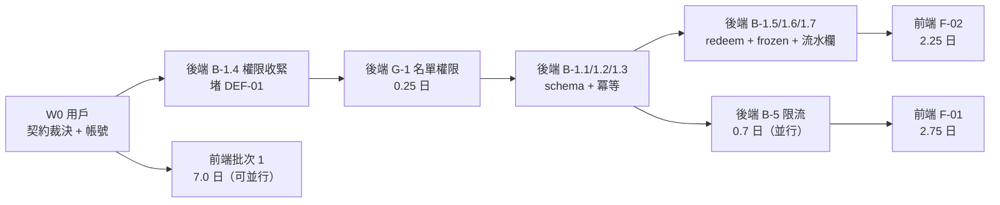

# Admin App 交接前可行性複審（前端外派 × 後端自做）

> **產出**：Neo Loop Engine（JARVIS Agent Network）｜**日期**：2026-09-15
> **品質合約**：strict（Pass Threshold 93）/ L3 Deep Dive
> **研究方法**：DISCOVER 階段獨立研究（morpheus）+ PLAN 階段證據核對（architect，發現 3 個 DISCOVER 未列問題）
> **Repo 基準**：`LinkCard_Event_Admin_App_Expo` @ `e33ca67`（main，working tree clean）
> **新增前提**：⚠️ **前端畫面交由工程師 `feiteng2015` 開發；後端 API 由用戶本人開發**
> **證據基準**：2026-09-15 實測。行號會隨開發變動，**以函式名為準**。

---

## 0. 一句話結論

> **功能清單設計得出來、技術上做得到；但「現在交出去」會卡住——因為 10 個 P0 中有 4 個的前端完全依賴後端尚未實作的能力。**
> 正解不是縮減功能，而是**先凍結契約 + 後端補 5 個阻斷項**，前端即能在第 1 天開工（7.0 人日無依賴工作）。

---

## 1. 複審方法（為什麼可信）

| 階段 | 執行者 | 方法 | 產出 |
|---|---|---|---|
| DISCOVER | morpheus（獨立研究員） | 兩個 repo 實時掃描 + `grep` 驗證 + 契約比對 | 5 個硬阻斷項 + 可行性矩陣 |
| PLAN | architect（規劃部，**非同一 agent**） | 逐項證據核對（file:line）+ 契約凍結草案 + 施工排序 | 3 份交付文件（含 17 個 W-ID） |
| 本報告 | Neo（複審整合） | 交叉比對兩階段結論差異 | 可行性裁決 |

**Maker ≠ Checker**：DISCOVER 與 PLAN 由不同 agent 執行；PLAN 階段**推翻了 DISCOVER 的 1 項評級**（見 §3.1）。

---

## 2. 可行性裁決表（10 個 P0 功能）

| ID | 功能 | 前端可開發？ | 卡在哪 | 裁決 |
|:---:|---|:---:|---|:---:|
| **F-01** | QR 簽到三態（三態 UI + 重複覆核 + 音效震動 + 計數） | 🟡 **部分** | 三態 UI ✅ 可做；**覆核**卡 B-2；**計數**卡新端點；**音效**卡無套件 | ⚠️ 拆成 W-26（可做）/ W-27 / W-28 / W-29 |
| **F-02** | Token 櫃台 wallet-counter | ❌ **不可** | **B-1**（帳務層 6 端點 + 冪等全缺） | 🚫 等後端 B-1a |
| **F-03** | 名單列表 + 搜尋/篩選 | ✅ **可**（搜尋除外） | 分頁/篩選 ✅；`search`/`sortBy` 後端未實作；**OPERATOR 被 403** | ✅ W-03 可開工；W-04 等後端 |
| **F-04** | 四大功能卡首頁 | ✅ **可** | 純前端編排 | ✅ 立即開工 |
| **F-05** | 用戶詳情頁 | ✅ **大部分** | 4 個既有端點拼出 80%；「所屬社團」API 未確認 | ✅ 立即開工（一區塊預留） |
| **F-06** | Credential 統一模型 | ❌ **不可** | 後端無 `EventCredential` model（grep 0 命中） | 🚫 純後端，前端僅批次 3 適配 |
| **F-07** | 權限矩陣與門控 | ❌ **不可** | **B-4**（VOLUNTEER 無任何授權引用） | 🚫 等 B-4 + D12 裁決 |
| **F-08** | EAS 初始化 + projectId | ✅ **可** | 僅需 Expo 帳號權限 | ✅ 立即開工 |
| **F-09** | 真機 E2E | ⏳ **後期** | 需設備 + badge 資料 + 前面全綠 | 批次 3 |
| **F-10** | Badge 批次資料建置 | ✅ **可** | 5 端點全在（`event-ops.routes.ts:60-65`） | ✅ 立即開工 |

### 2.1 統計

| 裁決 | 數量 | 人日 | 說明 |
|---|:---:|:---:|---|
| ✅ 可立即開發 | 5（F-03/F-04/F-05/F-08/F-10） | **7.0** | 無後端依賴 |
| 🟡 部分可開發 | 1（F-01） | 0.75 / 2.75 | 三態 UI 可先做 |
| ❌ 後端阻斷 | 4（F-02/F-06/F-07 + F-01 部分） | 8.0 | 等 B-1 / B-4 / 新模型 |

---

## 3. 5 個硬阻斷項（後端）

> 全部附實測證據。這些是**用戶本人的待辦**（→ `LinkCard_ExpressJS_Backend/docs/20260915_AdminApp_Backend_TODOs.md`）

### B-1 ｜Token 帳務層未實作 🔴 Critical

| 項 | 現況 | 證據 |
|---|---|---|
| wallet 端點數 | **4 條**（balance / transactions / top-up / deduct） | `src/events/routes/premium.routes.ts:12-20` |
| 缺的端點 | `redeem` / `adjust` / `approve` / `reject` / `adjustments` / `report/summary` = **6 條，全 0 命中** | grep routes |
| `REVERSAL` enum 值 | **不存在**（只有 5 值） | `prisma/schema.prisma:1306-1312` |
| `idempotencyKey` | **不存在** | `prisma/schema.prisma:1320-1346`；grep `idempotency` = **0 命中** |
| `EventWalletAdjustment` 表 | **不存在** | `schema.prisma` 無此 model |
| Admin App token 代碼 | **零**（scaffold 級） | v11.3 §5.2 自述 |

**影響**：F-02 整個做不了（2.25 人日）；F-05 的 Token 流水區塊只能顯示既有 5 種類型，無 `reasonCode`/`approvedBy`。

### B-2 ｜`checkIn` 無條件拋 `ALREADY_CHECKED_IN` 🔴 High

| 項 | 現況 | 證據 |
|---|---|---|
| 重複簽到處理 | **無條件 throw**，無 override 參數 | `src/events/services/EventRegistrationService.ts:1042-1044` |
| DTO | `CheckInDto` 只有 `registrationCode` | `EventRegistrationController.ts:205-211` |

**影響**：會議要求的「主管覆核後二次放行」**無法實作**。前端 W-27 阻斷。
**附帶缺口**：`EventRegistration` **無存放覆核理由的欄位** → 稽核不可查詢（須 add `checkInOverrideLog Json?`）。

### B-3 ｜無閘口 / 地點欄位 🔴 High

| 項 | 現況 | 證據 |
|---|---|---|
| 簽到欄位 | 只有 `checkedInAt` / `checkedInBy` | `prisma/schema.prisma:802-803` |
| `gate` 關鍵字 | grep 只命中 `venueName` / `boothLocation`（**不同語意**） | grep gate |

**影響**：會議要求「寫入閘口編號供稽核」無法滿足。前端 W-27 只能顯示時間。

### B-4 ｜`VOLUNTEER` 角色無任何 access 引用 🔴 High

| 項 | 現況 | 證據 |
|---|---|---|
| enum 存在 | `EventOrgRoleType` 有 `VOLUNTEER`（5 值） | `prisma/schema.prisma:1245-1251` |
| 授權使用 | grep `VOLUNTEER` 在 `src/` 僅 3 處且**皆非授權**（表單欄位 + 型別 union） | `registrationForm.ts:41`、`EventService.ts:546` |
| operator guard | 只有 SA / CO / OP | `src/events/services/EventService.ts:440-446` |

**影響**：F-07 權限門控無法收斂；會議 §F 的「閘口 staff / 攤位 staff / 主管 / 主辦方」4 角色無法完整對映。

### B-5 ｜`by-code` 限流 20 次 / 5 分鐘 / IP 🔴 **Critical**

| 項 | 現況 | 證據 |
|---|---|---|
| 限流設定 | `windowMs: 5*60*1000, limit: 20, keyGenerator: ipKeyGenerator(req.ip)` | `src/events/routes/registrations.routes.ts:15-33` |

**為什麼是 Critical（PLAN 階段由 High 升級）**：

| 面向 | 分析 |
|---|---|
| 用量模型 | 會議 §五：開場尖峰「5 分鐘 500 人入場」。**單一櫃台 5 分鐘可掃 50–100 人** |
| IP 情境 | 展館 WiFi 常為 NAT → 全場工作人員共用 1 個出口 IP → **第一個 20 人就鎖死全場** |
| 位置 | `by-code` 是**簽到流程第一步**（掃碼 → 查詢 → checkin）。它一 429，整條簽到死 |
| 後果 | 現場完全無法簽到 → 被迫人工紙本 → 活動信任度崩 |

---

## 4. PLAN 階段新增發現（DISCOVER 未列）

> **這是複審的價值所在**：第二輪獨立核對推翻了/補充了第一輪。

| # | 發現 | 級別 | 證據 | 為什麼 DISCOVER 漏了 |
|:---:|---|:---:|---|---|
| **G-1** | `GET /registrations` **擋掉 OPERATOR**，但 `checkin` **允許** OPERATOR | 🔴 High | `EventRegistrationController.ts:80` → `EventService.ts:375`（僅 owner/SA/CO）vs `:440-446`（含 OP） | DISCOVER 只掃「端點是否存在」，未交叉比對**同一功能的讀寫權限是否一致** |
| **G-2** | `COORDINATOR` **不能**提 `adjust`（v11.3 限 OWNER/SA） | 🟠 Medium | v11.3 §4.3 row 6 | DISCOVER 未做「會議角色 × v11.3 權限」對映 |
| **R-1** | Pagination 有 **5 種形狀**（3 種 live + 1 文件 + 1 App 型別） | 🟠 High | 見 §5.1 | DISCOVER 只找到 3 處漂移，未窮舉 |
| **R-2** | `/nfc/badges` **連 query 參數名都不同**（`pageSize` vs `limit`） | 🟠 High | `EventNfcBatchService.ts:130,146` | 同上 |
| **DEF-01** | **自助 top-up 漏洞**：參加者（`PART`）可自己給自己加 Token | 🔴 Critical（**現在就在 prod**） | `EventWalletController.ts:59-68`；`registrationAccess.ts:18-35` 允許 registration owner | DISCOVER 未檢視 v11.3 的 DEF 系列 |

### 4.1 G-1 為什麼是「彩排才爆」類風險

```
閘口 staff（OPERATOR）登入 → 首頁看到「名單」卡（W-02 會加）
→ 點進去 → 403 INSUFFICIENT_PERMISSION
```

現場才會發現，且**成本只有 0.25 人日**（新增 `getEventReadAccess` guard）。
→ **強烈建議提到 B-1 之前或並行處理。**

### 4.2 DEF-01 是既有安全漏洞，不是新需求

| 項 | 說明 |
|---|---|
| 現況 | `assertRegistrationOwnershipOrOperator` 允許 registration owner 操作 |
| 後果 | 參加者可無償自發 Token = **直接財務損失** |
| 對映 | v11.3 v1.2 已列為 `DEF-01`，修正 = 收緊為 OP+ only |
| 建議 | **最優先修**（即使冪等還沒做）——權限收緊防「不該發生的交易」，冪等防「重複套用」 |

---

## 5. 契約漂移（必須先凍結，否則外派必然重工）

### 5.1 Pagination 五種形狀 🔴

| # | 來源 | 形狀 | 證據 |
|:---:|---|---|---|
| 1 | `GET /registrations` | `{ total, page, limit, totalPages }` | `EventRegistrationService.ts:1333` |
| 2 | `GET /my-managed` | `{ page, limit, total, totalPages }` | `EventService.ts:560` |
| 3 | `GET /nfc/badges` | `{ total, page, pageSize }`（**query 參數亦為 `pageSize`**） | `EventNfcBatchService.ts:130,146` |
| 4 | **文件** | `{ total, page, limit, pages }` | `docs/api/v11.0-event-module/03-registration-payment-api.md:140` |
| 5 | **Admin App 型別** | `{ total, page, pageSize, pages? }` | `event.service.ts:6-11`、`nfc.service.ts:8` |

> **5 種形狀，沒有任何兩個完全一致。**

### 5.2 `Registration` 型別不符 🔴

| 位置 | 形狀 |
|---|---|
| 後端（by-code / checkin / list） | **flat**：`firstName` / `lastName` / `company` / `jobTitle` / `phone` / `email` / `tokenBalance` / `checkedInAt`（`EventRegistrationService.ts:1088-1098`） |
| Admin App 型別 | `profile: { fullName, email, phone, company, jobTitle }` + `customFields`（`src/types/api.types.ts:66-79`） |

**風險**：`check-in.tsx` 目前能跑，因為它**沒實際讀 `profile.*`**。一旦 W-03/W-05 開始讀姓名 → 拿到 `undefined`。

### 5.3 NFC batch 5 端點零文件

| 項 | 現況 |
|---|---|
| 實作 | ✅ **已完成**（`event-ops.routes.ts:60-65`，`EventNfcBatchController.ts:52-167`） |
| 文件 | ❌ **`docs/api/**` 內 0 命中** |
| 影響 | 前端無法得知契約；且 `/nfc/badges` 的 pagination 形狀與其他端點不同 |

---

## 6. 外派協作風險（CR 系列）

| ID | 風險 | 為什麼會發生 | 緩解 |
|:---:|---|---|---|
| **CR-1** | 契約漂移已實際存在 | §5 已證實 3 處 | **先凍結契約文件**（已產出 `20260915_AdminApp_API_Contract_Freeze_v1.md`）+ 10 項裁決 |
| **CR-2** | 手寫 mock 會製造第 4 份契約 | 「前端沒 API 只好自己掰」是必然反應 | mock 必須由契約型別 `satisfies` 護欄（`tsc` 一改即報錯） |
| **CR-3** | 後端工期是前端的 5 倍 | v11.3：BE 10.5 vs FE 2.0 人日（+ Admin App 新增 → BE 12.65 / FE 15.0） | 後端先交 **B-1a**（4.0 人日）解鎖 2.25 日前端 |
| **CR-4** | Admin App 無 API 文件 | `docs/` 只有 `.project-context.md` + `research/` | 本次已補（契約凍結文件） |
| **CR-5** | staging 0 badge 資料 | 4 個 staging 活動皆無 badge | W-07（0.5 人日）優先做 |
| **CR-6** | VOLUNTEER 設計斷層 | enum 有、授權零 | B-4 先定義語意 |
| **CR-7** | 現場限流未涵蓋 | B-5 | 提到 B-4 之前 |
| **CR-8** | 角色 × 端點無回歸測試 | 無測試框架 | B-4.5 補角色矩陣測試 |

---

## 7. 會議要求 vs 後端實況（期望落差）

> 這些**不能**靠前端假裝解決，否則會造成「畫面說成功、帳實不符」。

| 會議要求 | 後端實況 | 處理 |
|---|---|---|
| 操作可撤銷（Undo 5 秒） | v11.3 **明確不做 undo**（無端點） | 改「二次確認 + 反向 adjust」。**前端不得**用本地刪除假裝 undo |
| 簽到顯示「地點」 | 無 gate 欄位（B-3） | B-3 落地前只顯示時間 |
| 增值預設快捷金額（由 Web 配置） | **無配置端點** | 前端硬編碼起步 |
| 兌換品項價目表（咖啡 −20） | **無價目表 API**（v11.3 D8 未決） | 前端先用 `sourceType` 寫死；價目表屬 P1 |
| 離線暫存 | v11.3 **不做離線**（§5.4） | 走紙本 SOP |
| QR 防截圖冒用 | QR = 靜態 `registrationCode` | ⚠️ **未處理**；需新方案，建議 PM 決定風險接受度 |
| 多語言（繁/簡/英/**葡**） | 無 i18n 基建 | P1；先集中文案以便日後抽取 |

---

## 8. 外派可行性的三個前提（缺一不可）

| # | 前提 | 誰做 | 截止 |
|:---:|---|---|---|
| **1** | **契約凍結 v1 簽核** + 3 項裁決（C-1 pagination / C-2 Registration 型別 / C-3 限流） | 用戶 | 開工首週（W0） |
| **2** | **測試環境**：staging 帳號（COORDINATOR + OPERATOR 各 1）+ Expo 帳號權限 | 用戶 | W0 |
| **3** | **後端 B-1a 交付**（schema + 冪等 + 權限收緊 + redeem + frozen + 流水欄） | 用戶 | 第 3 週前 |

> 前提 1/2 沒交 → 前端 W-01 完全阻塞，7.0 人日的批次 1 全部開不了工。
> 前提 3 沒交 → 批次 2（5.0 人日）開不了工，critical path 平移。

---

## 9. 建議行動順序



| 優先 | 事項 | 人日 | 解鎖 |
|:---:|---|:---:|---|
| 1 | **B-1.4 權限收緊**（堵現有漏洞） | 0.5 | 安全 |
| 2 | **G-1 名單讀取權** | 0.25 | W-03 |
| 2 | **B-5 限流** | 0.7 | 現場可靠性 |
| 3 | **B-1.1~1.3**（schema + 冪等） | 2.0 | W-20..W-25 |
| 4 | **B-1.5~1.7**（redeem + frozen + 流水） | 1.25 | W-21/W-22/W-24 |
| 5 | **B-2 + B-3**（override + 閘口） | 1.95 | W-27 |
| 6 | **B-4**（VOLUNTEER + D12） | 1.75 | W-30/W-31 |

**後端關鍵路徑** = 4.0 人日（B-1a）→ 解鎖前端 2.25 人日 → E2E 1.5 人日 ≈ **7.75 人日 ≈ 2 週**。

---

## 10. 明確不做（避免 scope creep）

| 項目 | 為什麼不做 | 依據 |
|---|---|---|
| BFF / 聚合端點 | 現有 4 端點已拼出 F-05 的 80% | 本報告 §2 |
| `EventGate` 表（閘口管理系統） | 會議只要「記錄編號」 | B-3 |
| MSW（Mock Service Worker） | 無測試框架，需求只是開發期假資料 | CR-2 |
| `search` 加 trigram 索引 | 活動規模數百至數千筆，全表掃描可接受 | 契約 §2.C |
| Repository / Strategy / Factory | 無具體信號 | v11.3 §4.8 |
| 離線模式 / Undo / 跨活動轉移 / NFC tap-to-deduct | v11.3 明確 OOS | v11.3 §5.4 |

---

## 11. 待決策清單（PM / 用戶）

| ID | 決策 | 選項 | 建議 | 阻塞 |
|:---:|---|---|---|:---:|
| **C-1** | Pagination 長期方案 | (a) 維持 3 種 + 改文件 + App 兩型別<br/>(b) 後端統一（**breaking**） | **(a)** | 🚫 W-01 |
| **C-2** | `Registration` 型別 | (a) 前端改 flat<br/>(b) 後端加 `profile` | **(a)**（後端有 3+ 端點用 flat，改前端只動 1 檔） | 🚫 W-01 |
| **C-3** | by-code 限流 | (a) 已認證改 `userId` 計 key + 提高上限<br/>(b) 維持 IP 但放寬<br/>(c) 不改 | **(a)** | 🚫 W-21/W-26 |
| **C-4** | OPERATOR 名單讀取權（G-1） | (a) 新增 `getEventReadAccess` 含 OP<br/>(b) 前端對 OP 隱藏名單卡 | **(a)** — 會議 §F 要「攤位 staff 看自己攤位」 | 🚫 W-03/W-30 |
| **C-5** | COORDINATOR 可否提 `adjust`（G-2） | (a) 維持 OWNER/SA<br/>(b) 開放 COORDINATOR 為 maker | **(a)**（嚴守 maker-checker） | ⚠️ W-22 |
| **C-6** | override 端點形式 | (a) 新端點 `checkin/override`<br/>(b) `checkin` 加 body 參數 | **(a)** — 權限可分離 | 🚫 W-27 |
| **C-7** | 簽到計數語意 | (a) 新端點單日/單場<br/>(b) 降級用現有總數 | **(a)**，(b) 作 fallback | ⚠️ W-29 |
| **C-8** | 「所屬社團」API | (a) 有既有端點<br/>(b) 不做 | **(b)** 起步 | ⚠️ W-05 |
| **C-9** | NFC-08（依 registrationId 查 badge） | (a) 加 query 參數<br/>(b) 不做 | **(a)** — 成本 ≤ 0.25 人日，DB 已有 `registrationId @unique` | ⚠️ W-05 |
| **C-10** | 音效套件 | (a) `expo-audio`<br/>(b) `expo-av`<br/>(c) 只用震動 | **(a)** | ⚠️ W-28 |

---

## 12. 未驗證項（需用戶確認）

| # | 項目 | 為何未驗證 | 影響 |
|:---:|---|---|---|
| U-1 | 「所屬社團/協會」是否有按 userId 反查的 API | association 模組存在但端點未確認 | F-05 一區塊可能做不出 |
| U-2 | `getTransactionHistory` 的 pagination 欄位名 | 未實測該函式回傳 | 前端型別可能錯 |
| U-3 | `wallet/report/summary` 是否本次交付（前端不消費） | 設計有列，進度未知 | 批次 2 是否含報表 |
| U-4 | 現場「收款方式」是否含 `MPAY` | 會議只說記帳，但 UI 需預留「已收款」 | W-22 欄位設計 |
| U-5 | `by-code` 路由是否已解析 `req.user` | 該路由**無 auth 中間件**（public），`req.user` 可能為 undefined | **B-5.1 的前置驗證項** |
| U-6 | 用戶每週可投入的 BE 人日數 | 未知 | 12.65 人日能否塞進 6 週 |

---

## 13. 交付物清單（本次複審產出）

| 文件 | 位置 | 讀者 |
|---|---|---|
| **本文** | `LinkCard_Event_Admin_App_Expo/docs/research/09-feasibility-review.md` | 用戶（決策依據） |
| **前端施工計畫** | `LinkCard_Event_Admin_App_Expo/docs/20260915_AdminApp_Handoff_for_feiteng2015.md` | **feiteng2015** |
| **API 契約凍結規格 v1** | `LinkCard_Event_Admin_App_Expo/docs/20260915_AdminApp_API_Contract_Freeze_v1.md` | 雙方共同真相 |
| **後端待辦** | `LinkCard_ExpressJS_Backend/docs/20260915_AdminApp_Backend_TODOs.md` | 用戶本人 |

---

## 14. 變更記錄

| 版本 | 日期 | 變更 | 原因 |
|---|---|---|---|
| v1.0 | 2026-09-15 | 初版（DISCOVER + PLAN 交叉複審） | Neo Loop（admin-app-handoff） |

---

**END OF FILE**
