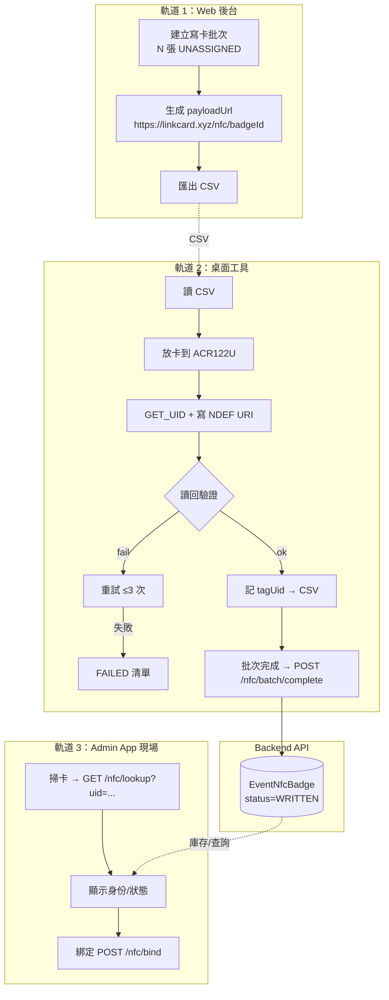

# LinkCard Event — NFC 硬體方案與批次寫入架構深度研究

> 產出日期：2026-09-18 ｜ Loop: `loop-adminapp-vs-web-gap-strategy`
> 品質合約：strict（threshold 93）/ L3 Deep Dive
> 報告類型：外部硬體 × 批次寫卡架構 × 成本供應 × 決策建議

---

## §1 決策問題定義 + 既有研究覆蓋盤點

### 1.1 本文件要回答的 6 個決策問題

| # | 決策問題 | 關聯模組 | 決策後果 |
| --- | --- | --- | --- |
| Q1 | **NFC 寫卡可行性**：ACR122U（或替代方案）能否在 macOS 上可靠地批量寫入 NTAG 標籤？ | 模組 C（NFC 發卡綁定） | 決定 11 月活動是否包含 NFC 寫卡功能 |
| Q2 | **容量充足性**：NTAG213/215/216 的記憶體是否足以容納 LinkCard 所需的 NDEF payload？ | 模組 C | 決定採購哪款晶片 |
| Q3 | **Mac 工具鏈**：Node.js `nfc-pcsc` 是否能在 macOS（含 Apple Silicon）上穩定運行？驅動相容性如何？ | 批次工具 | 決定開發工具棧與最低 Mac 版本要求 |
| Q4 | **批次架構**：Web 後台 ↔ 桌面工具 ↔ Backend API 的端到端流程如何設計？ | Web + Backend + 桌面工具 | 決定工程實作方案 |
| Q5 | **成本與到貨期**：以 2026-09-18 起算，最後可接受下單日是什麼時候？ | 採購與物流 | 決定採購行動 Deadline |
| Q6 | **降級路徑**：若 NFC 方案失敗或來不及，11 月活動怎麼辦？ | 全局 | 決定 Plan B 的觸發條件 |

### 1.2 既有研究覆蓋盤點

| # | 檔案 | 行數 | 覆蓋範圍 | 與本文件的差異 |
| --- | --- | --- | --- | --- |
| R1 | `docs/LinkCard Event related/20260815_LinkCard_NFC_Onboarding_App_Research_v1.0.md` | 441 | iOS Core NFC / Android NFC / 微信小程序 NFC 限制 / 臨時帳號設計 / 合規分析 / 競品分析 | 聚焦**手機端** NFC（App 寫卡 vs 小程序限制），**未覆蓋** USB 讀寫器（ACR122U）的詳細評估、macOS 驅動分析、批次架構 |
| R2 | `docs/LinkCard Event related/20260817_LinkCard_Phase0_Spike_S1_NFC_Research_v1.0.md` | ~100 | NFC spike 快速驗證 | 早期 spike，**內容已被 R1 與 R3 超越** |
| R3 | `docs/LinkCard Event related/20260912_LinkCard_Batch_Write_Trigger_Admin_App_Design.md` | 258 | 批量寫卡觸發位置 + Admin App 雙軌設計 + Backend API 設計 + 路線圖 | **最相關的既有研究**——已定義「Web 管批次 + 桌面工具寫卡 + App 管現場」的三軌架構、5 個 Backend 新端點、桌面工具技術建議。但：(a) ACR122U 評估停留在「知識庫推論」而非實測；(b) 未覆蓋替代方案比較表；(c) 未覆蓋成本供應鏈與到貨期；(d) 未覆蓋晶片容量精算（僅提 NTAG215） |

### 1.3 本文件的增量價值

本文件在 R3 基礎上補充以下 **四個未覆蓋區塊**：

1. **NTAG213/215/216 位元組級容量精算**（含 NDEF overhead、URI prefix 壓縮、多記錄格式比較）
2. **ACR122U × macOS 深度評估**（PC/SC driver、Apple Silicon 兼容性、已知坑、替代方案比較表帶價格）
3. **批次寫卡工具鏈完整實作路徑**（Node.js CLI 架構、冪等性、序號管理、與 Backend `/nfc/batch*` 端點的精確對接）
4. **成本供應鏈與到貨期倒推**（含最後可接受下單日）


---

## §2 晶片容量數學（NTAG213 / 215 / 216）

### 2.1 記憶體規格總覽

| 晶片 | 總記憶體 | 用戶記憶體（pages 4..N × 4B） | **可用 NDEF 容量**（扣除 CC/TLV/terminator） | 寫入壽命 | 典型零售空白標籤價 |
| --- | --- | --- | --- | --- | --- |
| **NTAG213** | 180 B（45 pages） | 144 B（36 pages） | **137 bytes** | ~50,000 次 | ~$0.39–0.55/張 |
| **NTAG215** | 540 B（135 pages） | 504 B（126 pages） | **496 bytes** | ~200,000 次 | 略高（+10–20%） |
| **NTAG216** | 924 B（231 pages） | 888 B（222 pages） | **872 bytes** | ~500,000 次 | 最高 |

> 說明：可用 NDEF 容量 = 用戶記憶體扣掉 Capability Container（第 4 page，4 bytes）、NDEF TLV 標頭（0x03 + 長度）、TLV 結尾（0xFE）與 lock bytes。上述 137/496/872 為業界工具（goToTags、NFC Tools、nfc-tools）通用引用值，且經下述位元組計算反推驗證。

### 2.2 NDEF 單一 URI Record 的結構精算

以 Type 2 Tag 上的 NDEF 訊息為例（NTAG21x 屬 Type 2 Tag）：

```
Page bit 布局（以 NTAG213 為例）：

  Page 0-3   UID (7 bytes) + internal             ← 出廠固化，不可寫
  Page 4     Capability Container (CC) 0xE1       ← 描述格式與容量
             + 0x10 (版本) + 0x12 (max NDEF/8)
             + 0x00 (讀取/寫入存取)
  Page 5..39 用戶記憶體（144 bytes）              ← NDEF 資料區
  (0x03 TLV 標頭) → (NDEF 訊息) → (0xFE 結尾)
```

單一 URI Record 的逐位元組計帳：

| 區段 | 位元組數 | 內容 |
| --- | :-: | --- |
| TLV 標頭 `0x03` + 長度 | 2 | NDEF TLV tag + message length |
| Record header `0xD1` | 1 | MB=1, ME=1, SR=1（short record）, TNF=0x01（Well Known） |
| Type length `0x01` | 1 | URI type 長度 |
| Payload length `0x01` | 1 | SR 模式 payload 長度（1 byte） |
| Type byte `'U'`（0x55） | 1 | URI record type |
| URI 前綴碼 | 1 | **`0x04` = `https://`**（prefix 壓縮） |
| URI 其餘內容 | N | URI 去掉前綴的剩餘部分 |
| Terminator `0xFE` | 1 | NDEF TLV 結尾 |

**NR（NDEF 訊息）總長 = 5 + N**（header + type len + payload len + type + prefix + N）
**TLV 總佔用 = 2 + NR + 1 = 8 + N**

### 2.3 LinkCard payload 精算

LinkCard 標籤需要寫入的 URL：`https://link-card.xyz/nfc/<token>`

- `https://` 前綴 → 壓縮為 `0x04`（省 7 bytes）
- URI 其餘 = `link-card.xyz/nfc/`（**18 字元**）+ token（建議 8–16 字元）

| 晶片 | 可用 NDEF | 可容納的 URI 其餘最大長度（N） | 可容納的最大 https URL 總長 | **LinkCard token 上限** | 餘量 |
| --- | :-: | :-: | :-: | :-: | :-: |
| **NTAG213** | 137 B | 137 − 8 = **129 B** | **137 字元** | 129 − 18 = **111 字元** | ✅ 綽綽有餘 |
| **NTAG215** | 496 B | **488 B** | **496 字元** | **470 字元** | ✅ 巨大餘量 |
| **NTAG216** | 872 B | **864 B** | **872 字元** | **846 字元** | ✅ |

> **計算結論：即使是最小的 NTAG213，URL-only 的 LinkCard payload 也只需 25–33 bytes（5 + 1 + 18 + token），遠小於 137 bytes 上限。** 容量完全不成問題。

### 2.4 若未來需要更多資料（vCard / 多記錄）

| 情境 | Payload 估算 | NTAG213 (137B) | NTAG215 (496B) | NTAG216 (872B) |
| --- | --- | :-: | :-: | :-: |
| URL-only（LinkCard 現需） | ~25–33 B | ✅ | ✅ | ✅ |
| **URL + 活動 ID（36 字元 GUID）雙記錄** | ~94–100 B | ✅（剛好） | ✅ | ✅ |
| **vCard 3.0（典型 ~200 B）** | ~205 B | ❌ 超容量 | ✅ | ✅ |
| **URL + vCard 多記錄** | ~230 B | ❌ | ✅ | ✅ |
| 自訂 binary（URL + GUID + 序號 + 簽名） | ~60–80 B | ✅ | ✅ | ✅ |

多記錄 vs 自訂 binary 格式比較：

| 方案 | 優點 | 缺點 | 建議 |
| --- | --- | --- | --- |
| **NDEF 多記錄** | 標準化、任何 NFC 讀取器可解析、iOS/Android 原生支援 | 每筆記錄 +6 B overhead；解析需用 NDEF 函式庫 | ✅ **11 月推薦**：標準與相容性優先 |
| 自訂 binary 格式 | 極省空間、可含簽名/版本欄位 | 需自建解析器；**第三方裝置（Android/iOS 系統讀卡）無法直接理解** | ❌ 僅在需要簽章防偽時才考慮（近期無） |

> ⚠️ 律師視角提醒：卡片 payload 用 **URL（指向 server）而非 vCard** 的另一個好處是「資料錯誤可事後遠端修正」——實體卡上的 URL 永遠不變，profile 內容由後端控制。這同時解決「現場代填資料錯誤」的風險（R1 §7 已論證）。**LinkCard 11 月應堅守 URL-only**。

### 2.5 建議晶片規格（結論）

> **NTAG215 為建議規格**，理由（依重要性排序）：
> 1. **符合 repo 既有鎖定規格**：`20260712_*` / `20260713_*` Research Draft 已鎖定 NTAG215 為 badge 晶片（R1 §1.5）。統一規格 → 合併採購、避免雙規格庫存。
> 2. **未來彈性**：若 11 月後要寫 vCard 或增加活動 ID 記錄，NTAG213 會卡在 137B 天花板，NTAG215 的 496B 提供 3.6 倍餘裕，完全不需換晶片重寫。
> 3. **成本差異小**：NTAG215 只比 NTAG213 貴約 10–20%（單張 <$0.1 差異），在「會員獲取機器」的戰略脈絡下微不足道。
> 4. 安全性：三款皆支援 4-byte 密碼保護（PWD_AUTH）鎖定寫入，規格相同；NTAG215 寫入壽命 20 萬次更耐用。

> 📌 NTAG213 的適用場景：**僅當**採購方成本極敏感且確定永遠只寫 URL 時。否則一律 NTAG215。


---

## §3 ACR122U 深度評估

### 3.1 硬體規格

| 項目 | ACR122U 規格 |
| --- | --- |
| 主晶片 | **NXP PN532**（業界最成熟 NFC 前端晶片） |
| 介面 | USB 2.0（CCID 協定，隨插即用） |
| 支援標準 | ISO/IEC 14443-A/B、ISO/IEC 18092 …… MIFARE Classic、MIFARE Ultralight、NTAG21x、FeliCa |
| 卡片讀寫 | 讀 UID、讀寫 NDEF、模擬、MIFARE 金鑰驗證 |
| 通訊距離 | 約 5 cm（ISO 14443）、約 8 cm（ISO 18092 被動模式） |
| 供電 | USB 供電（5V，200mA） |
| 尺寸 | 約 98 × 65 × 12.8 mm |
| LED/Buzzer | 有（連讀寫器警示） |
| 附贈 | **13.56MHz 相應卡片（MIFARE 1K demo card）** |

### 3.2 與 NTAG213/215/216 的相容性（關鍵）

ACR122U 透過 PN532 對 Type 2 Tag（NTAG 屬之）的支援是 **成熟且完整** 的：

| 功能 | ACR122U 對 NTAG21x 的支援 | 說明 |
| --- | --- | --- |
| **讀取 UID** | ✅ 完整 | PC/SC GET DATA 指令即取 |
| **讀取 NDEF 資料** | ✅ 完整 | READ 指令依 block 讀 |
| **寫入 NDEF 資料** | ✅ 完整 | WRITE/UPDATE 指令 |
| **格式化為 NDEF** | ✅ 需自行寫 CC page + TLV | `nfc-pcsc` 範例有實作 |
| **PWD_AUTH 密碼保護** | ⚠️ 需 APDU 直通 | 讀寫器不阻擋，但需自行發送 `PWD_AUTH` APDU（NTAG 專用） |
| **鎖定 PWD（永久防寫）** | ⚠️ 需 APDU 直通 | 寫 disable 命令；**11 月建議不用**（要允許補發/換卡） |
| **MIFARE Classic 金鑰** | ✅ 支援 | 非 NTAG 範疇，不需 |

> ⚠️ **重要實用細節**：NTAG213 出廠即為 NDEF 格式（CC 已寫），NTAG215/216 部分批次出廠是**空白**（CC 未寫）。桌面工具需處理「先格式化（寫 CC + 擦除）、再生效」的流程。這在 `nfc-pcsc` 的 `mifare-ultralight-ntag.js` 範例有完整實作模式。

### 3.3 macOS 支援現況（重點）

#### 3.3.1 驅動層

| 層級 | macOS 支援 | 說明 |
| --- | --- | --- |
| **PC/SC API** | ✅ 內建 | macOS 自 10.7 起內建 `PCSC.framework`（`pcsc-lite` 封裝），應用程式直接呼叫 PC/SC 不需安裝額外 SDK |
| **CCID 驅動** | ✅ 內建（IOUSBHostDevice / smartcard 服務） | macOS 內建 `CCID` class driver 可辨識 ACR122U 為智慧卡讀卡機 |
| **ACS 官方驅動** | ✅ 提供 | ACS 提供 `ACR122U macOS Driver`（macOS 10.9–12 支援），但**多為 Intel 版本**；Apple Silicon 需確認 |
| **Apple Silicon（M1/M2/M3/M4）** | ⚠️ 需驗證 | 多数社群回報「macOS Monterey+ 內建 CCID 直接可用」，但**仍有感應器/驅動衝突問題** |

**Apple Silicon 的關鍵脈絡**：
- macOS 內建 CCID 驅動屬**通用架構驅動**，理論上 Apple Silicon 原生支援。
- 但 **ACS 官方 driver 的舊版本（< 2023）多為 x86_64**，需 Rosetta 2 轉譯；新版本（2023+）有 Universal binary。
- 更大的風險：**PC/SC 與其他 USB 裝置的資源衝突**，以及 macOS smart card 服務（`com.apple.securityd` 的 smartcard 外掛）對讀卡機的介入。

#### 3.3.2 已知坑（蒐集自社群實證）

| # | 坑 | 嚴重度 | 影響 | 規避方式 |
| --- | --- | :-: | --- | --- |
| K1 | `com.apple.ifdreader`（智慧卡服務）與應用程式搶佔 ACR122U | 中 | 應用程式無法建立 PC/SC session | 用 `security smartcards` 指令檢查服務；在開發機上停用該服務或改用非系統路徑 |
| K2 | Apple Silicon + 舊版 ACS driver 不相容 | 中 | 安裝 nfc-pcsc 的 native module 時 pcsclite 找不到 | 使用 **macOS 內建 PC/SC**（nfc-pcsc 官方支援），不裝 ACS 驅動 |
| K3 | `node-gyp` 需要 Xcode Command Line Tools | 低-中 | `npm install nfc-pcsc` 失敗 | 確認 `xcode-select --install` 完成 |
| K4 | **大量快速寫卡時 PN532 過熱/通訊逾時** | 中-高 | 批次寫入中途失敗 | 寫入循環加 20–50ms delay + 重試機制 |
| K5 | macOS 通知權限/安全權限彈窗阻擋 | 低 | 首次使用 USB 設備需授權 | 首次連接時點「允許」 |

> ⚠️ **結論**：ACR122U + macOS **可行性高但非零摩擦**。最穩健路徑是**不裝 ACS 官方驅動、直接用 macOS 內建 PC/SC framework + nfc-pcsc**；強烈建議**在採購後立即做 30 分鐘 spike 驗證**（見 §8 決策 Gate）。

### 3.4 Linux / Raspberry Pi / Windows 支援（備援平台）

| 平台 | PC/SC | nfc-pcsc | 備註 |
| --- | --- | --- | --- |
| **Linux (Debian/Ubuntu)** | ✅ 需安裝 `libpcsclite-dev pcscd` | ✅ | 最成熟的批次寫卡平台 |
| **Raspberry Pi** | ✅ 同上 | ✅ | 可當「批次寫卡工作站」獨立運行 |
| **Windows** | ✅ 內建 + ACS 驅動 | ✅ | ACS 官方全力支援（x86/x64） |
| **macOS** | ✅ 內建 | ✅ | 見 §3.3，兼容性需 spike |

### 3.5 缺點與替代必要性（誠實評估）

| 缺點/風險 | 嚴重度 | 說明 |
| --- | --- | --- |
| **穩定性** | 中 | PN532 在**連續大量寫入**時偶發逾時（K4），需 delay + retry |
| **停產/仿冒** | 中-高 | ACR122U 已被 ACS 標示「停產（EOL）」（2023+），市面大量「複刻版」品質參差；**仿冒品 APDU 可能有相容性問題** |
| **寫卡速度** | 低 | 單卡約 1–2 秒（含放卡/讀回驗證），500 卡約 15–20 分鐘（可接受） |
| **無內建批次功能** | 低 | 需自行寫 CLI 工具（本文件 §5） |
| **密碼保護需 APDU** | 低 | 需自行送 PWD_AUTH，但有現成範例 |

> 📌 **關鍵決策含義**：由於 ACR122U 已 EOL，**強烈建議採購時選擇「新款替代」或至少驗證供應商的複刻版品質**。若預算允許，**ACR1252U（PN532 升級版，ACS 仍在產）** 是更穩健的選擇（見 §4 比較表）。


---

## §4 替代方案比較表

### 4.1 讀寫器硬體比較

| 方案 | 價格區間（USD） | 取得難度 | macOS 相容 | 批次寫入可行性 | 寫入速度 | 可自動化 | 適用場景 | 風險 |
| --- | --- | --- | --- | --- | --- | --- | --- | --- |
| **ACR122U**（PN532, EOL） | $15–35 | 高（停產，仿冒多） | ⚠️ 需 spike | ✅ 高 | 1–2 s/卡 | ✅ CLI | **主方案候選** | 仿冒品質、EOL |
| **ACR1252U**（PN532 升級） | $35–60 | 中 | ✅ 較佳（ACS 仍在產） | ✅ 高 | 1–2 s/卡 | ✅ CLI | **推薦替代** | 較貴 |
| **ACR1255U-J1**（藍牙） | $60–100 | 中 | ⚠️（藍牙配對 + 電池） | ⚠️ 中（需藍牙連線） | 1–2 s/卡 | ⚠️ | 移動式寫卡 | 電池、連線穩定性 |
| **Sony RC-S380 / PaSoRi** | $40–70 | 低-中（日系通路） | ✅ 原生支援（macOS 內建驅動） | ⚠️ 中（無批次，需 libusb/nfcpy） | 1–2 s/卡 | ⚠️ | 個人用途 | FeliCa 主導、NDEF 寫卡需 nfcpy |
| **Proxmark3** | $50–150 | 中 | ⚠️（需 libusb + 自編譯） | ✅ 高（極快） | <1 s/卡 | ✅ | 進階/研究用途 | 過度工程、法規敏感性 |
| **PN532 breakout（自製）** | $10–25 | 低 | ⚠️（需 FTDI/USB UART + 驅動） | ✅ 高（自寫） | 1–2 s/卡 | ✅ | 低預算 prototype | 需硬體焊接/設定 |
| **Android 手機 NFC** | $100+（舊機 $30） | 低 | — | ⚠️ 中（逐張） | 1–3 s/卡 | ⚠️ 需 App | 現場 walk-in | 無桌面批量、需 App |
| **iPhone Core NFC** | — | — | ✅ | ❌ 低（前台 session） | 5–15 s/卡 | ❌ | 現場單張 | 僅 iOS 13+、無法批量 |

### 4.2 推薦決策（讀寫器）

```
Primary（11 月）：ACR122U（若買得到正品/可驗證複刻） 或 直接選 ACR1252U
Backup（若 ACR 系列都買不到）：Sony RC-S380（macOS 原生驅動較穩）＋ nfcpy
Last resort（低成本 spike）：PN532 breakout（原型驗證用，不生產）
```

> **決策理由**：
> 1. ACR122U 最便宜、最廣為文件化、社群範例最多（`nfc-pcsc` 官方測試裝置），若驗證成功為性價比最高。
> 2. 但 ACR122U 已 EOL → **若採購容易取得仿冒，寧可直接買 ACR1252U**（同 PN532 晶片、ACS 仍在產、驅動支援更好）。
> 3. 所有方案（除 iPhone）皆可行批次寫卡；關鍵是 **macOS 驅動相容性需 spike**，因此採購後**第一步就是 30 分鐘驗證**（§8）。

### 4.3 標籤型式比較

| 型式 | 單價（批量） | 適用 | 備註 |
| --- | --- | --- | --- |
| **PVC 卡（CR80）** | $0.4–0.8/張 | 掛牌、隨身卡 | 可印刷品牌；堅固 |
| **矽膠手帶（內嵌 NTAG）** | $1.5–3/條 | 入場手帶 | 可選印刷；**活動主題感強** |
| **紙質貼紙（NFC sticker）** | $0.2–0.5/張 | 貼在名牌/手機背 | 最便宜；易損 |
| **混合（PVC 卡 + 貼紙標籤貼序號）** | $0.5–1/卡 | 批次追蹤 | 建議：**卡上印序號 + 貼紙標籤對應 batch** |

> 📌 11 月建議：**NTAG215 矽膠手帶（主）+ 紙質貼紙序號標籤**（追蹤用）。若成本敏感，可改 PVC 卡 + 標籤。**不建議 11 月用紙質貼紙作主體**（現場易折損、掃描困難）。


---

## §5 批次寫入架構設計

### 5.1 端到端流程（三軌分工）

```
┌──────────────────────────────────────────────────────────────────────┐
│ 軌道 1：Web 後台（既有，擴充）                                        │
│  manage/[eventId]/badges 頁                                          │
│  ├── 建立寫卡批次（選票種/人數 → N 張 UNASSIGNED badge 記錄）        │
│  ├── 每張生成 payload URL（https://linkcard.xyz/nfc/{badgeId}）      │
│  ├── 匯出 CSV（卡片清單：序號 + payload + tagUid 預留）              │
│  └── 追蹤批次狀態（待寫/已寫/已發/已綁定）                            │
└──────────────────────────────────────────────────────────────────────┘
                                  │ CSV
                                  ▼
┌──────────────────────────────────────────────────────────────────────┐
│ 軌道 2：桌面工具（Node.js CLI，接 ACR122U/ACR1252U）                  │
│  ├── 讀 CSV → 逐張放卡 → 寫入 NDEF URI                              │
│  ├── 寫入後讀回驗證（tagUid + payload）                              │
│  ├── 失敗重試（最多 3 次）→ 失敗清單                                │
│  └── 批次完成 → POST /nfc/batch/:id/complete（標記 WRITTEN）        │
└──────────────────────────────────────────────────────────────────────┘
                                  │
                                  ▼
┌──────────────────────────────────────────────────────────────────────┐
│ 軌道 3：Event Admin App（現場，既有骨架）                             │
│  ├── Walk-in 單張寫卡（Android NFC）                                 │
│  ├── Check-in / 綁定 / 補發（void 舊卡 → 綁新卡）                    │
│  └── 即時統計（到場人數等）                                           │
└──────────────────────────────────────────────────────────────────────┘
```

### 5.2 Backend 端點對接（精確契約）

既有 backend（`LinkCard_ExpressJS_Backend/src/events/routes/event-ops.routes.ts`）已存在以下端點（需實時確認 controller 邏輯）：

| Method & Path | 用途 | 對應軌道 | 契約備註 |
| --- | --- | --- | --- |
| `POST /nfc/batch` | 建立批量 badge 記錄 | 軌道 1（Web） | request 需含 `{ count, badgeType, ticketTypeId? }`；回應含 `batchId` + 每張 badge 的 `payloadUrl` |
| `GET /nfc/badges` | 列 badge 庫存（分頁/過濾） | 軌道 1 + 3（查詢） | 支援 `?status=UNASSIGNED` 等 |
| `GET /nfc/badges/export` | 匯出寫卡 CSV | 軌道 1 → 軌道 2 | CSV 格式需與桌面工具一致 |
| `POST /nfc/batch/:batchId/complete` | 桌面工具回報寫完 | 軌道 2 | 標記 `WRITTEN`；request 需含 tagUid ↔ badgeId 對應清單 |
| `POST /nfc/batch/:batchId/claim` | 展商領卡 | 軌道 1 | 展商 ↔ badge 綁定 |
| `POST /nfc/bind`（既有） | 現場綁定 badge ↔ registration | 軌道 3 | OPERATOR+ |
| `GET /nfc/lookup`（既有） | 現場查 badge（by uid/qr） | 軌道 3 | 公開 |

> ⚠️ **契約缺口**：既有 `/nfc/batch/complete` 需確認是否接受「tagUid ↔ badgeId」的 mapping 清單，或僅接受 batchId。若僅接受 batchId，**桌面工具需在本地維持 mapping 檔案**（CSV 欄位：`badgeId, payloadUrl, tagUid, status`），完成後一次上傳。

### 5.3 冪等性與重試（關鍵設計）

| 情境 | 設計 |
| --- | --- |
| **寫入中斷**（拔卡/逾時） | 桌面工具逐卡交易：寫入前先 `GET_UID` 記錄卡 UID → 寫入 → 讀回驗證 UID + payload。**任一步失敗 → 該卡標記 FAILED，換卡重試，不影響其他卡** |
| **重複寫入同一卡** | 寫入前檢查該 UID 是否已在本次批次 mapping；是 → 詢問是否覆寫 |
| **重試策略** | 每卡最多 3 次；每次間 50ms delay（PN532 冷卻）；連續 3 次失敗 → 移出批次、列入 FAILED 清單 |
| **批次級冪等** | 以 `batchId` 為冪等鍵；`complete` 端點應支援重複呼叫（同 mapping 不重複寫入） |

### 5.4 序號／標籤管理（實體 ↔ 數位對應）

```
建議流程：
  1. Web 後台建立批次 N 張 → 每張得到 badgeId + payloadUrl（形如 /nfc/{badgeId}）
  2. 匯出 CSV，欄位：badgeId, payloadUrl, batchId, status(UNASSIGNED), tagUid(空)
  3. 列印「序號貼紙」：每張貼紙印 badgeId（QR 或數字）
  4. 桌面工具：貼紙序號 = 卡片順序 → 寫入後把 tagUid 填入 CSV → 上傳 complete
  5. 之後現場：掃卡 → lookup(tagUid) → 顯示 badgeId → 綁 registration
```

> ⚠️ **實體卡序號 vs badgeId 的對應關鍵**：**貼紙序號（可見）≠ tagUid（NFC 內部）**。桌面工具必須在寫卡當下把兩者綁定（寫入 CSV 的 tagUid 欄位）。**不這樣做，現場就不知道哪張卡對應哪個 badgeId。**

### 5.5 建議桌面工具鏈結構

```
tools/nfc-batch-writer/          （新增 repo：LinkCard_ExpressJS_Backend 或獨立 repo）
├── package.json                 依賴：nfc-pcsc、commander（CLI）、csv-parse、axios
├── src/
│   ├── index.ts                 CLI 入口（commander）
│   ├── writer.ts                寫卡核心（nfc-pcsc 封裝）
│   ├── ndef.ts                  NDEF URI 建構/驗證（復用 LinkCard nfc-utils 的 buildUriNdefMessage）
│   ├── csv.ts                   CSV 讀取/mapping 管理
│   ├── api.ts                   Backend API client（batch complete 上傳）
│   └── types.ts
├── logs/                        （每批次的寫卡日誌 JSONL）
└── README.md                    使用說明（含 macOS spike 步驟）
```

**寫卡核心流程（writer.ts）：**

```typescript
// 偽代碼（示意，非最終）
async function writeBatch(batch: Batch, cards: Card[]): Promise<WriteResult> {
  for (const card of cards) {
    let attempt = 0;
    while (attempt < 3) {
      try {
        const uid = await reader.getUid();          // 放卡 → 讀 UID
        if (card.tagUid && uid !== card.tagUid) throw new Error('UID mismatch');
        const ndef = buildUriNdefMessage(card.payloadUrl); // https://linkcard.xyz/nfc/{badgeId}
        await reader.formatAsNdef();                // 若空白卡，先寫 CC
        await reader.write(4, ndef);                // 寫 NDEF
        const verify = await reader.read(4, ndef.length);
        if (!verify.equals(ndef)) throw new Error('verify failed');
        card.tagUid = uid;                          // 記住 UID → mapping
        break;
      } catch (e) {
        attempt++;
        if (attempt >= 3) card.status = 'FAILED';
        await sleep(50);
      }
    }
  }
  return { written: cards.filter(c => c.status !== 'FAILED'), failed: ... };
}
```

### 5.6 日誌格式（JSONL）

```jsonl
{"ts":"2026-09-18T10:00:01.000Z","op":"write_start","batchId":"b_123","badgeId":"bg_1","payload":"https://linkcard.xyz/nfc/bg_1"}
{"ts":"2026-09-18T10:00:02.500Z","op":"write_ok","batchId":"b_123","badgeId":"bg_1","uid":"04:AB:CD:12:34:56:78"}
{"ts":"2026-09-18T10:00:03.000Z","op":"write_fail","batchId":"b_123","badgeId":"bg_2","error":"timeout","attempt":2}
{"ts":"2026-09-18T10:00:05.000Z","op":"complete","batchId":"b_123","written":1,"failed":1}
```

### 5.7 完整 Mermaid 流程圖




---

## §6 工具鏈實作路徑（macOS 為主）

### 6.1 Node.js 路線（推薦主路徑）

**`nfc-pcsc`**（[pokusew/nfc-pcsc](https://github.com/pokusew/nfc-pcsc)）— 官方評測：

| 項目 | 評估 |
| --- | --- |
| 狀態 | **活躍度中**：最後 commit 2 年前（2024）；599 stars；380 dependent repos；15 releases（最新 0.8.1 為 5 年前） |
| **官方測試裝置** | **ACR122U（明確標註）**，並聲明「should work with all PC/SC compliant devices」 |
| macOS 支援 | ✅ Node.js 8–20 支援；macOS PC/SC 內建，無需額外安裝 |
| NDEF 寫入 | ⚠️ 非內建 — 需自行組合 NDEF 位元組（但官方範例 `mifare-ultralight-ntag.js` 有完整 NTAG 指令實作）|
| 缺點 | **使用 Node Native Modules（node-gyp / pcsclite）** → 依賴 Xcode CLT；非 React Native（無法用於 App）|

**`@pokusew/pcsclite`**（底層 native binding）：
- 需 node-gyp + Xcode Command Line Tools
- macOS 上使用系統 PC/SC framework

**安裝步驟（macOS）**：
```bash
xcode-select --install    # 確認 Xcode CLT
npm install nfc-pcsc --save
```

**驗證指令（30 分鐘 spike）**：
```bash
# 確認讀卡機被系統辨識
ioreg -p IOUSB -w0 | grep -i "ACR122"
system_profiler SPUSBDataType | grep -A5 -i "ACR122"

# 確認 PC/SC 可連
node -e "
const { NFC } = require('nfc-pcsc');
const nfc = new NFC();
nfc.on('reader', reader => {
  console.log('reader:', reader.reader.name);
  reader.on('card', card => console.log('card UID:', card.uid));
  reader.on('error', err => console.error('reader error', err));
});
nfc.on('error', err => console.error('nfc error', err));
"
```

**可行性評級**：✅ **可行（主路徑）**。首次上手約 2–4 小時（含 spike）。主要阻塞點＝Xcode CLT + pcsclite native build；已知坑見 §3.3.2。

### 6.2 Python 路線（備援）

| 方案 | 評估 |
| --- | --- |
| **nfcpy**（Sony 官方推薦）| 支援 ACR122U（部分）/ RC-S380（原生）；macOS 需 libusb；**NDEF 寫入需 TLVs 自組** |
| **pyscard** | 純 PC/SC 封裝；**無 NDEF 高層 API**；需自行組 APDU |

**nfcpy 對 ACR122U**：
- ⚠️ nfcpy 官方支援表將 ACR122U 標為「**partially supported**」（需特殊 mode 切換，且新韌體 ACR122U 可能無法通知 tag 進出）
- **RC-S380 才是 nfcpy 的一等公民**（macOS + libusb 原生）
- 若走 Python 路線 → 建議 **RC-S380 + nfcpy**，而非 ACR122U + nfcpy

**可行性評級**：⚠️ **可行但非首選**（nfcpy 對 ACR122U 支援不完整）。

### 6.3 底層函式庫（Homebrew）

```bash
brew install libusb        # nfcpy/S380 需要
# libpcsclite 在 macOS 內建，不需安裝
# pcscd 在 macOS 由系統服務提供（不需安裝）
```

### 6.4 iOS / Android 備援（活動現場）

| 平台 | 寫卡能力 | 適用 |
| --- | --- | --- |
| **Android** | ✅ NfcAdapter 全讀寫（react-native-nfc-manager）| Walk-in 單張寫卡（Admin App） |
| **iOS** | ⚠️ Core NFC 前台 session、每張 5–15 秒 | 緊急備援；不適合批量 |

> 現有 Admin App 的 `nfc.service.ts` 已實作 `lookup`/`listBadges`/`bind`；`react-native-nfc-manager` 在 Promoter App 已有寫卡實作可覆用（`src/utils/nfc-utils.ts` 的 `buildUriNdefMessage` / `writeUriToCard`）。

### 6.5 路線決策

```
Primary（11 月）：Node.js + nfc-pcsc + ACR122U/ACR1252U  （macOS 開發、Linux/Win 可跑）
Backup（nfc-pcsc 失敗）：Python + nfcpy + RC-S380
即時備援（現場）：Android Admin App 單張寫卡
```

