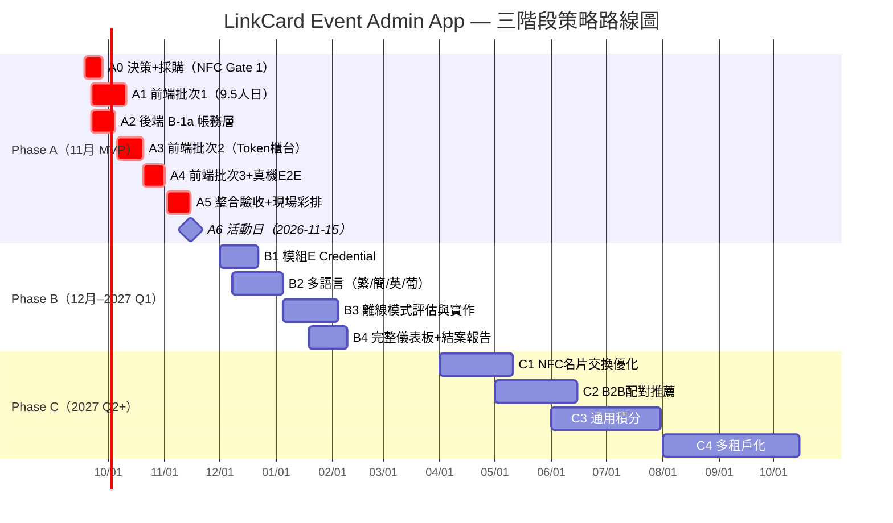

# LinkCard Event Admin App — 長遠策略路線圖

> **文件類型**：規劃部 PLAN 階段交付物 — 三階段策略路線圖
> **產出日期**：2026-09-18 ｜ Loop: `loop-adminapp-strategic-roadmap`
> **品質合約**：strict（Pass Threshold 93）/ L3 Deep Dive
> **交付目標**：供 feiteng2015 與用戶決策 11 月活動的整體方向
> **證據基準**：doc 13 `e3c68b8` / doc 14 `fe2ec4f` / Plan v1 v1.0-r5 / Handoff v1.0-r5
> **文件狀態**：完成（§1–§5 + 附錄）｜ 5 章節 hackathon commits 完成

---

## §1 願景與定位

### 1.1 一句話願景

> **LinkCard Event Admin App 不是活動管理工具，而是一台「線下會員獲取機器」。**

此願景直接來自 Plan v1 §十（`docs/LinkCard Event related/20260917_LinkCard_Event_Admin_App_Plan_v1.md`，`:280-301`）：

> 「這不是一個活動管理工具，而是一台『會員獲取機器』。」
> 「獲客路徑：主辦方的活動流量 → LinkCard 註冊用戶。LinkCard 不需自己買量，靠澳門創業節這類活動零成本沉澱真實 B 端用戶。」

NFC 手帶是這台機器的物理載體——「活動結束、手帶被留下來，它同時是 LinkCard 電子名片的實體入口。用戶每次被問『你係邊個』，碰一下就是產品曝光」（Plan v1 `:287-289`）。

### 1.2 四端定位（實測驗證）

doc 13 §2.1 以實測驗證了 Plan v1 §一（`:8-21`）的端分工原則：

| 端                              | 定位           | 主要使用者                 | 11 月交付範圍                                       | 核心限制                                       |
| ------------------------------- | -------------- | -------------------------- | --------------------------------------------------- | ---------------------------------------------- |
| **Admin App**（Expo）           | 現場作戰終端   | 現場工作人員 / 攤位 / 督導 | 模組 A（QR 簽到）、C（NFC 發卡）、G（降級統計）     | Android-only NFC；無名單頁；無 Token 頁        |
| **Admin Web**（Next.js）        | 配置／管理中樞 | 主辦方 / 運營              | 模組 D（名單）、F（org-roles）、B（Token 櫃台建議） | 無 NFC 讀寫；check-in 路由不可達               |
| **Backend**（Express + Prisma） | 唯一真相來源   | —                          | A/B/C/D/F 端點                                      | `checkin-stats` 不存在；`EventCredential` 未建 |
| **Hardware**（NFC 卡／手帶）    | 實體載體       | —                          | C（發卡）                                           | 需 Android 裝置 + NDEF 預格式化                |

> 證據來源：doc 13 §2.1「四端定位對照」表；doc 13 §2.2-2.4 逐端實測；doc 13 §5.5「責任分工建議」。

**關鍵發現：App 的不可替代性在 NFC，不在掃碼。** Web 已有可用的相機掃碼簽到（`@yudiel/react-qr-scanner`，doc 13 §5.3），App 的獨佔功能是 NFC 寫卡（doc 13 §5.3「平台不可能——Web 無 NFC 讀寫」）。但多數功能應「雙端共用同一 API、UI 各自最適化」（doc 13 §5.4）。

### 1.3 11 月活動的成敗定義（KPI 導向）

Plan v1 §十（`:291-297`）明確要求埋下三個數據鉤子：

|     #     | 數據鉤子                                        | 為什麼重要                                 | 衡量方式                                             | 對應功能模組                  |
| :-------: | ----------------------------------------------- | ------------------------------------------ | ---------------------------------------------------- | ----------------------------- |
| **KPI-1** | **註冊轉化率**（報名 → 成為 LinkCard 正式用戶） | 證明「活動即獲客」的商業假說               | 後台: 臨時帳戶轉正式帳號的比例                       | A（簽到）+ D（補報名）        |
| **KPI-2** | **活動後 30 天留存 / DAU**                      | Token 強迫用戶反覆打開 App，「註冊即活躍」 | 後台: 30 日 DAU / 報名人數                           | B（Token）+ C（NFC 常用入口） |
| **KPI-3** | **NFC 名片交換次數**                            | 證明「線下硬體反向為線上導流」的結構       | NFC `/exchange` 端點計數（`event-ops.routes.ts:63`） | C（NFC 交換）                 |

**11 月活動的成敗判定**：

| 維度     | 成功基準                                               | 失敗基準                        |
| -------- | ------------------------------------------------------ | ------------------------------- |
| **功能** | QR 簽到 + Token 增扣 + NFC 發卡（降級可 QR）三閉環走通 | 簽到或 Token 任一環節無法運營   |
| **效能** | 掃碼 → 結果 ≤ 1.5s；5 分鐘 500 人開場不癱瘓            | 尖峰 429 導致排隊 > 3 分鐘      |
| **數據** | 三個 KPI 鉤子成功埋入且可回溯                          | 任一 KPI 因功能缺失無法收集     |
| **降級** | NFC 失敗 → QR 手帶仍可完成全流程                       | QR 降級亦無法運營（如限流 429） |

### 1.4 現況錨定（2026-09-18 實測）

| 層級             | 現況                                                                     | 信心等級 | 關鍵缺口                                                              |
| ---------------- | ------------------------------------------------------------------------ | :------: | --------------------------------------------------------------------- |
| **App 骨架**     | 10 頁面、5 service、design token、auth 閉環、tsc/eslint 全過             |  ✅ 高   | 真機 0 / EAS build 0 / 自動化測試 0（doc 13 §2.5）                    |
| **Web 全功能**   | 12 項管理頁面已實作；registrations 頁 1256 行                            |  ✅ 高   | check-in 路由在導覽中不可達（doc 13 N-2）；名單無搜尋/排序            |
| **Backend 端點** | A/B/C/D/F 模組端點齊全且已掛載                                           |  ✅ 高   | OPERATOR 403（T-1）、by-code 限流 429（T-2）、checkin-stats 缺（B-7） |
| **NFC 硬體方案** | NTAG215 已定、ACR122U/1252U 已評估、桌面工具棧已選（Node.js + nfc-pcsc） |  ✅ 高   | 讀寫器未採購（最後下單日 9/22）、spike 未做（Gate 1）                 |
| **交接文件**     | Handoff v1.0-r5 + Contract Freeze v1 已就緒                              |  ✅ 高   | 5 處欄位漂移已標記（doc 13 §4）；3 個地雷仍成立（T-1/T-2/T-3）        |

> 證據來源：doc 13 §6.1「一句話回答」——「App 已具備骨架交棒條件，但尚未具備功能交棒條件」；doc 13 §2.5「執行期證據的共同缺口」；doc 14 §4「替代方案比較表」；doc 13 §4「stale claim 更正表」。

### 1.5 本文件的策略框架

本路線圖以 **三階段** 展開：

```
Phase A（11 月 MVP）→ 11 月 Macau Startup Festival 首次實戰驗證
Phase B（12 月–2027 Q1）→ 補齊核心功能、跨平台完善、運營優化
Phase C（2027 Q2+）→ 戰略升級：NFC 社交 + B2B 配對 + 通用積分 + 多租戶
```

每階段的設計原則：

1. **Codebase Reality First**：所有範圍判定基於 doc 13 的實測差距矩陣，非理想規格
2. **Gate-Driven**：NFC 路線依 doc 14 §8.3 的 4 個 Gate 判定，不賭
3. **降級優先**：每個階段都有明確的降級路徑（doc 14 §8.2），確保最壞情境仍可交付
4. **KPI 導向**：三個數據鉤子貫穿三階段，每階段都需驗證或延伸

---

## §2 三階段路線圖

### 2.0 路線圖總覽



### 2.1 Phase A — 11 月 MVP（2026-09-18 → 11-15）

#### 範圍與定位

Phase A 的目標不是「交付所有功能」，而是**讓 11 月活動的三個閉環（簽到 / Token / 發卡）在現場真實運營**。範圍由 doc 13 的 11 月可行性判定決定：

| 模組                 | 11 月可行性（doc 13 §3.8） | Phase A 範圍                                                                  |
| -------------------- | -------------------------- | ----------------------------------------------------------------------------- |
| **A** QR 掃碼簽到    | **高**                     | ✅ 三態簽到 + 票種/餘額顯示 + 音效/震動/大字 + 重複簽到覆核                   |
| **B** Token 增扣     | **低（全新建設）**         | ✅ 做 **Web 端櫃台**（建議，doc 13 §5.6）+ 後端 4 端點強化                    |
| **C** NFC 發卡       | **中**                     | ✅ 依 Gate 判定：Gate 過 → 批量寫卡；Gate 敗 → QR 手帶                        |
| **D** 名單與現場管理 | **中（Web 優先）**         | ✅ Web 名單搜尋/排序 + OPERATOR 403 修復；**App 端不做名單頁**                |
| **E** 憑證/會員      | **極低**                   | ❌ **11 月不做**（doc 13 §3.5「本次實測確認模型確實不存在」）                 |
| **F** 權限           | **中**                     | ✅ 角色感知 UI + OPERATOR 讀名單修復                                          |
| **G** 儀表板         | **低（完整）/ 高（降級）** | ✅ 用 App 降級版（`pagination.total` 技巧，doc 13 §3.7）；❌ 完整版 11 月不做 |

> 範圍裁決來源：doc 13 §3.8「矩陣總結表」；doc 13 §6.4「最需要用戶先拍板的 3 項」——① Token 櫃台做 Web ② 音效套件決策 ③ 模組 E 延後。

#### 關鍵依賴（施工順序）

**前端（feiteng2015，依據 Handoff §3 三批施工）**：

| 批次   | 時程        | 內容                                      |   人日   | 前置                                             |
| ------ | ----------- | ----------------------------------------- | :------: | ------------------------------------------------ |
| 批次 1 | 9/22–10/05  | F-04/F-03a/F-05/F-08/F-10 + W-09..W-15    | **9.5**  | 契約 v1 簽核 + 3 裁決（Handoff §4.4 P1-1..P1-4） |
| 批次 2 | 10/06–10/19 | F-02 wallet-counter → F-01 三態簽到       | **5.75** | B-1a 完成（W-20..25）；B-2/B-3/B-5               |
| 批次 3 | 10/20–10/26 | F-07 權限門控 + F-06 適配 + F-09 真機 E2E | **3.0**  | B-4 + D12 裁決                                   |

**後端（用戶本人，依據 Handoff §3.1）**：

| 施工項      | 內容                                                                                    | 人日 | 解鎖            |
| ----------- | --------------------------------------------------------------------------------------- | :--: | --------------- |
| **B-1a**    | 帳務層：冪等（`idempotencyKey` + migration）+ `top-up`/`deduct` 強化 + `balance.frozen` | 4.0  | W-20..W-25      |
| **B-1b**    | `adjust`/`approve`/`reject`（maker≠checker）                                            | 4.0  | W-22b           |
| **B-2/B-3** | `checkIn` override + `gateId` 欄位                                                      | 1.95 | W-27            |
| **B-5**     | by-code 限流放寬（NAT 共用 IP 必爆）                                                    | 0.7  | 模組 A 現場可用 |
| **B-4**     | VOLUNTEER 定義 + 讀取權                                                                 | 1.75 | W-30            |
| **B-6**     | `listRegistrations` 加 `search`/`sortBy`/`sortOrder`                                    | 0.75 | W-04            |
| **B-7**     | `/checkin-stats` 端點（或降級 fallback）                                                | 0.75 | W-29            |

> ⚠️ **唯一 critical path 風險**：`B-1a` 延後 → F-02 整條平移（Handoff §3.1 Gantt 警告）。後端鏈 `B-1a 4.0` → `max(B-1b 4.0, B-2+B-3 1.95, B-5 0.7, B-4 1.75)` = **8.0 人日**（Handoff §3.1「關鍵路徑（重算）」）。

#### Phase A 里程碑

| 里程碑                   | 日期  | 驗收標準                                                                      |
| ------------------------ | ----- | ----------------------------------------------------------------------------- |
| **M-A1** 開工就緒        | 9/22  | 契約 v1 簽核；3 裁決拍板；staging 測試帳號交付；NFC 最後下單日（doc 14 §7.3） |
| **M-A2** NFC Gate 1      | 9/28  | 讀寫器 30 分鐘 macOS spike 通過（doc 14 §8.3）→ 敗則降級 C（QR-only）         |
| **M-A3** 前端批次 1 完成 | 10/05 | 10 個 P0 功能頁可跑；tsc/lint 全過                                            |
| **M-A4** NFC Gate 2      | 10/13 | 桌面工具能寫 1 張 + 驗證 + 回報 backend → 敗則降級 B（App 逐張）              |
| **M-A5** 前端批次 2 完成 | 10/19 | Token 櫃台 + 三態簽到完成；後端 B-1a/B-5 已交付                               |
| **M-A6** NFC Gate 3      | 10/30 | 批量寫完全部展商卡 1200+ → 敗則降級 B                                         |
| **M-A7** 整合驗收        | 11/02 | 全鏈路走通（報名→簽到→發卡→增值→核銷→報表）                                   |
| **M-A8** NFC Gate 4      | 11/12 | 現場演練走通 → 敗則降級 A（QR 手帶）                                          |
| **M-A9** 活動日          | 11/15 | 三閉環真實運營；三個 KPI 鉤子可回溯                                           |

#### Phase A 風險焦點

| 風險              | 來源                          | 緩解                                                                                   |
| ----------------- | ----------------------------- | -------------------------------------------------------------------------------------- |
| 開場尖峰 429      | doc 13 T-2 / Handoff TL;DR #7 | **B-5 為模組 A 硬依賴**（doc 13 §4.2「B-5 應列為模組 A 的硬依賴而非並行項」）          |
| OPERATOR 全數 403 | doc 13 T-1 / Handoff TL;DR #6 | **1 行改動**：`getEventWriteAccess` → `getEventOperatorAccess`（doc 13 §4.2 T-1 建議） |
| NFC 硬體未到      | doc 14 R1/R2                  | 9/22 淘寶下單；本地通路 buffer 到 9/27（doc 14 §7.3）                                  |
| 真機從未驗證      | doc 13 §2.5（真機 0）         | W-32 真機 E2E 排入批次 3；EAS build 初始化（W-06）                                     |

#### Phase A 負責人建議

| 角色     | 負責人          | 範圍                                     |
| -------- | --------------- | ---------------------------------------- |
| 前端施工 | **feiteng2015** | Handoff 三批次 30 W-ID（17.25 承諾人日） |
| 後端施工 | **用戶本人**    | B-1a/b、B-2..B-7（約 14 人日）           |
| 硬體採購 | **用戶 / PM**   | doc 14 §7.3 最後下單日 9/22              |
| 契約裁決 | **用戶**        | Handoff §4.4 的 P1-1..P1-4、C-1..C-18    |
| 現場彩排 | **專案負責人**  | W6 實地彩排（Plan v1 §七「別省這一步」） |

---

### 2.2 Phase B — 補齊與完善（2026-12 → 2027 Q1）

#### 範圍與定位

Phase B 的目標：**把 11 月驗證過的核心流程產品化**，補齊 P1 功能，讓 LinkCard Event 從「單場可用」變成「可重複交付的產品」。

| 工作項                     | 內容                                                                      | 依賴                                                                                | 優先級 | 對應 Plan v1      |
| -------------------------- | ------------------------------------------------------------------------- | ----------------------------------------------------------------------------------- | ------ | ----------------- |
| **B-P1 模組 E Credential** | 後端 `EventCredential` 模型（B-8，2.0 BE 人日）+ App/Web 憑證展示（W-31） | 無（全新，11 月不做釋放的 2.0 人日移至此）                                          | 🟡 P1  | 模組 E            |
| **B-P2 多語言**            | 繁/簡/英/葡四語言資源檔；i18n 抽離                                        | 文案集中在 `copy.zh-TW.ts`（Handoff §6「批次 1–3 先全繁中…以便日後抽 i18n」）       | 🟡 P1  | 會議 §五多語言    |
| **B-P3 離線模式**          | 場館弱網本地暫存 + 聯網補同步                                             | **schema 已備**：`offlineSeqNum`/`syncStatus`/`terminalId`/`syncedAt`（doc 13 N-1） | 🟢 P2  | 會議 §P2 / 模組 A |
| **B-P4 完整儀表板**        | 時段曲線、Token 聚合、閘口工作量、結案報告                                | `/checkin-stats` + 新 aggregate 端點 + `gateId` 欄位                                | 🟡 P1  | 模組 G            |
| **B-P5 現場補報名**        | App/Web walk-in 建臨時帳戶 → Email → 發卡                                 | 端點已存在（`POST /registrations`）                                                 | 🟡 P1  | 模組 D            |
| **B-P6 押金退款追蹤**      | Web 端 `markDepositRefund` 完善 + 稽核視圖                                | 端點已存在（`registrations.routes.ts:95`）                                          | 🟡 P1  | 模組 D            |
| **B-P7 真機驗證制度化**    | 建立 device E2E checklist 與回歸流程；補自動化測試                        | W-32 的 `docs/20260915_AdminApp_Device_E2E_Checklist.md`                            | 🔴 P0  | Handoff §8.2 T6   |

> ⚠️ **N-1 取捨提示（doc 13 §4.4）**：離線 schema 若長期不用是 4 個死欄位。Phase B 若確定做離線，成本低於預期；若不做，應在裁決中明示（不建議刪，因澳門展館弱網是 Plan v1 明載痛點）。

#### 里程碑

| 里程碑                   | 日期  | 驗收標準                                          |
| ------------------------ | ----- | ------------------------------------------------- |
| **M-B1** 11 月回顧裁決   | 12/01 | 以 11 月三個 KPI 數據決定 Phase B 優先序          |
| **M-B2** Credential 上線 | 12/22 | 模型 + 三端展示走通；QR 渲染統一                  |
| **M-B3** 多語言完成      | 01/05 | 四語言無溢出、無漏翻（UAT §八）                   |
| **M-B4** 離線 Alpha      | 02/01 | 弱網暫存 + 聯網補同步；同步衝突處理               |
| **M-B5** 完整儀表板      | 02/15 | 時段曲線 + Token 聚合 + 閘口工作量 + 結案報告模板 |

#### 負責人建議

| 角色                    | 負責人                        | 範圍                                |
| ----------------------- | ----------------------------- | ----------------------------------- |
| Credential + 儀表板後端 | 用戶本人                      | B-8 + aggregate 端點                |
| 多語言 + 離線前端       | feiteng2015（或第二位工程師） | i18n 抽離、離線佇列                 |
| 數據分析                | 用戶 / PM                     | 11 月 KPI 數據解讀 → Phase B 優先序 |

---

### 2.3 Phase C — 戰略演進（2027 Q2+）

#### 範圍與定位

Phase C 的目標：**把 11 月驗證的「會員獲取機器」升級為「線下商業網絡平台」**。這是 Plan v1 §十（`:289`）明示的演進方向：

> 「演進方向：靜態會員卡 → 動態活動平台 → 線下商業網絡（NFC 名片交換 + B2B 配對 + 通用積分）。」

| 工作項                    | 內容                                                                              | 依賴                                                                     | 商業價值                                   | 對應 Plan v1              |
| ------------------------- | --------------------------------------------------------------------------------- | ------------------------------------------------------------------------ | ------------------------------------------ | ------------------------- |
| **C-P1 NFC 名片交換優化** | NFC `/exchange` 端點（`event-ops.routes.ts:63`）產品化：碰一下交換名片 + 交換紀錄 | Phase A NFC 成功（Gate 1-4 全過）                                        | **KPI-3 直接放大**；產品曝光引擎           | P2「名片交換」            |
| **C-P2 B2B 配對推薦**     | 依名片交換 + 活動參與資料做商業配對推薦                                           | C-P1 數據累積                                                            | 主辦方賣點；參展商付費點                   | P2「B2B 配對」            |
| **C-P3 通用積分**         | Token 跨活動通用；活動後餘額轉 LinkCard 通用點數                                  | Plan v1 待決策 #6（「後者是最佳會員留存鉤子」）                          | 跨活動留存；把「活動內貨幣」變「平台貨幣」 | P2「通用積分」/ 待決策 #6 |
| **C-P4 多租戶化**         | SaaS 化；多主辦方自助後台                                                         | Plan v1 待決策 #7（「11 月由 LinkCard 團隊代配置；創業節後再做租戶化」） | **對外販售前提**；收入模式                 | P2「多租戶」              |
| **C-P5 支付串接**         | MPay / 信用卡 App 直接收款自動入 Token                                            | 模組 B 成熟 + 澳門支付合規                                               | 攤位收款自動化；B 端收費點                 | P2「支付」                |
| **C-P6 Booth Mode**       | 精簡攤位模式：只留「掃碼 → 扣點」                                                 | 模組 B 成熟                                                              | 可交給非技術人員；擴攤位覆蓋               | P2「Booth Mode」          |

#### 里程碑

| 里程碑                  | 日期    | 驗收標準                                    |
| ----------------------- | ------- | ------------------------------------------- |
| **M-C1** NFC 交換上線   | 2027-04 | 名片交換次數達 11 月活動的 3 倍             |
| **M-C2** B2B 配對 Alpha | 2027-05 | 配對推薦準確率可量測（參與者滿意度）        |
| **M-C3** 通用積分       | 2027-06 | 跨兩場活動 Token 可流通；活動後餘額轉換成功 |
| **M-C4** 多租戶 Beta    | 2027-08 | 第二位主辦方自助開通活動                    |

#### Phase C 風險焦點

| 風險                                 | 緩解                                                                 |
| ------------------------------------ | -------------------------------------------------------------------- |
| 名片交換是「活動內」還是「平台級」？ | 先做活動內交換，數據累積後再平台化（C-P1 → C-P2 依序）               |
| 通用積分牽涉跨活動帳務               | 以 11 月 Token ledger 的 `scope` 欄位設計為起點（Plan v1 待決策 #3） |
| 多租戶需重新設計 auth 與資料隔離     | 11 月權限體系（模組 F）是基礎；Phase C 前先做租戶隔離架構研究        |
| SaaS 化後維護成本                    | 建立 phase B 的自動化測試（B-P7）是前提；避免單場客製硬編            |

#### 負責人建議

| 角色     | 負責人             | 範圍                                         |
| -------- | ------------------ | -------------------------------------------- |
| 產品策略 | 用戶 / PM          | 通用積分規則、B2B 配對演算法、多租戶商業模式 |
| 平台工程 | feiteng2015 + 擴編 | NFC 交換、租戶隔離、支付串接                 |
| 數據     | 用戶               | 名片交換 → 配對推薦的數據閉環                |

---

### 2.4 三階段策略總結

| 階段        | 時間       | 核心目標                | 驗證方式                    | 主要風險                           |
| ----------- | ---------- | ----------------------- | --------------------------- | ---------------------------------- |
| **Phase A** | 9/18–11/15 | 三閉環現場真實運營      | 11 月活動三個 KPI           | 尖峰 429 / OPERATOR 403 / NFC 硬體 |
| **Phase B** | 12–2027 Q1 | 單場 → 可重複交付產品   | Phase B 里程碑 + 第二場活動 | 離線同步 / Credential 重工         |
| **Phase C** | 2027 Q2+   | 活動工具 → 商業網絡平台 | 名片交換量 / 多主辦方採用   | 通用積分帳務 / 租戶隔離            |

**三階段的延續性**：Phase A 的設計決策（Token `scope` 欄位、權限體系、NFC URL-only payload）都是為 Phase C 鋪路；Phase B 是 A → C 的橋樑（把單場的臨時方案變成產品基礎）。

---

## §3 資源與依賴分析

### 3.1 人力資源

#### 11 月（Phase A）角色分工

| 角色                    | 人日/週 | 11 月負擔                                                     | 來源                                        |
| ----------------------- | :-----: | ------------------------------------------------------------- | ------------------------------------------- |
| **feiteng2015（前端）** |  ~3.5   | 批次 1–3 共 **17.25 承諾人日** + 彩排支援 0.5                 | Handoff §3「產能假設」；§TL;DR #4           |
| **用戶本人（後端）**    |   ~3    | B-1a/b + B-2..B-7 ≈ **14 人日**                               | Handoff §3.1「後端側對應假設為每週 3 人日」 |
| **用戶（PM/裁決）**     |    —    | 契約簽核、3+ 裁決、staging/Expo 帳號、硬體採購                | Handoff §4.4 前置條件                       |
| **主辦方**              |    —    | 活動日期/人數/標籤型式確認                                    | doc 14 §9.2 U-2/U-3/U-4                     |
| **阿聰（後端/系統）**   |    —    | `/nfc/batch*` 契約確認（doc 14 U-1）；Email/帳戶/Token ledger | Plan v1 §九待辦                             |

> ⚠️ **產能假設需用戶裁決**（Handoff §3.1「批次 1 實際為 9.5 人日，即約 2.7 週（非原估 2 週）——需用戶裁決（裁決 C-18）」）。

#### 12 月後（Phase B）人力規劃

| 角色           | 建議                         | 理由                                                    |
| -------------- | ---------------------------- | ------------------------------------------------------- |
| feiteng2015    | 持續（若 11 月表現符合預期） | 熟悉 codebase；模組 E 前端、多語言、離線 UI             |
| 用戶本人       | 後端 + 產品                  | Credential 模型、aggregate 端點、通用積分規則           |
| **第二位前端** | 視負載決定                   | 多語言（4 語）資源檔 + 離線 UI 是獨立工作流             |
| **翻譯資源**   | 外部約聘                     | 繁/簡/英/葡（Plan v1 待辦 #15「需翻譯資源，提前安排」） |

#### Phase C 人力

| 角色       | 建議                                                      |
| ---------- | --------------------------------------------------------- |
| 平台工程   | feiteng2015 + 擴編 1–2 人（NFC 交換、租戶隔離、支付串接） |
| 產品/數據  | 用戶 / PM（B2B 配對演算法、通用積分帳務）                 |
| 主辦方成功 | 多租戶自助開通後的 onboarding                             |

### 3.2 外部依賴

| 依賴                            | 對象   |         最後期限          | 來源                         | 風險                        |
| ------------------------------- | ------ | :-----------------------: | ---------------------------- | --------------------------- |
| **讀寫器採購**（ACR122U/1252U） | 供應商 | **9/22 淘寶 / 9/27 本地** | doc 14 §7.3「⚠️ 最後下單日」 | 🔴 到貨延遲（doc 14 R1）    |
| **NTAG215 標籤**（手帶/卡）     | 印刷廠 |         9/22–9/30         | doc 14 §7.1/7.3              | 🟡 印製錯誤（R7）；打樣先驗 |
| **契約 v1 簽核 + 裁決**         | 用戶   |        9/22（W0）         | Handoff §4.4 P1-1..P1-4      | 🔴 W-01 阻塞                |
| **staging 測試帳號**            | 用戶   |           9/22            | Handoff P1-5                 | 🟡 無法驗證                 |
| **Expo 帳號**（EAS init）       | 用戶   |         W-06 排程         | Handoff P1-6                 | 🟡 EAS build 受阻           |
| **活動日期/人數確認**           | 主辦方 |         **9/22**          | doc 14 U-2/U-4               | 🟡 影響倒推時程             |
| **標籤型式決策**（手帶 vs PVC） | PM     |           9/22            | doc 14 U-3                   | 🟡 採購延誤                 |
| **翻譯資源**                    | 外部   |       Phase B 前置        | Plan v1 待辦 #15             | 🟡 4 語資源檔延誤           |

### 3.3 技術依賴（Backend 缺口）

doc 13 §6.3「須先解決前置依賴才能交棒」的清單是本路線圖的技術關鍵路徑：

| 後端施工項   | 內容                                                                                                                              | 人日 | 解鎖                       |       風險等級        |
| ------------ | --------------------------------------------------------------------------------------------------------------------------------- | :--: | -------------------------- | :-------------------: |
| **B-5**      | `by-code` 限流改 key + 放寬（`registrations.routes.ts:12-26`，現 20/5min/IP）                                                     | 0.7  | 模組 A 開場不 429          |         🔴 高         |
| **B-1a**     | 冪等 `idempotencyKey`（**全庫不存在，需 migration**，doc 13 M-3）+ `top-up`/`deduct` 強化 + `balance.frozen` + **M-4 發起人欄位** | 4.0  | W-20..W-25                 |         🔴 高         |
| **T-1 修復** | `getEventWriteAccess` → `getEventOperatorAccess`（1 行 + 迴歸）                                                                   | ~0.1 | OPERATOR 讀名單            | 🔴 高（錯則全員 403） |
| **B-2**      | `checkIn` override（現 `:1044` 無條件拋錯）                                                                                       | 1.1  | W-27 重複簽到覆核          |         🟡 中         |
| **B-3**      | `gateId` 欄位（migration；`schema.prisma` 無此欄）                                                                                | 0.85 | W-27 顯示地點              |         🟡 中         |
| **B-6**      | `listRegistrations` 加 `search`/`sortBy`/`sortOrder`（現 `:1216-1224` 無）                                                        | 0.75 | W-04 名單搜尋              |         🟡 中         |
| **B-7**      | `/checkin-stats`（確認不存在）或 fallback                                                                                         | 0.75 | W-29 單日計數              |    🟢 低（有降級）    |
| **B-8**      | `EventCredential` 模型（確認不存在）                                                                                              | 2.0  | W-31（**建議 11 月不做**） |         🟢 低         |

> **M-1/M-3/M-4 更正**（doc 13 §4.3）：① 後端動詞是 `deduct` 非 `redeem`；② `idempotencyKey` 全庫不存在，B-1a 需 **Prisma migration**（非純 service 層）；③ wallet 交易**只記錄 `approvedBy` 不記錄發起者**，B-1b 需補 `initiatedBy` 欄位，否則會後對帳無法回答「這筆 +100 是誰按的」。

### 3.4 技術依賴（NFC 工具鏈）

doc 14 §5（批次寫入架構）+ §6（工具鏈實作路徑）定義的技術棧：

| 層               | 技術                                                                | 狀態                   | 來源                     |
| ---------------- | ------------------------------------------------------------------- | ---------------------- | ------------------------ |
| **讀寫器**       | ACR122U（EOL，需驗證正品）或 ACR1252U（推薦）                       | 未採購                 | doc 14 §3/§4             |
| **桌面工具**     | Node.js + `nfc-pcsc` + CLI（`commander`/`csv-parse`/`axios`）       | 未開發                 | doc 14 §5.5              |
| **NDEF 建構**    | 復用 App `nfc-utils.ts` 的 `buildUriNdefMessage` / `writeUriToCard` | 已實作（Android-only） | doc 14 §6.4              |
| **Backend 端點** | `/nfc/batch*` 5 條已掛載（`event-ops.routes.ts:66-70`）             | 已存在未實測           | doc 13 §3.3；doc 14 §5.2 |
| **批次冪等**     | 以 `batchId` 為冪等鍵；每卡 ≤3 次重試 + 50ms delay                  | 設計已完成             | doc 14 §5.3              |

> ⚠️ **契約缺口（doc 14 §5.2）**：`/nfc/batch/complete` 是否接受「tagUid ↔ badgeId」mapping 清單未確認（doc 14 U-1）——若僅接受 batchId，桌面工具需本地維持 mapping 檔案。

### 3.5 資源依賴總結（一句話）

> **Phase A 的資源瓶頸不是人力，是「決策 + 硬體 + 後端前置」三條線。** 契約裁決（9/22）、讀寫器採購（9/22–9/27）、B-5/B-1a 後端前置（10 月中前）三者任一延後，都會沿關鍵路徑壓縮到 11/15 活動日。

---

## §4 排期與里程碑（以 2026-11-15 活動日倒推）

### 4.1 Phase A 週排期（2026-09-18 → 11-15）

> 倒推依據：doc 14 §7.3「以 2026-11-15 為活動日推算」；doc 14 §8.3 的 4 個決策 Gate 已內嵌。

|    週     | 日期        | 里程碑                                  | 驗收標準                                                                                                               | 負責           |
| :-------: | ----------- | --------------------------------------- | ---------------------------------------------------------------------------------------------------------------------- | -------------- |
|  **W0**   | 9/18–9/21   | 決策週                                  | 契約 v1 簽核；裁決 C-1..C-18 拍板；staging/Expo 帳號交付；**Tag 型式與人數確認**                                       | 用戶/PM        |
|  **W1**   | 9/22–9/28   | 開工 + 採購                             | 前端批次 1 開工（W-01）；後端 B-1a 開工；**NFC 最後下單日 9/22（淘寶）/9/27（本地）**                                  | feiteng / 用戶 |
| **W1 中** | **9/28**    | 🔴 **NFC Gate 1**                       | 讀寫器 30 分鐘 spike 通過 → 開發桌面工具；敗 → **降級 C（QR-only）**                                                   | 用戶           |
|  **W2**   | 9/29–10/05  | 批次 1 完成                             | 10 個 P0 頁面可跑；tsc/lint 全過；B-1a 冪等 migration 完成                                                             | feiteng / 用戶 |
|  **W3**   | 10/06–10/12 | Token 櫃台前半                          | F-02 W-20..W-25（需 B-1a）；B-2/B-3/B-5 完成                                                                           | feiteng / 用戶 |
|  **W4**   | 10/13–10/19 | **Gate 2 + 批次 2 完成**                | **NFC Gate 2（10/13）**：桌面工具寫 1 張 + 驗證 + 回報 backend；敗 → **降級 B（App 逐張）**；前端批次 2（5.75 日）完成 | feiteng / 用戶 |
|  **W5**   | 10/20–10/26 | 批次 3 + 真機 E2E                       | F-07/F-06/F-09；W-32 真機 E2E（Android+iOS）；後端 B-4/B-6/B-7 完成                                                    | feiteng / 用戶 |
| **W5 尾** | 10/27–10/30 | **NFC Gate 3**                          | 批量寫完全部展商卡 1200+；敗 → **降級 B**                                                                              | 用戶           |
|  **W6**   | 11/02–11/08 | 整合驗收                                | 全鏈路走通（報名→簽到→發卡→增值→核銷→報表）；併發壓測（5 分鐘 500 人）                                                 | 全員           |
| **W6 尾** | 11/09–11/12 | **NFC Gate 4 + 現場彩排**               | 現場演練走通（**Gate 4，11/12**）；敗 → **降級 A（QR 手帶）**；異常劇本演練                                            | 全員           |
| **W6→W7** | **11/15**   | 🎯 **活動日（Macau Startup Festival）** | 三閉環真實運營；三個 KPI 鉤子可回溯                                                                                    | 全員           |

### 4.2 里程碑 × 驗收標準總表（Phase A）

| 里程碑 ID             | 日期  |  類型   | 驗收標準                             | 失敗行動                  |
| --------------------- | ----- | :-----: | ------------------------------------ | ------------------------- |
| **M-A1** 開工就緒     | 9/22  |  前置   | 契約+裁決+帳號就緒；採購下單         | 延後即壓縮 W1             |
| **M-A2 = NFC Gate 1** | 9/28  | 🔴 Gate | spike 通過                           | **降級 C**                |
| **M-A3** 批次 1       | 10/05 |  交付   | 10 P0 頁面 + tsc/lint                | 溢出則移 buffer W-13/W-15 |
| **M-A4 = NFC Gate 2** | 10/13 | 🔴 Gate | 桌面工具寫卡成功                     | **降級 B**                |
| **M-A5** 批次 2       | 10/19 |  交付   | Token 櫃台 + 三態簽到（需 B-1a/B-5） | B-1a 延後則 F-02 整條平移 |
| **M-A6 = NFC Gate 3** | 10/30 | 🔴 Gate | 1200+ 卡寫完                         | **降級 B**                |
| **M-A7** 整合驗收     | 11/02 |  交付   | 全鏈路 + 壓測通過                    | 進入 hotfix 模式          |
| **M-A8 = NFC Gate 4** | 11/12 | 🔴 Gate | 現場演練走通                         | **降級 A（QR 手帶）**     |
| **M-A9** 活動日       | 11/15 |   🎯    | 三閉環運營 + KPI 可回溯              | —                         |

### 4.3 後端交付排程（與前端並行）

| 後端項                            | 人日 | 排定區間    | 交付節點  | 解鎖                       |
| --------------------------------- | :--: | ----------- | --------- | -------------------------- |
| **B-1a**（冪等+強化）             | 4.0  | 9/22–10/06  | **10/06** | W-20..25（Token 櫃台前半） |
| **B-5**（by-code 限流）           | 0.7  | 9/22–10/06  | **10/06** | 模組 A 現場不 429          |
| **T-1**（OPERATOR 讀取）          | 0.1  | 9/22–9/29   | 9/29      | 名單頁 OPERATOR 可用       |
| **B-2/B-3**（override+gateId）    | 1.95 | 9/29–10/10  | 10/10     | W-27 重複簽到覆核          |
| **B-1b**（adjust/approve/reject） | 4.0  | 10/13–10/17 | **10/17** | W-22b 調整 tab             |
| **B-4**（VOLUNTEER+讀取權）       | 1.75 | 10/06–10/15 | 10/15     | W-30 權限門控              |
| **B-6**（search/sortBy）          | 0.75 | 10/06–10/10 | 10/10     | W-04 名單搜尋              |
| **B-7**（/checkin-stats）         | 0.75 | 10/13–10/17 | 10/17     | W-29 單日計數              |

### 4.4 Phase B 里程碑（2026-12 → 2027 Q1）

| 里程碑 ID                | 日期  |              驗收標準              |
| ------------------------ | ----- | :--------------------------------: |
| **M-B1** 11 月回顧裁決   | 12/01 | 以三個 KPI 數據決定 Phase B 優先序 |
| **M-B2** Credential 上線 | 12/22 |        模型 + 三端展示走通         |
| **M-B3** 多語言完成      | 01/05 |        四語言無溢出、無漏翻        |
| **M-B4** 離線 Alpha      | 02/01 |       弱網暫存 + 聯網補同步        |
| **M-B5** 完整儀表板      | 02/15 |  時段曲線 + Token 聚合 + 結案報告  |

### 4.5 Phase C 里程碑（2027 Q2+）

| 里程碑 ID               | 日期    |          驗收標準           |
| ----------------------- | ------- | :-------------------------: |
| **M-C1** NFC 交換上線   | 2027-04 | 名片交換次數達 11 月的 3 倍 |
| **M-C2** B2B 配對 Alpha | 2027-05 |      配對準確率可量測       |
| **M-C3** 通用積分       | 2027-06 |     跨兩場 Token 可流通     |
| **M-C4** 多租戶 Beta    | 2027-08 |    第二位主辦方自助開通     |

### 4.6 排期核心風險（倒推敏感性）

| 風險                   | 影響                               | 緩衝                                           |
| ---------------------- | ---------------------------------- | ---------------------------------------------- |
| W0 決策延後 > 1 週     | W-01 阻塞 → 批次 1 溢出 → 撞彩排週 | Handoff §3.1「唯一會斷鏈的情境」；提前並行準備 |
| B-1a 延後 > 1 週       | F-02 整條平移 → W-32 撞彩排週      | 後端每週 3 人日假設需維持；B-1a 列最高優先     |
| NFC 採購延後           | Gate 1 無法 9/28 執行              | 9/22 淘寶下單硬期限；本地通路 buffer           |
| 前端產能 < 3.5 人日/週 | 批次 1 溢出                        | 裁決 C-18：承認 2.7 週或移出 buffer pool       |

---

## §5 風險總覽與決策建議

### 5.1 Top 10 風險（彙整 doc 13 / doc 14 / Handoff / Plan v1）

|    #    | 風險                                                        | 機率  |   影響   | 來源                             | 緩解                                                                 | 監測指標                    |
| :-----: | ----------------------------------------------------------- | :---: | :------: | -------------------------------- | -------------------------------------------------------------------- | --------------------------- |
| **R1**  | **開場尖峰 by-code 429**（20 次/5min/IP，NAT 共用出口必爆） |  高   |  🔴 高   | doc 13 T-2 / Handoff TL;DR #7    | **B-5 是模組 A 硬依賴**（doc 13 §4.2）；前端 429 退避                | 限流是否改 key + B-5 交付日 |
| **R2**  | **OPERATOR 讀名單全數 403**                                 |  高   |  🔴 高   | doc 13 T-1 / Handoff TL;DR #6    | 1 行改動 `getEventWriteAccess` → `getEventOperatorAccess` + 迴歸測試 | 以 OPERATOR token 實測      |
| **R3**  | **讀寫器到貨延遲**                                          |  中   |  🔴 高   | doc 14 R1                        | 9/22 淘寶下單硬期限；本地通路 buffer 9/27                            | 是否 9/22 完成下單          |
| **R4**  | **macOS × ACR122U 不相容**                                  | 低-中 |  🔴 高   | doc 14 R2                        | Gate 1 spike 先行；備援 ACR1252U / RC-S380                           | 9/28 spike 結果             |
| **R5**  | **B-1a 延後（冪等 migration + 強化）**                      |  中   |  🔴 高   | doc 13 M-3/M-1；Handoff §3.1     | B-1a 列後端最高優先；`idempotencyKey` migration 提前排               | F-02 是否 10/06 開工        |
| **R6**  | **真機 0 / EAS build 0 / 自動化測試 0**                     | 確定  | 🟡 中-高 | doc 13 §2.5                      | W-32 真機 E2E；EAS init（W-06）；設備準備                            | Android/iOS 實機到場        |
| **R7**  | **wallet 稽核斷鏈**（只記 `approvedBy` 無發起人）           |  中   |  🟡 中   | doc 13 M-4                       | B-1b 補 `initiatedBy` 欄位                                           | migration 是否含新欄位      |
| **R8**  | **`/nfc/batch*` 契約不符**（complete 格式未確認）           | 低-中 |  🟡 中   | doc 14 R5 / U-1                  | 實測確認（doc 13 §4 穩健性）；桌面工具本地 mapping 備援              | 阿聰 9/28 前確認            |
| **R9**  | **前端產能假設失準**（假設 3.5 人日/週）                    |  中   |  🟡 中   | Handoff §3.1                     | 裁決 C-18（承認 2.7 週或移 buffer）                                  | 批次 1 是否 10/05 完成      |
| **R10** | **W0 決策延後 > 1 週**                                      |  中   |  🟡 中   | Handoff §3.1「唯一會斷鏈的情境」 | 決策清單週內拍板；並行準備                                           | 9/22 前決策完成數           |

### 5.2 決策建議（給 feiteng2015 與用戶）

#### 決策 1：11 月是否做 NFC？

> **建議：做，但以「Gate 通過」為前提——9/28 Gate 1 spike 是唯一判準，不做無條件承諾。**

| 路徑                          | 觸發                     | 行動                                                    | 影響                                |
| ----------------------------- | ------------------------ | ------------------------------------------------------- | ----------------------------------- |
| ✅ **NFC 全開**               | Gate 1-4 全過            | NTAG215 手帶 + ACR122U/1252U + Node.js 桌面工具批量寫卡 | 最完整體驗；名片交換 KPI-3 可收集   |
| 🟡 **QR 手帶**（降級 A）      | 物流失敗（Gate 4 前）    | 手帶印 QR 而非嵌 NFC                                    | 失去 NFC 體驗；QR 簽到 + Token 完整 |
| 🟡 **App 逐張寫卡**（降級 B） | 工具開發不及（Gate 2/3） | Android Admin App walk-in 發卡                          | 展商改現場發卡；排隊增加            |
| ❌ **QR-only**（降級 C）      | spike 失敗（Gate 1）     | 完全放棄 NFC                                            | 開發風險最低；KPI-3 無法收集        |

> **證據（doc 14 §8.1/8.3）**：11 月 NFC 的可行性取決於「讀寫器 spike 是否成功」與「採購能否在 9/22–9/27 到貨」。**最後下單日是 9/22（4 天後）。若 9/22 未下單，等於自動選擇降級路徑。**

#### 決策 2：工作優先順序（11 月）

> **建議：以「閉環優先於功能、數據優先於體驗」排序。**

|   優先   | 工作項                                    | 理由                                                               |
| :------: | ----------------------------------------- | ------------------------------------------------------------------ |
| **P0-1** | **後端 B-5（限流）+ T-1（OPERATOR 403）** | 兩者不動，模組 A/D 根本無法運營（doc 13 T-1/T-2）                  |
| **P0-2** | **後端 B-1a（Token 帳務冪等）**           | 模組 B 的關鍵路徑；`idempotencyKey` 需 migration 前置              |
| **P0-3** | **前端批次 1（9.5 日）**                  | 零後端依賴，第 1 天可開工（Handoff §TL;DR #1）                     |
| **P0-4** | **NFC 採購 + Gate 1 spike**               | 9/22 下單才行；決定 11 月是否 NFC                                  |
| **P1-1** | 前端批次 2（Token 櫃台，Web）             | 依 B-1a；11 月生命線（Plan v1 §七「模組 A+B+D 是 11 月的生命線」） |
| **P1-2** | W-26/W-28 簽到體驗（票種/餘額/音效/震動） | 現場體驗必需；無音效降級可接受                                     |
| **P2-1** | 模組 E Credential                         | **建議 11 月不做**（doc 13 §6.4 建議 (b) 延後，釋放 2.0 BE 人日）  |
| **P2-2** | 完整儀表板/時段曲線                       | 用 App 降級版（`pagination.total`）即可，完整版 Phase B            |

#### 決策 3：Token 櫃台做在哪一端？

> **建議：Web，不做 App。** 現場「攤位扣點」是資訊密集型（餘額+品項+流水），Web 已有 `lib/events/wallet.ts` facade 可複用，後端 4 端點已 live——投入到已有 8 成基礎的 Web 效益更高（doc 13 §5.6）。

#### 決策 4：音效套件

> **建議：`expo-audio`（SDK 57 官方音訊庫）或無音效降級。** `expo-av` 已 deprecated 且 SDK 55 移除（Handoff W-28 / doc 13 T-7）。此決策需在批次 1 結束前拍板，否則 W-28 無法驗收。

#### 決策 5：模組 E（Credential）

> **建議：延後至 Phase B。** doc 13 §3.5 實測確認 `EventCredential` 模型不存在，11 月承諾範圍應排除（釋放 2.0 BE 人日轉投 T-1/M-3/M-4）。

### 5.3 風險匯總表（三階段）

| 階段        | 致命風險（不可降級） | 重大風險（可緩解）            | 可接受風險（有降級）         |
| ----------- | -------------------- | ----------------------------- | ---------------------------- |
| **Phase A** | R1（429）、R2（403） | R3/R4（NFC 硬體）、R5（B-1a） | R6（真機）、R8（batch 契約） |
| **Phase B** | —                    | 離線同步衝突（N-1）           | Credential 重工、翻譯延誤    |
| **Phase C** | 通用積分帳務錯誤     | 租戶隔離資料外洩              | B2B 配對準確率               |

### 5.4 一句話決策總結

> **11 月：先解 B-5 + T-1（否則無法運營），前後端並行開工，NFC 依 Gate 1–4 逐步判定（9/22 必須下單）。12 月：以 11 月 KPI 數據決定 Phase B 優先序。2027：驗證「會員獲取機器」→「商業網絡平台」的演進。**

---

## 附錄 A：引用來源清單

|     代號     | 文件                         | 路徑                                                                                      | 關鍵章節                                                                           |
| :----------: | ---------------------------- | ----------------------------------------------------------------------------------------- | ---------------------------------------------------------------------------------- |
|  **doc 13**  | App vs Web 功能差距矩陣      | `LinkCard_Event_Admin_App_Expo/docs/research/13-app-vs-web-feature-gap-matrix.md`         | §2 四端定位、§3 模組矩陣、§4 stale claim、§5 責任分工、§6 交棒結論                 |
|  **doc 14**  | NFC 硬體方案與批次寫入       | `LinkCard_Event_Admin_App_Expo/docs/research/14-nfc-hardware-and-batch-write-research.md` | §2 晶片規格、§4 比較表、§5 批次架構、§6 工具鏈、§7 成本到貨、§8 決策 Gate、§9 風險 |
| **Plan v1**  | Event Admin App 深度需求整理 | `docs/LinkCard Event related/20260917_LinkCard_Event_Admin_App_Plan_v1.md`                | §一 定位、§二 模組 A-G、§五 非功能、§六 待決策、§七 排期、§十 戰略                 |
| **Handoff**  | Admin App 前端施工計畫       | `LinkCard_Event_Admin_App_Expo/docs/20260915_AdminApp_Handoff_for_feiteng2015.md`         | §1 TL;DR、§3 三批施工、§4 W-ID、§4.4 前置、§6 非功能                               |
| **Contract** | API 契約凍結                 | `LinkCard_Event_Admin_App_Expo/docs/20260915_AdminApp_API_Contract_Freeze_v1.md`          | 端點/錯誤碼/權限（§2 行號漂移聲明）                                                |

## 附錄 B：章節 commit 對照

|   章節    | 內容               | Commit        |
| :-------: | ------------------ | ------------- |
|    §1     | 願景與定位         | `a303770`     |
|    §2     | 三階段路線圖       | `ead5118`     |
|    §3     | 資源與依賴分析     | `b358726`     |
|    §4     | 排期與里程碑       | `95f496c`     |
| §5 + 附錄 | 風險總覽與決策建議 | （本 commit） |

驗證指令：

```bash
cd /Users/chonwai/Desktop/Self/Lab/LinkCard/LinkCard_Event_Admin_App_Expo
git log --oneline -6 -- docs/research/15-admin-app-strategic-roadmap.md
```

---

**文件結束** ｜ 產出日 2026-09-18 ｜ 策略基準：doc 13（`e3c68b8`）+ doc 14（`fe2ec4f`）+ Plan v1（v1.0-r5）+ Handoff（v1.0-r5）
