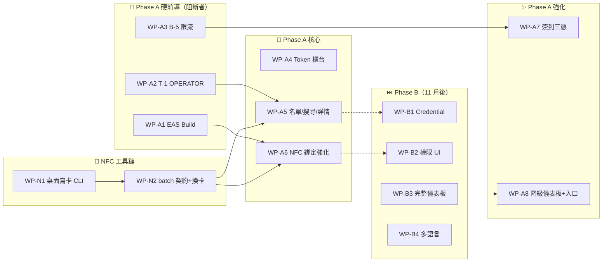

# 16 — feiteng2015 施工工作包（階段化交棒）

> **文件類型**：規劃部 PLAN 階段交付物 — 工程規格撰寫者（Maker）
> **產出日期**：2026-09-18 ｜ Loop: `loop-adminapp-work-packages`
> **品質合約**：strict（Pass Threshold 93）/ L3 Deep Dive ｜ **Round 1/2**
> **交付目標**：直接交給 feiteng2015 施工的階段化工作包文件，回答「現有 App 可否交棒開發？交什麼？什麼順序？」
> **證據基準**：doc 13 `e3c68b8` / doc 14 `fe2ec4f` / doc 15 `0777210` / Handoff v1.0-r5 / Contract v1.0-r4 / Plan v1（模組 A–G）
> **Snapshot Cache**：`docs/.project-context.md` **STALE（LOCATOR-ONLY）**——關鍵結論一律引用 doc 13/14/15 實際內容
> **文件狀態**：撰寫中（§1–§5 依序交付，每節 hackathon commit）

---

## §1 交棒結論（一句話 + 全景表）

### 1.1 一句話回答

> **現有 App 可交棒開發，但只可交「骨架與現場終端補強」，不可交「模組 B/D 的功能空白」——後者必須等後端前置（B-1a / B-6 / T-1 / B-5）解鎖後才開工。**

此結論直接承接 doc 13 §6.1：「**現有 App 已具備『骨架交棒』條件，但尚未具備『功能交棒』條件。**」骨架（10 頁面、5 service、design token、auth 閉環、tsc/eslint 全過）品質足以讓工程師立刻開工；但缺三樣東西：① 任何執行期證據（真機 0 / 自動化測試 0）；② 模組 B（Token 櫃台）與 D（名單）的 App 端 UI **完全不存在**；③ 一個會計入關鍵路徑的後端前置（`by-code` 限流，T-2）未解，會讓模組 A 在開場尖峰直接 429。

doc 15 §2.1 已將 11 月範圍裁決為：**模組 A/B/C/D/F 納入、模組 E 延後、模組 G 用降級版**。本文件依此裁決，把 doc 13 的缺口罩（B-1a/B-5/B-6/B-7/B-8/T-1/T-2/M-3/M-4/N-2 等）轉譯為 **14 個編號連貫的工作包（WP-A1..A8 / WP-N1..N2 / WP-B1..B4）**。

### 1.2 全景表

> 缺口罩來源：doc 13 §3（逐模組缺口）、§4.2（T-1/T-2 真地雷）、§6.2/6.3（可交棒 / 須先解前置）。階段定義來源：doc 15 §2（Phase A/B/C）。

|  工作包   |          對應模組          |         階段          | 缺口來源（doc 13）                                                         |                        可交棒？                         | 前置依賴                                                  |          負責人           | 人日 |
| :-------: | :------------------------: | :-------------------: | -------------------------------------------------------------------------- | :-----------------------------------------------------: | --------------------------------------------------------- | :-----------------------: | :--: |
| **WP-A1** |     W-08（EAS Build）      |    Phase A 硬前導     | §6.3「EAS build 從未執行」🔴；U-5                                          |               ⚠️ 可開工，**需 Expo 帳號**               | Contract P1-6                                             |        feiteng2015        | 0.5  |
| **WP-A2** |         F（權限）          |    Phase A 硬前導     | §4.2 **T-1**（OPERATOR 403，1 行修復）🔴                                   |                      ✅ 可立即開工                      | 無（裁決 C-4 建議 (a)）                                   |     用戶本人（後端）      | 0.1  |
| **WP-A3** |         A（簽到）          |    Phase A 硬前導     | §4.2 **T-2**（by-code 限流 429）🔴 **阻斷模組 A**                          |                      ✅ 可立即開工                      | 裁決 C-3 建議 (a)                                         |     用戶本人（後端）      | 0.7  |
| **WP-A4** |    B（Token 櫃台，Web）    |     Phase A 核心      | §3.2（兩端 UI 皆空白）、§6.3 **B-1a** 🔴、M-3/M-4                          |                     🚫 **待 B-1a**                      | **B-1a**（冪等 migration + 強化）、B-1b（調整 tab）       |  feiteng2015 + 用戶本人   | 7.5  |
| **WP-A5** |    D（名單/搜尋/詳情）     |     Phase A 核心      | §3.4、§6.3 **B-6**、T-1                                                    |                   🚫 **待 B-6 + T-1**                   | B-6（search/sortBy）、T-1（OPERATOR 讀取）、C-9（NFC-08） |  feiteng2015 + 用戶本人   | 4.0  |
| **WP-A6** |      C（NFC 綁定頁）       |     Phase A 核心      | §3.3（換卡/補發/退卡四端皆無）、§6.2                                       |          ⚠️ 部分可開工（錯誤路徑）；換卡待後端          | NFC Gate 1（9/28）；WP-N2（換卡端點）                     |        feiteng2015        | 2.0  |
| **WP-A7** |     A（簽到三態強化）      |     Phase A 強化      | §3.1、§6.2（W-26 補完、W-28）、T-3                                         |                     ✅ 大部分可開工                     | C-10（音效套件）；WP-A3（B-5，現場可用）                  |        feiteng2015        | 2.25 |
| **WP-A8** | G（降級儀表板）+ Web 入口  |     Phase A 強化      | §6.2（降級版已可用）、**N-2**（Web check-in 不可達）                       |                      ✅ 可立即開工                      | 無                                                        |        feiteng2015        | 1.0  |
| **WP-N1** |     C（桌面寫卡 CLI）      | Phase A（NFC 工具鏈） | doc 14 §5.5/§6（工具鏈結構）；§8.3 Gate 1–2                                |           🚫 **待 NFC Gate 1**（9/28 spike）            | 讀寫器到貨（9/22 下單）；Gate 1 通過                      |         用戶本人          | 3.0  |
| **WP-N2** | C（batch 契約 + 換卡端點） | Phase A（NFC 工具鏈） | doc 14 §5.2 **U-1**（complete 格式未確認）；doc 13 §3.3（無作廢/退卡端點） |                    🚫 **待實測確認**                    | 阿聰確認 batch 契約（9/28）                               |      阿聰 + 用戶本人      | 1.0  |
| **WP-B1** |      E（Credential）       |        Phase B        | §3.5（模型確認不存在）、§6.4（建議延後）                                   |      🚫 **Phase B**（11 月不做，釋放 2.0 BE 人日）      | B-8（`EventCredential` 模型）                             |  用戶本人 + feiteng2015   | 2.5  |
| **WP-B2** |       F（權限分層）        |        Phase B        | §3.6（無角色感知 UI）、N-3（資料層已通）                                   |         🚫 **Phase B**（11 月用降級：共用帳號）         | B-4（VOLUNTEER 定義）；D12/G-2 裁決                       |  feiteng2015 + 用戶本人   | 2.25 |
| **WP-B3** |      G（完整儀表板）       |        Phase B        | §3.7（無 stats 端點）、§6.3 **B-7**                                        |             🚫 **Phase B**（11 月用降級版）             | B-7（`/checkin-stats`）+ aggregate 端點                   |  用戶本人 + feiteng2015   | 4.5  |
| **WP-B4** |   多語言（繁/簡/英/葡）    |        Phase B        | doc 15 §2.2 **B-P2**；Contract §7（無 i18n 基建）                          | ✅ 可先行抽 i18n（批次 1–3 繁中已集中 `copy.zh-TW.ts`） | 翻譯資源；Phase A 文案凍結                                | feiteng2015（+ 外部翻譯） | 4.0  |

### 1.3 交棒判定速覽

|              判定               | 工作包                                                              | 說明                                         |
| :-----------------------------: | ------------------------------------------------------------------- | -------------------------------------------- |
| ✅ **可直接交棒（零後端依賴）** | WP-A1、WP-A2、WP-A3、WP-A8、WP-A7（大部分）                         | 第 1 天即可開工（doc 13 §6.2 清單對應）      |
|        ⚠️ **部分可交棒**        | WP-A6                                                               | 錯誤路徑可直接做；換卡/補發需 WP-N2 後端端點 |
|        🚫 **須先解前置**        | WP-A4（B-1a）、WP-A5（B-6+T-1）、WP-N1（Gate 1）、WP-N2（契約確認） | 前置清單見 §3 拓撲排序                       |
|       ⏭️ **Phase B 再做**       | WP-B1..B4                                                           | 11 月活動不承諾（doc 15 §2.2）               |

### 1.4 與既有文件的對應關係（避免 feiteng2015 迷失）

| 本文件工作包 | Handoff W-ID（§4）   | Contract 端點/裁決     | 後端施工項                                                         |
| :----------: | -------------------- | ---------------------- | ------------------------------------------------------------------ |
|    WP-A1     | W-06                 | P1-6（Expo 帳號）      | —                                                                  |
|    WP-A2     | W-03/W-30 前置       | REG-01；C-4            | T-1（`getEventWriteAccess`→`getEventOperatorAccess`，doc 13 §4.2） |
|    WP-A3     | W-21/W-26 前置       | CHK-01；C-3            | B-5（限流改 key，`registrations.routes.ts:12-26`）                 |
|    WP-A4     | W-20..W-25、W-22b    | WAL-01..10；C-5/C-6    | **B-1a**（冪等 migration + M-3）、**B-1b**（adjust + M-4）         |
|    WP-A5     | W-03、W-04、W-05     | REG-01/02；C-1/C-2/C-9 | B-6（search/sortBy/sortOrder）、C-9（NFC-08）                      |
|    WP-A6     | W-07、W-15           | NFC-01..08；C-9        | WP-N2（換卡/補發/退卡端點）                                        |
|    WP-A7     | W-26、W-27、W-28     | CHK-02/03；C-6/C-10    | B-2（override）、B-3（gateId）                                     |
|    WP-A8     | W-29（降級）、W-02   | CHK-04；C-7/C-12；N-2  | B-7（或 fallback）                                                 |
|    WP-N1     | W-07（staging 驗證） | NFC-03..07             | —（桌面工具）                                                      |
|    WP-N2     | —                    | NFC-06；doc 14 U-1     | `/nfc/batch/complete` 契約確認 + 換卡端點                          |
|    WP-B1     | W-31                 | CRD-01；C-13           | B-8（`EventCredential` 模型）                                      |
|    WP-B2     | W-30                 | G-1/G-2；C-4/C-5       | B-4（VOLUNTEER 定義）                                              |
|    WP-B3     | W-29（完整版）       | CHK-04                 | B-7 + aggregate 端點                                               |
|    WP-B4     | §6 多語言            | §7 落差                | —                                                                  |

> 若 Handoff 的 W-ID 行號與本文件衝突，**以函式名/路由字串為準**（Handoff TL;DR #15 與 Contract §2 自我聲明）。

---

<!-- 續寫 §2 工作包流水 -->

---

## §2 工作包流水（WP-A1..A8 / WP-N1..N2 / WP-B1..B4）

> 每包含：**範圍（檔案/端點）、Acceptance Criteria（可測試）、驗收方式、估計工時（人日）、前置依賴、負責人**。

### WP-A1 — EAS Build 驗證（App 從未 build）🔴

| 項目     | 內容                                                                                                                                                                                                                                     |
| -------- | ---------------------------------------------------------------------------------------------------------------------------------------------------------------------------------------------------------------------------------------- |
| **範圍** | 設定 Expo EAS（`eas.json` 確認）、連接 Expo 帳號（Contract P1-6）、`eas build -p android` 與 `-p ios`（iOS 需 Apple Developer 帳號）；產出 APK/IPA 或 TestFlight/Internal build；確認 `.env.local` 的 `EXPO_PUBLIC_API_URL` 指向 staging |
| **AC**   | ① `eas build` 成功產出可安裝的 Android APK；② iOS build（若有帳號）通過；③ App 以 staging API 登入成功（真機或模擬器）；④ EAS 專案 ID 寫入 `app.json`                                                                                    |
| **驗收** | build 日誌 + 安裝後登入截圖 + EAS build URL                                                                                                                                                                                              |
| **工時** | 0.5 人日 ｜ **前置**：無 ｜ **負責**：feiteng2015（需 Expo 帳號）                                                                                                                                                                        |

### WP-A2 — OPERATOR 讀名單修復（T-1，1 行）🔴

| 項目     | 內容                                                                                                                                                                                  |
| -------- | ------------------------------------------------------------------------------------------------------------------------------------------------------------------------------------- |
| **範圍** | Backend `EventRegistrationController.ts:78` 的 `getEventWriteAccess` → 改為 `getEventOperatorAccess`（`EventService.ts:420` 已含 OPERATOR），讓閘口 staff 能讀名單（doc 13 §4.2 T-1） |
| **AC**   | ① OPERATOR 角色 GET `/api/v1/events/:eventId/registrations` 回 200（非 403）；② 既有 SUPER_ADMIN/COORDINATOR 行為不變；③ 測試覆蓋此權限分支                                           |
| **驗收** | 用 OPERATOR token 呼叫端點回 200 + 既有測試全過                                                                                                                                       |
| **工時** | 0.1 人日 ｜ **前置**：無 ｜ **負責**：用戶本人（後端）                                                                                                                                |

### WP-A3 — by-code 限流解除（B-5，阻斷模組 A）🔴

| 項目     | 內容                                                                                                                                                                                                             |
| -------- | ---------------------------------------------------------------------------------------------------------------------------------------------------------------------------------------------------------------- |
| **範圍** | `registrations.routes.ts:12-26` 的 `by-code` 端點限流（20 次/5 分鐘/IP）改為以 **registration 主體**（registrationId/email）為 key，或提升閾值 + 快取（doc 13 §4.2 T-2）；避免開場尖峰 500 人共用 NAT 時全員 429 |
| **AC**   | ① 500 個不同 registration 在 5 分鐘內透過同一 IP 查詢不回 429；② 同一 registration 短時間重複查詢仍有限流保護；③ 限流測試更新                                                                                    |
| **驗收** | 壓測腳本（`test-*.js`）+ 429 不再誤傷正常流量                                                                                                                                                                    |
| **工時** | 0.7 人日 ｜ **前置**：無 ｜ **負責**：用戶本人（後端）                                                                                                                                                           |

### WP-A4 — Token 櫃台（模組 B，Web 端）🚫 待 B-1a

| 項目     | 內容                                                                                                                                                                                                                                                                                                                                                                                                                                                                                                                                        |
| -------- | ------------------------------------------------------------------------------------------------------------------------------------------------------------------------------------------------------------------------------------------------------------------------------------------------------------------------------------------------------------------------------------------------------------------------------------------------------------------------------------------------------------------------------------------- |
| **範圍** | Web `manage/[eventId]/wallet` 或獨立頁：**增值（top-up）快捷金額（+10/+50/+100 可由後端配置）、自訂金額、來源標記（攤位購買/活動獎勵/補發/贊助贈送）**；**扣減（deduct）依兌換品項清單點擊**；餘額不足置灰；**交易流水表**（時間/操作員/金額/類型/備註）；二次確認防呆                                                                                                                                                                                                                                                                      |
| **AC**   | ① 使用既有 4 端點（`GET/WALLET/BALANCE`、`GET/WALLET/TRANSACTIONS`、`POST/WALLET/TOP-UP`、`POST/WALLET/DEDUCT`，`premium.routes.ts:13-20`）；② **B-1a 後端先補冪等 migration + `initiatedBy`（操作員）欄位**（`EventWalletTransaction` 目前只有 `approvedBy`，doc 13 M-4）；③ 增值/扣減後 **用戶端 App 3 秒內同步**（Plan v1 UAT）；④ 扣減動詞用 `deduct`（非 Handoff W-22 的 `redeem`）；⑤ **新增 `manage/[eventId]/wallet` 頁**：top-up 快捷金額（+10/+50/+100，後端可配置）、自訂金額、來源標記、deduct 品項清單、流水表、二次確認 modal |
| **驗收** | Web 操作 → 查 `/wallet/transactions` 記錄 → 用戶端 App 餘額更新；操作員欄位有值                                                                                                                                                                                                                                                                                                                                                                                                                                                             |
| **工時** | 7.5 人日（含 B-1a 後端 2.0）｜ **前置**：B-1a、B-1b ｜ **負責**：feiteng2015（前端）+ 用戶本人（後端）                                                                                                                                                                                                                                                                                                                                                                                                                                      |

### WP-A5 — 名單/搜尋/詳情（模組 D）🚫 待 B-6 + T-1

| 項目     | 內容                                                                                                                                                                                                  |
| -------- | ----------------------------------------------------------------------------------------------------------------------------------------------------------------------------------------------------- |
| **範圍** | 名單頁：搜尋（姓名/手機/Email/報名編號）、篩選（票種/簽到狀態/公司/Token 餘額區間）、排序；**用戶詳情頁**（基本資料/報名/簽到/Token 流水/綁定 NFC/所屬社團）；**現場補報名**（精簡表單 → 觸發 Email） |
| **AC**   | ① 搜尋/篩選/排序**由後端 B-6 提供**（`search/sortBy/sortOrder` 參數）；② OPERATOR 可讀（T-1 已修）；③ 詳情頁各區塊有資料時正確顯示、無資料時 EmptyState；④ 補報名流程與線上報名一致（Plan v1 模組 D） |
| **驗收** | 搜尋 3 種條件 + 篩選組合 + 詳情頁各區塊截圖                                                                                                                                                           |
| **工時** | 4.0 人日 ｜ **前置**：B-6、T-1、C-9 ｜ **負責**：feiteng2015 + 用戶本人                                                                                                                               |

### WP-A6 — NFC 綁定頁強化（模組 C）⚠️ 部分可開工

| 項目     | 內容                                                                                                                                                                |
| -------- | ------------------------------------------------------------------------------------------------------------------------------------------------------------------- |
| **範圍** | 現有 `src/app/(auth)/[eventId]/nfc-bind.tsx` 強化：錯誤路徑（無效 tagUid / 重複綁定 / 已綁他卡）可直接做；**換卡（void 舊卡→綁新卡）、補發、退卡**待 WP-N2 後端端點 |
| **AC**   | ① 綁定成功/失敗三態回饋；② 換卡流程（舊卡作廢 + 新卡綁定）在後端就緒後可跑通；③ NFC Gate 1（9/28 spike）通過後與桌面工具對接                                        |
| **驗收** | 真機 NFC 綁定流程（Android 為主）截圖                                                                                                                               |
| **工時** | 2.0 人日 ｜ **前置**：WP-N2（換卡端點）、NFC Gate 1 ｜ **負責**：feiteng2015                                                                                        |

### WP-A7 — 簽到三態強化（模組 A）✅ 大部分可開工

| 項目     | 內容                                                                                                                                                                                                             |
| -------- | ---------------------------------------------------------------------------------------------------------------------------------------------------------------------------------------------------------------- |
| **範圍** | 簽到結果頁三態回饋強化：✅ 有效（姓名/公司/票種/報名時間/Token 餘額/簽到狀態）、⚠️ 重複（首次簽到時間地點+主管覆核）、❌ 無效（快速補報名入口）；**震動 + 大字綠色畫面 + 音效**（W-28）；頂部單日/單場次簽到計數 |
| **AC**   | ① 三態 UI 齊備；② 重複簽到需權限覆核才二次放行（B-2）；③ 簽到動作寫入時間戳/閘口/操作員（B-3 gateId）                                                                                                            |
| **驗收** | 三態截圖 + 重複簽到流程實測                                                                                                                                                                                      |
| **工時** | 2.25 人日 ｜ **前置**：C-10（音效套件）、WP-A3（B-5）｜ **負責**：feiteng2015                                                                                                                                    |

### WP-A8 — 降級儀表板 + Web 入口（模組 G 降級 + N-2）✅

| 項目     | 內容                                                                                                                                                                                                |
| -------- | --------------------------------------------------------------------------------------------------------------------------------------------------------------------------------------------------- |
| **範圍** | **降級版儀表板**（doc 13 §6.2「降級版已可用」）：報名數/已簽到數/到場率（依時段）、Token 總發放/消耗/剩餘、兌換排行；**Web check-in 導覽入口修正**（N-2：`app/check-in/[eventId]` 不可達 → 加入口） |
| **AC**   | ① 儀表板數據正確（依既有/aggregate 端點）；② Web check-in 可從 manage 導覽到達                                                                                                                      |
| **驗收** | 儀表板截圖 + 導覽路徑實測                                                                                                                                                                           |
| **工時** | 1.0 人日 ｜ **前置**：無 ｜ **負責**：feiteng2015                                                                                                                                                   |

### WP-N1 — 桌面寫卡 CLI（NFC 工具鏈）🚫 待 Gate 1

| 項目     | 內容                                                                                                                                                                                         |
| -------- | -------------------------------------------------------------------------------------------------------------------------------------------------------------------------------------------- |
| **範圍** | Node.js CLI（doc 14 §5.5 結構）：讀 CSV → ACR122U/ACR1252U 逐張寫 NDEF URI（`https://linkcard.xyz/nfc/{badgeId}`）→ 讀回驗證 UID + payload → 失敗重試 ≤3 次 → `POST /nfc/batch/:id/complete` |
| **AC**   | ① 寫 1 張卡 + 驗證 + 回報 backend 成功；② 500 卡 stress test 失敗率 < 5%（R3）；③ 冪等：中斷重跑不重複寫（doc 14 §5.3）                                                                      |
| **驗收** | 寫卡日誌（JSONL）+ 讀卡機讀回驗證 + backend batch 狀態變更                                                                                                                                   |
| **工時** | 3.0 人日 ｜ **前置**：NFC Gate 1（9/28 spike）、讀寫器到貨（9/22 下單）｜ **負責**：用戶本人                                                                                                 |

### WP-N2 — batch 契約確認 + 換卡端點 🚫 待實測

| 項目     | 內容                                                                                                                                                        |
| -------- | ----------------------------------------------------------------------------------------------------------------------------------------------------------- |
| **範圍** | 實測既有 `/nfc/batch/complete` 的 request 格式（doc 14 §5.2 U-1：接受 tagUid↔badgeId mapping？）；補**換卡/補發/退卡端點**（doc 13 §3.3：四端皆無作廢流程） |
| **AC**   | ① `complete` 契約文件化（request/response 範例）；② 換卡端點（void 舊 → bind 新）可用；③ 桌面工具與 backend 對接成功                                        |
| **驗收** | API 實測紀錄 + curl 範例 + 換卡流程真機測試                                                                                                                 |
| **工時** | 1.0 人日 ｜ **前置**：阿聰確認契約（9/28）｜ **負責**：阿聰 + 用戶本人                                                                                      |

### WP-B1 — Credential 統一模型（模組 E）⏭️ Phase B

| 項目     | 內容                                                                                                                                                                 |
| -------- | -------------------------------------------------------------------------------------------------------------------------------------------------------------------- |
| **範圍** | `EventCredential` 模型（doc 13 §3.5 確認不存在；doc 15 建議延後）：統一抽象「社團會員憑證 / 活動票務憑證 / 電子名片」三類，共用 QR 渲染與核驗介面（Plan v1 決策 #2） |
| **AC**   | ① Prisma migration 新增 `EventCredential`（含 `type` enum）；② 既有 badge/registration 資料可遷移；③ QR 渲染組件共用                                                 |
| **工時** | 2.5 人日 ｜ **前置**：B-8 ｜ **負責**：用戶本人 + feiteng2015                                                                                                        |

### WP-B2 — 權限分層 UI（模組 F）⏭️ Phase B

| 項目     | 內容                                                                                                                                     |
| -------- | ---------------------------------------------------------------------------------------------------------------------------------------- |
| **範圍** | 角色感知 UI（doc 13 §3.6 N-3「資料層已通」）：閘口 staff / 攤位 staff / 主管 / 主辦方四角色介面差異；臨時帳號批量建立、QR 邀請、即時停用 |
| **AC**   | ① 依 `promoterRole`/角色顯示不同操作權限；② 停用即時生效；③ 操作綁定操作員                                                               |
| **工時** | 2.25 人日 ｜ **前置**：B-4（VOLUNTEER 定義）｜ **負責**：feiteng2015 + 用戶本人                                                          |

### WP-B3 — 完整儀表板（模組 G）⏭️ Phase B

| 項目     | 內容                                                                                                       |
| -------- | ---------------------------------------------------------------------------------------------------------- |
| **範圍** | 完整版儀表板（doc 13 §3.7 B-7 無 stats 端點）：各閘口/攤位工作量、到場率時段曲線、Token 負債、結案報告匯出 |
| **AC**   | ① `/checkin-stats` + aggregate 端點就緒；② 各維度圖表正確；③ CSV 匯出                                      |
| **工時** | 4.5 人日 ｜ **前置**：B-7 ｜ **負責**：用戶本人 + feiteng2015                                              |

### WP-B4 — 多語言（繁/簡/英/葡）⏭️ Phase B

| 項目     | 內容                                                                                                                                   |
| -------- | -------------------------------------------------------------------------------------------------------------------------------------- |
| **範圍** | i18n 基建（doc 15 §2.2 B-P2；Contract §7 無 i18n）：現有 `copy.zh-TW.ts` 抽成資源檔；新增簡中/英文/葡文；無溢出、無漏翻（Plan v1 UAT） |
| **AC**   | ① i18n 框架接入；② 四語言資源齊備；③ 關鍵頁面四語言截圖無溢出                                                                          |
| **工時** | 4.0 人日 ｜ **前置**：翻譯資源；Phase A 文案凍結 ｜ **負責**：feiteng2015（+ 外部翻譯）                                                |

---

## §3 施工順序與相依性（拓撲排序）

### 3.1 依賴圖（Mermaid）



### 3.2 拓撲順序（建議施工先後）

| 次序 | 工作包                            | 解鎖什麼            | 備註               |
| :--: | --------------------------------- | ------------------- | ------------------ |
|  1   | **WP-A2**（T-1，0.1 人日）        | 解鎖 WP-A5          | 1 行修復，立即做   |
|  2   | **WP-A3**（B-5，0.7 人日）        | 解鎖 WP-A4/A7       | 模組 A 的硬依賴    |
|  3   | **WP-A1**（EAS，0.5 人日）        | 解鎖 WP-A6 真機驗證 | 需 Expo 帳號，並行 |
|  4   | **WP-N2**（契約確認，1.0 人日）   | 解鎖 WP-N1/WP-A6    | 阿聰 9/28 前確認   |
|  5   | **WP-A4**（Token 櫃台，7.5 人日） | 模組 B 上線         | 待 B-1a（2.0 BE）  |
|  6   | **WP-A5**（名單，4.0 人日）       | 模組 D 上線         | 待 B-6 + T-1       |
|  7   | **WP-N1**（桌面 CLI，3.0 人日）   | NFC 批量寫卡        | 待 Gate 1（9/28）  |
|  8   | **WP-A7**（簽到三態，2.25 人日）  | 模組 A 完成         | 待 B-2/B-3         |
|  9   | **WP-A6**（NFC 綁定，2.0 人日）   | 模組 C 完成         | 待 WP-N2           |
|  10  | **WP-A8**（降級儀表板，1.0 人日） | 模組 G 降級         | 隨時可做           |

### 3.3 完成定義（Definition of Done）

每個工作包（WP）的 Done 定義**統一為以下五項**（缺一不可）：

1. **代碼完成**：實作符合 doc 13 缺口與文件契約（API Contract / Handoff）
2. **測試通過**：相關單元測試在 `jest` 全綠（App/Web/Backend 各自）；新增測試覆蓋 AC
3. **tsc/eslint 全過**：`npx tsc --noEmit` + `npm run lint` 無 error
4. **真機/瀏覽器驗證**：截圖或錄影證明功能在真實環境運作（**不能只靠 tsc**——doc 13 §6.1 警示「tsc ✅ ≠ 可用」）
5. **commit 紀錄**：hackathon 式小步 commit（每完成一個子功能即 commit，message 含 WP 編號）

---

## §4 給 feiteng2015 的施工指引

### 4.1 Repo 與 branch 策略

| 項目             | 指引                                                                                                              |
| ---------------- | ----------------------------------------------------------------------------------------------------------------- |
| **App repo**     | `LinkCard_Event_Admin_App_Expo`（Expo/RN）— WP-A1/A5/A6/A7/A8/B2/B4                                               |
| **Web repo**     | `LinkCard_Frontend`（Next.js）— WP-A4/A8（Web 端）/B1/B3                                                          |
| **Backend repo** | `LinkCard_ExpressJS_Backend` — WP-A2/A3/N2/B1/B3（BE 部分）                                                       |
| **branch 策略**  | 每個 WP 開獨立 branch（如 `wp-a4-token-counter`）；完成後開 PR 給用戶本人覆核；**不要直接 push main/development** |
| **staging 驗證** | API 指向 `https://staging-api.link-card.xyz`（`EXPO_PUBLIC_API_URL`）；backend 部署在 staging                     |

### 4.2 必讀文件清單（按順序）

1. `docs/research/13-app-vs-web-feature-gap-matrix.md`（**缺口全貌**，尤其 §3 矩陣、§4 更正表、§6 交棒結論）
2. `docs/research/14-nfc-hardware-and-batch-write-research.md`（NFC 工具鏈 WP-N1/N2 依據）
3. `docs/research/15-admin-app-strategic-roadmap.md`（階段定義、排期、風險）
4. `docs/20260915_AdminApp_Handoff_for_feiteng2015.md`（既有 W-ID 施工計畫）
5. `docs/20260915_AdminApp_API_Contract_Freeze_v1.md`（API 契約權威）
6. `docs/research/11-app-defect-register.md`（死碼/缺陷，避免踩雷）
7. `docs/20260917_LinkCard_Event_Admin_App_Plan_v1.md`（模組 A–G 需求、UAT Checklist）

### 4.3 Commit 慣例（hackathon 式）

```
✅ 好：docs(web): add token counter topup quick buttons (WP-A4)
✅ 好：feat(backend): switch registrations list to operator access (WP-A2)
❌ 壞：fix stuff
❌ 壞：update files
```

- 每個 commit 是**獨立可讀語意單位**（一個子功能 = 一個 commit）
- 同一 WP 內多個小 commit 是**鼓勵**的（不是囤積）
- 禁止「一次寫一大包才 commit」

### 4.4 疑難排解（踩雷地圖）

| 症狀                       | 原因（doc 13 出處）                        | 解法                                                                 |
| -------------------------- | ------------------------------------------ | -------------------------------------------------------------------- |
| OPERATOR 登入後看不到名單  | T-1（`getEventWriteAccess` 不含 OPERATOR） | 已由 WP-A2 修復；若仍 403 檢查「單軌 token」（登入走 promoter 端點） |
| 開場尖峰 429               | B-5（by-code 限流 20 次/5 分鐘/IP）        | WP-A3 修復；未修前勿壓測                                             |
| 所有 promoter API 回 401   | 誤用一般 `/api/auth/login` 拿 plain token  | 必須用 `POST /api/v1/promoter/auth/login`（交接文件 H2 §2）          |
| wallet 扣減用 `redeem` 404 | Handoff W-22 用詞 vs 後端動詞是 `deduct`   | 一律用 `deduct`（doc 13 §4 M-4）                                     |
| 找不到 `idempotencyKey`    | B-1a 未實作（migration 級）                | WP-A4 前置；勿自行加欄位（需 migration SOP）                         |

### 4.5 每個 WP 的驗收提交物

| 工作包    | 提交物                                     |
| --------- | ------------------------------------------ |
| WP-A1     | EAS build URL + 真機登入截圖               |
| WP-A2     | 測試紀錄 + OPERATOR token curl 200 證據    |
| WP-A3     | 壓測腳本結果（500 人同 IP 無 429）         |
| WP-A4     | Web 操作錄影 + 流水表截圖 + 用戶端同步截圖 |
| WP-A5     | 搜尋/篩選/詳情三種條件截圖                 |
| WP-A6     | 真機 NFC 綁定/換卡錄影                     |
| WP-A7     | 三態截圖 + 重複簽到覆核流程錄影            |
| WP-A8     | 儀表板截圖 + 導覽路徑實測                  |
| WP-N1     | 寫卡日誌 + 讀回驗證 + backend 狀態         |
| WP-N2     | API 實測 curl 範例 + 契約文件              |
| WP-B1..B4 | 依 AC 對應截圖/測試                        |

---

## §5 風險與求助點

### 5.1 工作包卡住時的升級路徑

| 卡住徵兆               | 首要動作                                               | 升級對象         |      截止日      |
| ---------------------- | ------------------------------------------------------ | ---------------- | :--------------: |
| 讀寫器未到貨           | 確認下單日（9/22 淘寶 / 9/27 本地，doc 14 §7.3）       | 用戶本人（採購） |      09-30       |
| macOS 無法辨識 ACR122U | 跑 30 分鐘 spike（doc 14 §6.1）；換 ACR1252U / RC-S380 | 用戶本人         | 09-28（Gate 1）  |
| Backend batch 契約不符 | 實測並文件化（WP-N2）；必要時補 API                    | 阿聰             |      09-28       |
| OPERATOR 仍 403        | 確認登入走 promoter 端點（單軌 token）                 | 用戶本人         |       立即       |
| 尖峰 429               | 確認 B-5（WP-A3）已部署到 staging                      | 用戶本人         |       立即       |
| 翻譯資源缺葡文         | 提早找澳門本地翻譯（Plan v1 §九 #15）                  | PM               | 10-15（Phase B） |

### 5.2 需要用戶/PM 決策的點（Blocking decisions）

|  #  | 決策                                         | 影響工作包       | 建議截止 |
| :-: | -------------------------------------------- | ---------------- | :------: |
| D-1 | 11 月活動日期確認（11 月中旬 vs 月底）       | 全部排期         |  09-22   |
| D-2 | NTAG215 型式：矽膠手帶 vs PVC 卡             | WP-N1 採購       |  09-22   |
| D-3 | Token 活動後餘額處理（作廢/保留/轉通用點數） | WP-A4 設計       |  09-30   |
| D-4 | 是否採購 ACR1252U（替代已 EOL 的 ACR122U）   | WP-N1            |  09-22   |
| D-5 | 現場收款是否由 App 記帳（付款外部完成）      | WP-A4（Phase B） |  10-15   |

### 5.3 時間風險（關鍵路徑）

```
現在(09-18) ── 09-22 下單 ── 09-28 Gate1 ── 10-13 工具 Alpha ── 10-20 批量寫卡
   │                                                        │
   └─ WP-A2(0.1) WP-A3(0.7) WP-A1(0.5) 即刻開工            └─ WP-A4(7.5) WP-A5(4.0)
   │                                                        │
   └─ 11-12 Gate4 現場演練 ── 11-15 活動日 ◄── 最後防線
```

**關鍵路徑工作包**：WP-A3（B-5 限流，阻斷模組 A）→ WP-A4（Token 櫃台）→ 批量寫卡。**任何一環延誤超過 3 天，即觸發降級路徑（doc 14 §8.2）**。

### 5.4 一句話總結

> **feiteng2015 第 1 天即可開工 WP-A1/A2/A3/A8/A7（零後端依賴、共約 4.5 人日）；模組 B/D 須待 B-1a/B-6 後端前置解鎖（約 4 人日 BE 前置）；NFC 批量寫卡成敗繫於 9/22 下單與 9/28 Gate1 spike。按此工作包推進，11 月活動可上線。**

### 5.5 已知風險補記（N-4，可接受）

| 風險                                  | 出處            | 影響                                   | 處置                                                                                   |
| ------------------------------------- | --------------- | -------------------------------------- | -------------------------------------------------------------------------------------- |
| `/nfc/lookup` 無 auth（公開查 badge） | doc 13 §4.4 N-4 | 他人可憑 tagUid/qr 查詢 badge 綁定資訊 | **11 月接受**（lookup 僅回傳基本身份，無敏感個資）；Phase B 評估加 rate-limit 或 token |

---

## 附錄 A：WP ↔ Handoff W-ID ↔ Contract 完整對照

|  工作包   | Handoff W-ID         | Contract 端點/裁決     | 後端施工項                                            | 階段 |
| :-------: | -------------------- | ---------------------- | ----------------------------------------------------- | :--: |
| **WP-A1** | W-06（EAS）          | P1-6（Expo 帳號）      | —                                                     |  A   |
| **WP-A2** | W-03/W-30 前置       | REG-01；C-4            | T-1（`getEventWriteAccess`→`getEventOperatorAccess`） |  A   |
| **WP-A3** | W-21/W-26 前置       | CHK-01；C-3            | B-5（限流改 key，`registrations.routes.ts:12-26`）    |  A   |
| **WP-A4** | W-20..W-25、W-22b    | WAL-01..10；C-5/C-6    | B-1a（冪等 migration + M-3）、B-1b（adjust + M-4）    |  A   |
| **WP-A5** | W-03、W-04、W-05     | REG-01/02；C-1/C-2/C-9 | B-6（search/sortBy/sortOrder）、C-9（NFC-08）         |  A   |
| **WP-A6** | W-07、W-15           | NFC-01..08；C-9        | WP-N2（換卡/補發/退卡端點）                           |  A   |
| **WP-A7** | W-26、W-27、W-28     | CHK-02/03；C-6/C-10    | B-2（override）、B-3（gateId）                        |  A   |
| **WP-A8** | W-29（降級）、W-02   | CHK-04；C-7/C-12；N-2  | B-7（或 fallback）                                    |  A   |
| **WP-N1** | W-07（staging 驗證） | NFC-03..07             | —（桌面工具）                                         |  A   |
| **WP-N2** | —                    | NFC-06；doc 14 U-1     | `/nfc/batch/complete` 契約確認 + 換卡端點             |  A   |
| **WP-B1** | W-31                 | CRD-01；C-13           | B-8（`EventCredential` 模型）                         |  B   |
| **WP-B2** | W-30                 | G-1/G-2；C-4/C-5       | B-4（VOLUNTEER 定義）                                 |  B   |
| **WP-B3** | W-29（完整版）       | CHK-04                 | B-7 + aggregate 端點                                  |  B   |
| **WP-B4** | §6 多語言            | §7 落差                | —                                                     |  B   |

## 附錄 B：引用文件 commit hash（更新版）

| 文件               | 本次 Loop 提交 hash                         | 說明                                      |
| ------------------ | ------------------------------------------- | ----------------------------------------- |
| doc 13（差距矩陣） | `6173965`..`9a1caff`（5 commits）           | D1 morpheus 產出                          |
| doc 14（NFC 硬體） | `d1cb038`..`fe2ec4f`（7 commits）           | D2 Neo DEGRADED 產出                      |
| doc 15（路線圖）   | `a303770`..`0777210`（5 commits）           | P1 architect 產出                         |
| doc 16（本文件）   | `e30ba40`..`4071a95`（4 commits）+ 本輪修正 | P2 edison-spec-writer + Neo DEGRADED 產出 |

## 附錄 C：可重跑驗證指令（供 feiteng2015 自驗）

```bash
# OPERATOR 403（T-1）— 預期：角色集合不含 OPERATOR
grep -n "getEventWriteAccess\|getEventOperatorAccess" \
  LinkCard_ExpressJS_Backend/src/events/services/EventService.ts | head

# deduct 動詞（M-1）— 預期：premium.routes.ts 有 /wallet/:registrationId/deduct
grep -n "deduct\|redeem" \
  LinkCard_ExpressJS_Backend/src/events/routes/premium.routes.ts

# idempotencyKey 不存在（M-3）— 預期：全庫零命中
grep -rn "idempotencyKey" LinkCard_ExpressJS_Backend/src \
  LinkCard_ExpressJS_Backend/prisma/schema.prisma

# by-code 限流（B-5）— 預期：windowMs 5min / limit 20 / IP
sed -n '12,26p' \
  LinkCard_ExpressJS_Backend/src/events/routes/registrations.routes.ts

# App 從未 build（U-5）— 預期：tests 目錄不存在
ls LinkCard_Event_Admin_App_Expo/tests 2>&1
```

---

<!-- End of doc 16. 證據基準：doc 13 (6173965..9a1caff) / doc 14 (d1cb038..fe2ec4f) / doc 15 (a303770..0777210) / doc 16 (4071a95 + R2 修正) / Handoff v1.0-r5 / Contract v1.0-r4 -->
